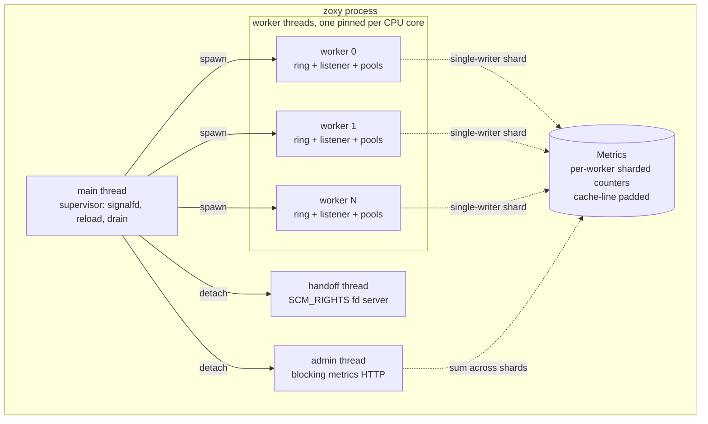
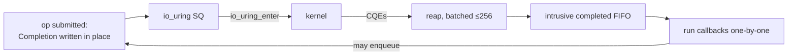
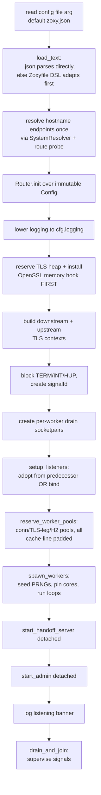
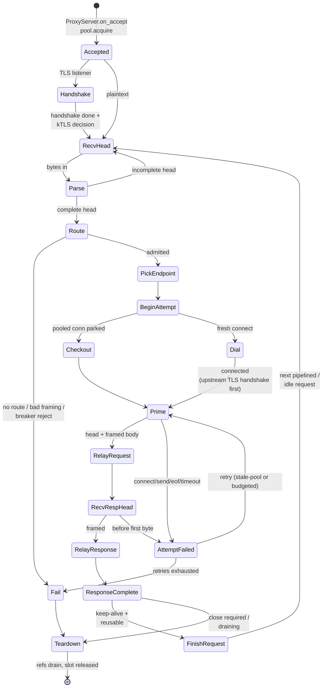
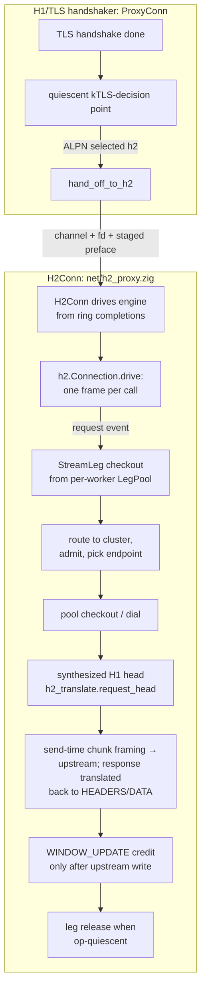
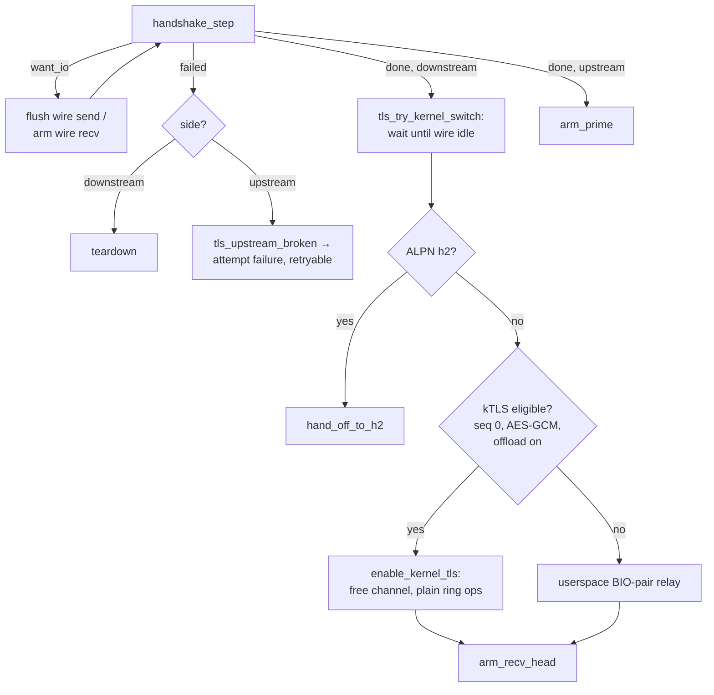
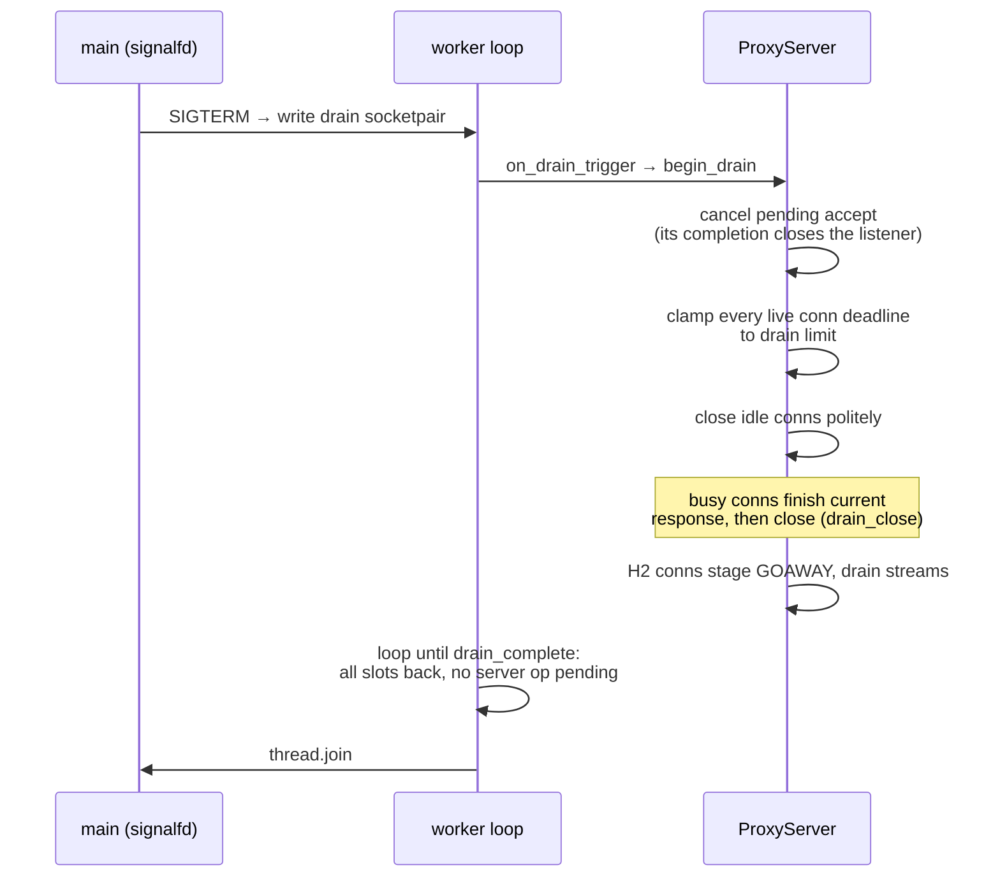
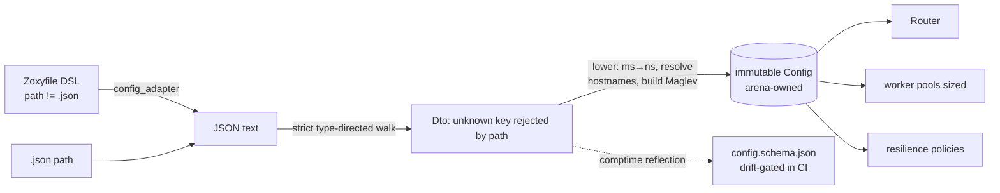

# zoxy architecture

This document maps zoxy's runtime architecture and control flow: the process
and thread topology, the completion-based I/O model that shapes everything
else, and the exact path a request takes from `accept` to teardown — for
HTTP/1.1 and HTTP/2, plaintext and TLS. It is the "how it's built and how a
request flows through it" reference.

It complements the other docs rather than duplicating them:

- [`docs/DESIGN.md`](docs/DESIGN.md) — the *why*: rationale, alternatives
  rejected, measurements, and the phase-by-phase build history/roadmap.
- [`CLAUDE.md`](CLAUDE.md) — the per-module responsibility table, day-to-day
  commands, and Zig 0.16 API notes.
- [`README.md`](README.md) — user-facing configuration and usage.

> Diagrams are Mermaid; they render on GitHub and in most Markdown viewers.

---

## 1. Overview

zoxy is a zero-allocation L4/L7 edge reverse proxy in Zig 0.16, Linux-only. It
speaks HTTP/1.1 and HTTP/2 downstream, re-encrypts or forwards plaintext
upstream, and terminates TLS with kernel-TLS offload. Two constraints define
the architecture:

1. **Zero allocation after startup.** All memory is reserved up front; the
   accept→parse→route→connect→relay path issues no heap allocations and no
   allocating syscalls. Allocation is confined to config parsing (an arena the
   `Config` owns) and is enforced by a test-time `CountingAllocator` gate
   ([`src/mem/guard.zig`](src/mem/guard.zig:1)).
2. **Share-nothing, thread-per-core.** One worker per CPU, each owning its
   io_uring ring, its `SO_REUSEPORT` listener, and its connection pool. A
   connection is pinned to its accepting worker for life, so there are no locks
   on the data path.

The [`Pool(T)`](src/net/pool.zig:11) intrusive free-list, the
[`IO`/`Completion`](src/io/linux.zig:114) seam, and the immutable
[`Config`](src/config.zig:394) are the three structural primitives everything
is built from.

---

## 2. Process & thread topology



The **main thread** ([`main`](src/main.zig:46)) does all startup allocation,
spawns workers, then becomes a supervisor blocked on a `signalfd`
(SIGTERM/SIGINT → drain, SIGHUP → reload).

Each **worker** ([`run_worker`](src/main.zig:808)) is a self-contained event
loop: it builds its own [`IO`](src/io/linux.zig:151) ring, owns a
[`ProxyServer`](src/net/proxy.zig:2506) (accept loop + connection pool +
resilience state + upstream pool) and a
[`HealthChecker`](src/proxy/health_check.zig:31), pins itself to a core with
`sched_setaffinity`, and runs `io.run_once()` until drained.

The only cross-worker state is [`Metrics`](src/obs/metrics.zig:39): each worker
writes only its own cache-line-padded `Counters` shard (single writer, so the
atomic RMW is uncontended and the line stays in that core's cache); readers
(admin scrape, handoff snapshot) sum across shards. The **admin** and
**handoff** threads are blocking and detached, deliberately off the data path.

---

## 3. The I/O model — the load-bearing abstraction

Everything downstream of this section is a consequence of one decision:
**completion-based io_uring with caller-owned completions** (TigerBeetle's
`IO`/`Completion` pattern), not fibers and not `std.Io`'s async executor.

- [`src/io/io.zig`](src/io/io.zig:1) is a **comptime backend seam**: the `IO`
  *type* is the abstraction (no runtime vtable). `builtin` selects
  [`linux.zig`](src/io/linux.zig:1) (real io_uring) or
  [`test_io.zig`](src/io/test_io.zig:1) (deterministic simulator) — the latter
  when the root file declares `pub const zoxy_io = .simulation`.
- A [`Completion`](src/io/linux.zig:114) is **embedded inline** in long-lived,
  statically-allocated connection state. Submitting an op writes it in place;
  the io_uring `user_data` *is* the `*Completion`. Submitting allocates
  nothing.
- Ops take `(comptime Context, context, comptime callback, *Completion, args)`.
  The callback is type-erased once ([`erase`](src/io/linux.zig:659)), so the
  ring stores one `*anyopaque` + fn pointer.
- **Completions never run inline.** Reaped CQEs (batched, ≤256) go onto an
  intrusive `completed` FIFO and run one-by-one
  ([`run_completed`](src/io/linux.zig:532)); a callback may safely enqueue more
  work.



Consequences that shape the data-path code:

- **Functions run to completion without suspending** (TigerStyle), precisely
  because I/O is callback-based — precondition assertions hold across the whole
  function body.
- **Teardown must `shutdown(SHUT_RDWR)` both fds before the async `close`.** An
  io_uring `close` does *not* cancel a `recv` already pending on that fd;
  without the shutdown the pending recv never completes and the slot leaks (a
  real deadlock found by the simulator). See
  [`teardown`](src/net/proxy.zig:905). Timer and connect ops, which `shutdown`
  cannot reach, are cancelled by `user_data`
  ([`cancel`](src/io/linux.zig:291)).
- **A `Completion` in flight must never be resubmitted** — a double submit
  corrupts the ring. Ops that can overlap get their *own* completions; several
  `ProxyConn` completions exist solely to break a proven race (e.g.
  [`teardown_close_upstream_completion`](src/net/proxy.zig:372)).
- **The clock is a seam.** [`IO.now_ns`](src/io/linux.zig:376) returns a value
  refreshed per loop iteration (per-callback `clock_gettime` was ~3% of
  data-path CPU) — and it is exactly the hook the simulator's virtual clock
  needs. All deadline math goes through it.

The loop driver is [`run_once`](src/io/linux.zig:478): submit queued work, then
block for at least one completion *only if* no callbacks are already ready
(a ready callback may enqueue more work, so draining takes priority over
blocking).

---

## 4. Startup sequence

[`main`](src/main.zig:46) reserves everything before any worker touches shared
state. The ordering is deliberate: every fallible step (config, TLS certs,
listener adoption) happens *before* workers spawn and before a hot-restart
successor adopts listeners, so a failure dies cleanly instead of taking down a
predecessor's accept queues.



Key invariants established here:

- **Reserve-before-serve.** [`reserve_worker_pools`](src/main.zig:400) allocates
  every worker's connection pool, TLS-leg pool, and H2 pools on the main thread,
  so worker startup and the serving loop touch no shared allocator.
- **TLS hook first.** [`reserve_tls_heap`](src/main.zig:162) installs OpenSSL's
  global memory hook before any other OpenSSL call — OpenSSL refuses the hook
  after its first allocation.
- **Signals masked before workers spawn**, so workers inherit the mask and a
  drain poke arrives as an ordinary ring completion on a socketpair, not an
  async signal.

The supervisor loop [`drain_and_join`](src/main.zig:561) blocks on the
signalfd: SIGHUP triggers [`reload_config`](src/main.zig:631) (fork+exec a
successor); TERM/INT poke every worker's drain socketpair and join.

---

## 5. Data path — HTTP/1.1 downstream

The core is [`ProxyConn`](src/net/proxy.zig:277) in
[`src/net/proxy.zig`](src/net/proxy.zig:1), one pooled object per accepted
downstream socket. All its buffers, framers, and a dozen named `Completion`s
live inline in the pool slot.



### 5.1 Receiving and parsing

[`arm_recv_head`](src/net/proxy.zig:1573) reads into `head_buf`;
[`process_head`](src/net/proxy.zig:1618) runs the zero-copy parser
[`h1.parse`](src/http/h1.zig:84) (picohttpparser-style: re-runs from the start
each call, every field a slice into the buffer, header lines in a fixed
`[headers_max]Header` array). An oversize head is a 431; too many headers is
also 431; a bad version is 505 — never a grow.

### 5.2 Routing and admission

[`route_and_connect`](src/net/proxy.zig:1664):

1. `Upgrade` → 501 (cannot survive the forced `Connection: close`).
2. [`h1.request_framing`](src/http/h1.zig:1) rejects smuggling shapes
   (TE+CL, duplicate/garbage Content-Length) → 400, before any upstream byte.
3. [`Router.route`](src/proxy/router.zig:19) — first route whose host (`*` or
   exact, port-insensitive) and `path_prefix` match wins → cluster, else 404.
4. [`resilience.admit_request`](src/proxy/resilience.zig:89) — circuit-breaker
   `max_requests` → 503 if tripped.
5. [`pick_endpoint`](src/net/proxy.zig:1640) — Maglev consistent hash when the
   cluster has a table and the request carries the key, else P2C least-request
   (§8).

The request's `head_len..request_end` (head + framed body prefix) is computed;
if the whole request fits the prime segments it is marked **replayable** (a
prerequisite for retries and the per-try timeout).

### 5.3 Upstream: pool checkout or dial

[`begin_attempt`](src/net/proxy.zig:1715) checks the per-worker
[`UpstreamPool`](src/proxy/upstream_pool.zig:22) for a parked connection to the
endpoint (keyed by address, TLS-posture-matched). A hit resumes it (skipping the
dial, and for TLS resuming the parked channel);
a miss [`connect_upstream`](src/net/proxy.zig:1755) admits a dial through the
breaker and issues `io.connect`. On connect,
[`on_connect`](src/net/proxy.zig:1782) begins the upstream TLS handshake for a
re-encrypting cluster, then primes.

### 5.4 The framed relay and backpressure

Each direction is a [`Pipe`](src/net/proxy.zig:127) with one fixed
`relay_buf_bytes` buffer and a strict **recv → send → recv** discipline: the
next chunk is never read until the current one is fully written. A slow
destination therefore stalls the source through TCP flow control, and memory
per direction is bounded regardless of stream size — stronger than
watermark read-disable, because there is no read-ahead to disable.

Both directions are **framed** (RFC 9112 §6.3, via
[`h1.BodyFramer`](src/http/h1.zig:1)): each side knows where its message ends,
so an upstream that ignores `Connection: close` cannot pin the slot, and
pipelined bytes past a message end are never forwarded. Hop-by-hop headers are
stripped both ways ([`build_prime_segments`](src/net/proxy.zig:2037)).

### 5.5 Keep-alive and completion

[`response_complete`](src/net/proxy.zig:2334) settles resilience accounting and
tries to park the upstream connection
([`maybe_pool_upstream`](src/net/proxy.zig:2350)) — independent of whether the
*downstream* connection survives. If the downstream is reusable (keep-alive
client, framed response, request fully forwarded, no stranded pipelined bytes,
previous upstream close done — [`can_reuse_downstream`](src/net/proxy.zig:2393)),
[`finish_request`](src/net/proxy.zig:2405) logs the request, slides pipelined
bytes to the front of `head_buf`, resets per-request state, and parses the next
head. Otherwise the connection closes politely
([`close_downstream`](src/net/proxy.zig:1187)).

### 5.6 Retries and per-try timeout

An attempt that dies **before any response byte**
([`attempt_failed`](src/net/proxy.zig:1871)) has two retry tiers:

- **Tier 1 — free stale-pool replay.** A parked keep-alive connection the
  origin closed while idle is normal churn, not an endpoint-health signal:
  replayed once, same endpoint, no backoff, no budget charge.
- **Tier 2 — configured retries.** Gated by the retry budget
  ([`admit_retry`](src/proxy/resilience.zig:119)) and the `max_retries`
  breaker; re-picks a different endpoint; fully-jittered exponential backoff
  ([`schedule_retry`](src/net/proxy.zig:1914)). Only replayable requests, never
  after a forwarded response byte.

The **per-try timeout** rides the single ticking deadline timer
([`arm_timeout`](src/net/proxy.zig:720)): one timeout op per connection
re-checks an absolute deadline, and phase transitions just move the deadline —
no cancel/re-arm races. It arms only for replayable requests, where the attempt
owns exactly one in-flight upstream op that an abort can drain deterministically
([`abort_attempt`](src/net/proxy.zig:1820)).

### 5.7 Lifetime and teardown

`refs` counts in-flight io_uring ops for the connection.
[`teardown`](src/net/proxy.zig:905) flips `closing`, cancels the timer/connect,
`shutdown`s and async-`close`s both fds; each resulting (and any other pending)
completion decrements `refs`, and the last one
([`release_ref`](src/net/proxy.zig:872)) frees the TLS channels back to the TLS
heap and releases the slot to the pool.

### 5.8 Error path

[`fail`](src/net/proxy.zig:2449) sends a fixed `Connection: close` 4xx/5xx
response (`response_400` … `response_505`), settles accounting, records the
metric by status class, and tears down after the send.

---

## 6. Data path — HTTP/2 downstream

HTTP/2 is an own sans-io core (H2-downstream / H1-upstream). Each H2 stream maps
to one HTTP/1.1 upstream transaction over the *same* upstream pool and
resilience machinery — this layer is translation, not upstream multiplexing.



- **Arrival.** A connection reaches H2 only via
  [`ProxyServer.hand_off_to_h2`](src/net/proxy.zig:1136): at the quiescent
  kTLS-decision point (§7), an `h2`-negotiated connection's `terminator.Channel`
  + fd + any coalesced-preface bytes move to a fresh
  [`H2Conn`](src/net/h2_proxy.zig:1) from the per-worker pool, and the original
  `ProxyConn` returns to its pool. (The simulator's plaintext `H2Server` is the
  other route in, since the sim excludes OpenSSL.)
- **Engine.** [`h2.Connection.drive`](src/http/h2.zig:77) is sans-io: fed bytes,
  it consumes one frame per call, stages control frames (SETTINGS/PING/RST/
  GOAWAY/WINDOW_UPDATE) into a caller buffer, and surfaces one
  [`Event`](src/http/h2.zig:32). Every knob (concurrent streams, HPACK table
  size, frame size, windows) is a [`constants.zig`](src/constants.zig:1) number,
  advertised in SETTINGS and enforced on the wire — a peer setting never grows
  past what was reserved. Fixed stream slots; excess opens → REFUSED_STREAM.
- **Per-stream leg.** A [`StreamLeg`](src/net/h2_proxy.zig:84) (pooled, sized by
  `h2_legs_max`) runs one H1 transaction: [`h2_translate`](src/http/h2_translate.zig:1)
  synthesizes an H1 head from the decoded pseudo-headers (rejecting CR/LF/NUL
  head-splitting, rejoining cookies), chunk framing happens at send time, and
  the response head is translated back into HEADERS/DATA.
- **Flow control *is* the backpressure model.** The advertised stream window
  equals the leg's relay-buffer size; WINDOW_UPDATE credit is issued only as the
  upstream write completes. A slow origin closes exactly that stream's window; an
  unwilling client stalls exactly its stream, one leg buffer deep.
- **Maturity.** Shipped at H1's Phase-1 equivalent: no retry tiers or per-try
  timeout for H2 legs yet (failures answer 502/504 pre-first-byte, RST after),
  no upstream TLS for H2 legs (such clusters answer 502), abrupt close after
  GOAWAY.

---

## 7. TLS control flow

TLS termination is sans-io, mirroring the H2 engine's shape: a pure byte
transformer driven by the same `ProxyConn` that drives plain sockets.

- [`terminator.Context`](src/tls/terminator.zig:69) is an immutable `SSL_CTX`
  built at startup (identity install + cross-check so a bad cert kills boot,
  ALPN policy, session cache/tickets off so one context serves every worker).
- [`terminator.Channel`](src/tls/terminator.zig:1) is per-connection: an `SSL`
  over a fixed-size **memory-BIO pair**. OpenSSL never sees a socket — ciphertext
  shuttles between the pair and the ring through the connection's fixed buffers
  ([`WireRelay`](src/tls/wire_relay.zig:1)), so run-to-completion holds and the
  handshake is deterministically testable down to 1-byte delivery.
- OpenSSL's allocations route through the reserved **TLS heap**
  ([`src/tls/heap.zig`](src/tls/heap.zig:1)) behind its global memory hook;
  exhaustion load-sheds a handshake, never OOMs.

A downstream `ProxyConn.Tls` leg is checked out of the per-worker
`TlsLegPool` at accept; an upstream leg at connect for a re-encrypting cluster.
The driver ([`tls_progress`](src/net/proxy.zig:1037) and friends) calls
`tls_recv_start`/`tls_send_start` exactly where the plaintext path would call
`io.recv`/`io.send`, so the control-flow shape is identical.



The **kernel-TLS switchover** ([`tls_try_kernel_switch`](src/net/proxy.zig:1076))
is the pivot: after the handshake, once the wire is provably idle (all our
ciphertext out, nothing pending, no wire recv in flight — meaning both TLS
sequence numbers are exactly 0), the connection either hands off to H2 (if ALPN
negotiated `h2`), moves its record layer into the kernel via
[`enable_kernel_tls`](src/io/linux.zig:445) (freeing the ~161 KiB channel and
running the *plaintext* relay path), or — if a client coalesced data into the
handshake flight, or the module/cipher is unavailable — stays on the userspace
BIO-pair relay, which serves identical bytes. A missed switch costs performance,
never correctness. Polite closes send `close_notify` either way (a userspace
alert, or a `TLS_SET_RECORD_TYPE` cmsg for a kernel-switched connection).

SNI selects among explicit config-declared `server_names`
([`build_sni_table`](src/main.zig:228)); absent/unmatched SNI gets the default
identity. Upstream re-encryption demands an explicit posture (`ca_file` +
`server_name`, or spelled-out `insecure`); upstream channels park in the pool
alongside their fd, but only when fully quiescent (§5.5).

---

## 8. Routing, balancing, and resilience

These are pure reads over the immutable `Config` plus one per-worker mutable
table — the Envoy "filter seam" idea reduced to a narrow admission/outcome API.

- **Router** ([`src/proxy/router.zig`](src/proxy/router.zig:1)) — first-match
  host + path-prefix, no allocation, no shared mutable state.
- **Balancer** ([`src/proxy/balancer.zig`](src/proxy/balancer.zig:1)):
  - [`pick_least_request`](src/proxy/balancer.zig:31) — P2C: two random draws,
    keep the one with fewer in-flight attempts. O(1), self-adapts to unequal
    endpoint capacity.
  - [`pick_hashed`](src/proxy/balancer.zig:78) — Maglev: table maps the key
    hash to a home endpoint; unavailable/excluded ones trigger a *deterministic*
    forward walk, so affinity is stable across workers and time.
  - Both **fail open**: when zero endpoints are available the balancer routes
    anyway (an all-ejected cluster must not become a self-sustaining 503 storm).
- **Maglev tables** ([`src/proxy/maglev.zig`](src/proxy/maglev.zig:1)) are built
  once at config time (prime-sized, `u8` entries); the data path is one wyhash +
  one array index.
- **Resilience** ([`src/proxy/resilience.zig`](src/proxy/resilience.zig:62)) is
  the per-worker mutable state. `ProxyConn` calls it at four fixed points:

  ```mermaid
  flowchart LR
      admit[admit_request<br/>max_requests breaker] --> pick[cluster_state →<br/>balancer pick]
      pick --> dial[admit_dial<br/>max_pending/max_connections]
      dial --> finish[attempt_finish:<br/>outlier detection +<br/>in_flight bookkeeping]
      finish -.retry.-> retry[admit_retry:<br/>budget + max_retries]
      retry --> pick
  ```

  It also holds the passive **outlier detection** (consecutive-failure ejection
  bounded by `max_ejection_percent`) and the endpoint `healthy` flag the
  balancer reads. Every counter must drain to zero at shutdown — the simulator
  asserts this each iteration ([`is_idle`](src/proxy/resilience.zig:264)).
- **Health checking** ([`src/proxy/health_check.zig`](src/proxy/health_check.zig:31))
  — per-worker active TCP-connect probes on one ticking scheduler, bounded probe
  slots, streak thresholds flip `healthy`. Endpoints start healthy.
- **Upstream pool** ([`src/proxy/upstream_pool.zig`](src/proxy/upstream_pool.zig:22))
  — fixed slots keyed by endpoint address, TLS-channel-aware; checkin beyond
  `upstream_idle_max` closes rather than parks.

All limits and budgets are **per worker** — a cluster-wide budget is the
configured value × worker count (share-nothing, no cross-worker coordination).

---

## 9. Graceful drain & hot restart

### 9.1 Graceful drain



[`begin_drain`](src/net/proxy.zig:2755) stops accepting, closes the listener
(refcounted in `shared` accept mode so only the last worker out closes the
shared fd), and clamps deadlines — the *existing* ticking timer enforces the
drain limit, so no new timer op is needed. A worker exits only when every
connection slot is back in the pool and no server-scoped op remains
([`drain_complete`](src/net/proxy.zig:2831)).

### 9.2 Hot restart

[`src/net/handoff.zig`](src/net/handoff.zig:1) carries every worker's listener
fd to a successor over a unix socket in one `SCM_RIGHTS` cmsg, validated
(`getsockname` + `SO_ACCEPTCONN`) before adoption; the duplicated fds keep the
accept queues alive across the pair, closing the drain RST window. Counter
totals ride behind the header as name-keyed records (version-skew tolerant).
`accept_mode` chooses the shape — `reuseport` (one listener per worker, kernel
hashes) or `shared` (one listener, idle workers pull more; effectively required
for HTTP/2's few-hot-connections shape).

### 9.3 Config reload

[`reload.zig`](src/reload.zig:1) makes a reload a **hot restart of ourselves**:
on SIGHUP, [`reload_config`](src/main.zig:631) re-reads and strict-parses the
file (re-resolving hostnames), and if the change is reloadable (handoff socket
configured, listen address unchanged) `fork`+`exec`s a fresh zoxy on the same
path. The successor adopts the live listeners through the handoff socket and
serves while the predecessor drains — no in-process config swap, so any change
(clusters, endpoints, TLS) works because the successor reserves everything
fresh. A successor that rejects the new config dies before adopting; the running
instance keeps serving and reaps it on the next SIGHUP.

---

## 10. Configuration pipeline



- JSON is the canonical format and the single validation path
  ([`config.zig`](src/config.zig:1)); the **Zoxyfile DSL**
  ([`config_adapter.zig`](src/config_adapter.zig:1)) is only a text→text
  front-end that lowers to it (Caddy's `caddy adapt` model).
- Parsing is **strict**: [`config_schema.zig`](src/config_schema.zig:1) reflects
  a JSON Schema from the DTO at comptime, and an unknown key is rejected by name
  with its path — a typo can't silently disable a feature.
- The immutable [`Config`](src/config.zig:394) owns the only allocating arena;
  per-cluster resilience blocks resolve into a
  [`ResiliencePolicy`](src/config.zig:289) (ms→ns, validated), and hostname
  endpoints resolve here exactly once through an injectable `Resolver` seam.

---

## 11. Memory & concurrency model

Total memory is a function of [`constants.zig`](src/constants.zig:1) — sizing
the proxy *is* choosing those numbers. The reservation timeline:

| When | What | Where |
|------|------|-------|
| Config parse | The one arena: strings, endpoint slices, Maglev tables | [`config.zig`](src/config.zig:394) |
| Startup, main thread | Per-worker connection / TLS-leg / H2 pools; TLS heap; listeners; metrics | [`reserve_worker_pools`](src/main.zig:400), [`reserve_tls_heap`](src/main.zig:162) |
| Serving path | **Nothing** — enforced by the counting-allocator gate | [`mem/guard.zig`](src/mem/guard.zig:1) |

Structural primitives:

- **[`Pool(T)`](src/net/pool.zig:11)** — one startup allocation + an intrusive
  free list (requires `free_next` and `in_use` fields). Acquire/release never
  allocate; exhaustion returns null so callers apply backpressure (reject, never
  grow). Reused for `ProxyConn`, `ProxyConn.Tls` legs, `H2Conn`, and `StreamLeg`.
- **Cache-line isolation** ([`mem/cache_line.zig`](src/mem/cache_line.zig:1)) —
  `Padded(T)` over-aligns per-worker slots in shared arrays (metrics shards, pool
  headers, access logs) so neighbors never share a line. Logical share-nothing is
  not physical share-nothing; this makes it physical.
- **[`futex_mutex.zig`](src/mem/futex_mutex.zig:1)** — a raw-futex mutex for the
  off-data-path TLS heap only (0.16 removed `std.Thread.Mutex`; its replacement
  wants an `Io` the workers deliberately don't carry).

Concurrency: one thread per core, no shared mutable data-path state, no locks.
Cross-worker communication is limited to the sharded atomic counters and the
one-time listener handoff.

---

## 12. Observability

- **[`Metrics`](src/obs/metrics.zig:39)** — a fixed set of counters, sharded per
  worker and cache-line padded (§2). Gauges (`active`, `draining`) and monotonic
  counters both live here; `Metrics.total` sums a series across shards for the
  scrape.
- **[`AccessLog`](src/obs/access_log.zig:1)** — per-worker, fixed-buffer,
  batched: one write per event-loop iteration
  ([`access.flush`](src/main.zig:869)), off the per-connection path.
- **[`Admin`](src/obs/admin.zig:1)** — a blocking Prometheus-style
  `/metrics` endpoint on its own detached thread, off the data path
  ([`start_admin`](src/main.zig:537)).

---

## 13. Source map

A condensed path → responsibility index. The full, prose-rich table is in
[`CLAUDE.md`](CLAUDE.md); this is the quick lookup.

| Path | Responsibility |
|------|----------------|
| [`src/main.zig`](src/main.zig:1) | Startup, worker spawn, signal/drain/reload supervision |
| [`src/root.zig`](src/root.zig:1) | Module root: public re-exports + test aggregation |
| [`src/constants.zig`](src/constants.zig:1) | Every static limit; total memory is a function of these |
| [`src/io/io.zig`](src/io/io.zig:1) | Comptime IO backend seam |
| [`src/io/linux.zig`](src/io/linux.zig:1) | `IO`/`Completion` over io_uring; the real backend |
| [`src/io/test_io.zig`](src/io/test_io.zig:1) | Deterministic simulation backend (virtual sockets/clock) |
| [`src/net/proxy.zig`](src/net/proxy.zig:1) | **The H1 data path**: `ProxyConn`, `Pipe`, `ProxyServer`, retries, drain, TLS driving, H2 handoff |
| [`src/net/h2_proxy.zig`](src/net/h2_proxy.zig:1) | The H2 data path: `H2Conn` driver + per-stream `StreamLeg` |
| [`src/net/listener.zig`](src/net/listener.zig:1) | `SO_REUSEPORT` TCP listener |
| [`src/net/handoff.zig`](src/net/handoff.zig:1) | Hot-restart listener-fd handoff over `SCM_RIGHTS` |
| [`src/net/pool.zig`](src/net/pool.zig:1) | Generic intrusive-free-list `Pool(T)` |
| [`src/http/h1.zig`](src/http/h1.zig:1) | Zero-copy HTTP/1.1 parsers + `BodyFramer` |
| [`src/http/chunked.zig`](src/http/chunked.zig:1) | Incremental chunked-coding decoder |
| [`src/http/h2_frame.zig`](src/http/h2_frame.zig:1) | Sans-io HTTP/2 frame codec |
| [`src/http/hpack.zig`](src/http/hpack.zig:1) | HPACK with fixed-reservation dynamic table |
| [`src/http/h2.zig`](src/http/h2.zig:1) | Sans-io HTTP/2 connection/stream engine |
| [`src/http/h2_translate.zig`](src/http/h2_translate.zig:1) | H2 ↔ H1 head translation |
| [`src/proxy/router.zig`](src/proxy/router.zig:1) | First-match host/path routing |
| [`src/proxy/balancer.zig`](src/proxy/balancer.zig:1) | P2C least-request + Maglev pick |
| [`src/proxy/maglev.zig`](src/proxy/maglev.zig:1) | Maglev lookup-table build + key hash |
| [`src/proxy/resilience.zig`](src/proxy/resilience.zig:1) | Per-worker admission/outcome accounting |
| [`src/proxy/health_check.zig`](src/proxy/health_check.zig:1) | Active TCP-connect health probes |
| [`src/proxy/upstream_pool.zig`](src/proxy/upstream_pool.zig:1) | Idle upstream connection pool |
| [`src/tls/terminator.zig`](src/tls/terminator.zig:1) | Sans-io TLS `Context` + `Channel` |
| [`src/tls/openssl.zig`](src/tls/openssl.zig:1) | OpenSSL FFI seam + memory hook |
| [`src/tls/heap.zig`](src/tls/heap.zig:1) | Fixed-capacity TLS heap behind the hook |
| [`src/tls/kernel.zig`](src/tls/kernel.zig:1) | kTLS crypto-info + record-type control |
| [`src/tls/wire_relay.zig`](src/tls/wire_relay.zig:1) | Ciphertext ↔ ring staging for the BIO pair |
| [`src/config.zig`](src/config.zig:1) | JSON → immutable `Config`; hostname resolution |
| [`src/config_schema.zig`](src/config_schema.zig:1) | Comptime JSON-Schema generator |
| [`src/config_adapter.zig`](src/config_adapter.zig:1) | Zoxyfile DSL → JSON adapter |
| [`src/reload.zig`](src/reload.zig:1) | SIGHUP reload via supervised self-relaunch |
| [`src/obs/metrics.zig`](src/obs/metrics.zig:1) | Sharded per-worker counters |
| [`src/obs/access_log.zig`](src/obs/access_log.zig:1) | Batched per-worker access log |
| [`src/obs/admin.zig`](src/obs/admin.zig:1) | Admin/metrics HTTP endpoint |
| [`src/mem/guard.zig`](src/mem/guard.zig:1) | Zero-alloc acceptance gate |
| [`src/mem/cache_line.zig`](src/mem/cache_line.zig:1) | `Padded(T)` cache-line isolation |
| [`src/mem/futex_mutex.zig`](src/mem/futex_mutex.zig:1) | Raw-futex mutex (off data path) |
| [`src/sim.zig`](src/sim.zig:1) | The deterministic simulator (real data path vs. adversarial IO) |
