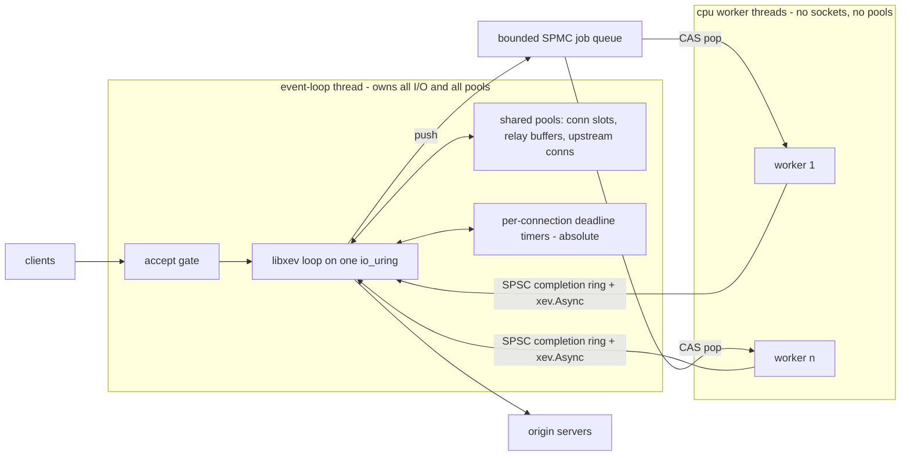

# zoxy — bullet-proof L4/L7 proxy

An L4/L7 proxy in Zig 0.16 in the spirit of Cloudflare's Pingora, with two
hard constraints: **nothing allocates on the hot path** and **exhaustion
sheds load — it never crashes, never queues unboundedly, never allocates.**
Steady-state operation issues zero heap allocations and zero allocating
syscalls; total memory is a startup-time function of the static limits.

Simplicity is prioritized over feature-richness. The coding rules live in
[`docs/TIGER_STYLE.md`](TIGER_STYLE.md). The previous iteration of this
project ([zoxy-io/zoxy@main](https://github.com/zoxy-io/zoxy)) shipped an
L7-only, share-nothing, thread-per-core proxy directly on `io_uring`; its
measured lessons are carried forward here (§2) and its dead ends are not
revisited.

---

## 1. Goals and non-goals

Goals, in priority order:

1. **Bullet-proof.** No crash, no OOM, no unbounded queue — ever. Every
   resource has a static limit; hitting a limit sheds load at a well-defined
   point with a well-defined answer (§8).
2. **Zero allocation after startup.** All memory is reserved at `init`;
   the serving path allocates nothing. Enforced by a test-time gate, not
   aspired to.
3. **Minimal memory consumption.** Pools are *shared*, sized for concurrent
   *activity*, not for open-connection worst cases multiplied by core count
   (§5). Total memory is a closed-form function of `src/constants.zig`.
4. **Simplicity.** One event loop, one ring, one writer for every pool.
   Fewer moving parts than the previous iteration, not more.
5. **L4 (TCP relay) and L7 (HTTP/1.1 reverse proxy)** serving, with
   keep-alive and shared upstream connection reuse.

Non-goals (deliberate, recorded so they are decisions rather than drift):

- HTTP/2, HTTP/3, gRPC, WebSocket — deferred until the L4/L7 core is proven.
- Feature parity with Envoy/NGINX. Pingora's lesson is that a small, sharp
  proxy core beats a configurable monolith.
- Caching, compression, request transformation.
- Windows/macOS *production* support. Production is Linux + `io_uring`;
  libxev's kqueue backend keeps macOS usable as a dev box only.
- Multi-process orchestration, xDS, hot restart — until operability demands
  them (the previous iteration's Phase-4 machinery is a known-good recipe
  when they do).
- Config reload. Config is parse-once immutable (§5); a change is a
  process restart — consistent with process-per-port scale-out (§3). Hot
  restart / drain-to-successor stays deferred (§10).
- Dynamic DNS for upstreams. Cluster endpoints are static socket
  addresses resolved once at config load (§7); re-resolution waits for a
  demonstrated need.

## 2. Lessons carried from the previous iteration

Paid for with implementation time and simulator seeds; adopted here as
constraints, not suggestions.

- **The deterministic-simulation seam is the single highest-leverage testing decision.** 
  The data path must be written against an `Io` facade from the
  first commit so a seeded, adversarial, virtual-socket backend can run the
  *real* code (§9).
- **Connection reuse is the biggest performance lever** (~3× req/s in the
  previous iteration). The upstream pool is first-class, not an add-on.
- **Teardown is where the races live.** `shutdown(SHUT_RDWR)` both fds
  before async close (a pending recv never completes otherwise); an
  in-flight completion must never be resubmitted — overlapping ops get their
  own completions.
- **One ticking absolute-deadline timer per connection**; phase transitions
  move the deadline. No cancel/re-arm races.
- **TCP_NODELAY always** — Nagle + delayed ACK cost warm pooled connections
  a hard 40 ms, invisible on fresh connections.
- **Announce closes** (`Connection: close` injection per RFC 9112 §9.6) or
  clients pipeline into the close and read errors.
- **Single-writer beats clever synchronization.** Cache-line sharing across
  writers cost ~60× in HITM snoops; the fix was removing contention, not
  optimizing it. This iteration makes single-writer *structural* (§3).
- **SO_REUSEPORT accept imbalance is real** and forced a shared-accept mode
  late in the previous project. A single accepting loop makes the problem
  unrepresentable.
- **Per-worker reservation multiplies memory by core count** for worst
  cases that never co-occur. Shared pools are the fix and the reason this
  iteration exists (§5).
- **The Zig 0.16 std landscape still rules out** `std.Io.Threaded`
  (allocates per task), the evented executor (stubbed networking,
  work-stealing), and `std.crypto.tls` for termination (client-only) —
  verified against the pinned toolchain last iteration.

## 3. Topology — one loop, one ring, shared pools

The user-visible promise: *one io_uring serves everything; workers exist
only for CPU-heavy jobs; every pool is shared.*



**The decision.** One event-loop thread owns the single `io_uring` (via
libxev) and performs *all* socket I/O: accepts, recvs, sends, connects,
timers. A small, fixed set of CPU worker threads exists only for jobs that
burn milliseconds of CPU (TLS handshakes, when TLS lands in Phase 3); they
never touch a socket, a pool, or the ring. Until Phase 3 the worker set is
empty and the binary is single-threaded.

<details>
  <summary><b>Why this is the simplest topology that satisfies the goals</b></summary>

- **Zero-alloc and single-writer become structural.** Only the loop thread
  acquires and releases pool slots, so pools need no locks, no atomics, no
  cache-line padding on the data path — plain code. The previous iteration
  spent a hardware-counter investigation earning this property; here it
  holds by construction.
- **Minimal memory.** One shared pool sized for the global limit replaces
  N per-core pools each sized for a local worst case. Idle keep-alive
  connections hold a slot and a head buffer, not relay buffers (§5) —
  memory follows *activity*, not connection count.
- **Perfect connection reuse.** Pingora's headline win over NGINX was
  sharing upstream connections across all threads. With one loop, every
  upstream connection is visible to every request — maximal reuse with zero
  synchronization, better than work-stealing can do.
- **No accept balancing.** One accepting loop distributes nothing, so the
  SO_REUSEPORT small-sample imbalance that plagued the previous iteration
  (hottest worker 23% of connections; H2 made shared accepts mandatory)
  cannot exist.
- **Load shedding has one choke point.** Every admission decision happens
  on one thread with a consistent view of every pool — no cross-worker
  budget splitting, no per-worker limits that sum to surprising totals.

**Why one core is enough (back of the envelope).** A proxy is
network-bound. A relay copies each byte twice through userspace
(recv + send); at 10 GbE line rate (~1.25 GB/s) that is ~2.5 GB/s of memory
traffic against tens of GB/s of per-core bandwidth. At 100 k req/s a
request costs ~4–6 ring ops → ~500 k SQE/s, well inside a single ring's
capability, batched one submit per loop tick. The previous iteration
measured itself latency-bound with CPU headroom on the data path; the only
CPU-heavy work is the TLS handshake (~1–2 ms), which is exactly what the
worker seam is for. **Horizontal scaling is N independent zoxy processes
behind SO_REUSEPORT** — share-nothing at the process boundary, where the
kernel actually isolates — not N loops in one process.

**Why not one ring per worker.** Ring-per-worker with *shared* pools is the
hybrid to avoid: the moment several ring-owning threads acquire/release pool
slots, every pool op needs atomics or locks and the pool headers/free lists
become multi-writer cache lines — the previous iteration measured that exact
class at ~50–60× HITM snoop amplification *within a single socket*. Pingora
pays this cost with Rust async and mutex-guarded pools; in a zero-alloc,
assertion-dense Zig codebase the two coherent designs are
share-nothing-per-core (previous iteration — multiplies memory by core
count) or single-writer-shared (this one). Ring-per-worker also re-imports
the accept-balancing problem, splits shedding budgets per worker (the
previous iteration documented "budget = configured × worker count" as a
wart), and — decisively for §9 — makes execution nondeterministic, demoting
the simulator from replayable proof to stress test.

**NUMA.** A single pinned loop deliberately does not scale across sockets —
scale-out is **process-per-NUMA-node**: N independent zoxy processes, each
pinned to a node with pools faulted node-local, sharing the port via
SO_REUSEPORT (optionally eBPF/`SO_INCOMING_CPU` steering and NIC IRQ
affinity to the same node). That is the *best-case* NUMA topology — zero
cross-node cache traffic, kernel-level fault isolation — whereas in-process
ring-per-worker over shared pools is the *worst* case: pool memory homed on
one node, remote writers paying cross-node HITM on every hot-path op. The
honest cost: upstream connection reuse becomes per-process rather than
global. It stays maximal within each process, and single-node deployments —
the common case — keep the fully global reuse win.

**Worker seam — one shared job queue, not per-worker queues.** Loop →
workers: the **job queue**, one bounded SPMC ring (single producer: the
loop; consumers: workers CAS-pop) of job descriptors — pointers into
the requesting connection's slot, whose scratch memory is part of the slot,
so enqueue allocates nothing. Workers futex-wait on the queue when empty.
Worker → loop: a per-worker SPSC **completion ring** plus one `xev.Async`
to wake the loop (completions stay single-producer/single-consumer, so
that direction needs no CAS). A full job queue is an exhaustion signal
like any other: the job is shed (§8), never blocked on.

The trade study, since Pingora offers both shapes (per-worker queues with
work stealing — the Go/Tokio runtime model — or one shared queue):

- **Work stealing solves a problem we don't have.** Stealing pays off when
  tasks *spawn tasks* on the worker they run on, creating local imbalance
  that must be re-spread. Here every job originates from exactly one
  producer (the loop) and spawns nothing; there is no locality to preserve
  (a handshake job's cache lines live in the connection slot, foreign to
  every worker equally) and nothing to steal back. Stealing would add the
  hardest concurrency artifact in the design (Chase–Lev deques + the
  victim-selection loop) for zero expected benefit.
- **Per-worker SPSC without stealing is simpler but strands work:** the
  loop must pick a worker at enqueue time, and a job pinned behind a slow
  neighbour waits while other workers idle — head-of-line blocking that
  turns into spurious sheds under the very burst (handshake storm) the
  workers exist for. It also splits the exhaustion signal into N queue-full
  conditions, muddying the shed ladder's single-choke-point property.
- **One shared queue is the fit:** jobs are few and coarse (~ms-scale TLS
  handshakes, not µs-scale tasks), so one CAS per pop is noise against the
  job body; idle workers self-balance by construction (exactly the
  behaviour the previous iteration had to *build* as `accept_mode=shared`
  for accepts); and one queue = one depth = one shed rung. The known cost —
  producer/consumer contention on the queue's cache lines — matters at
  millions of tiny ops/s, two orders of magnitude past the handshake rate.
  Determinism (§9) is untouched either way: workers are off the data path
  and virtualized in the simulator.

If profiling ever shows queue contention (it should not at handshake
rates), the escape hatch is per-worker queues *fed round-robin by the
loop* — still no stealing — traded knowingly for the head-of-line cost
above.

</details>

## 4. I/O — libxev behind a thin seam

[libxev](https://github.com/mitchellh/libxev) is a proactor: work is
submitted, completions are called back — the same shape as the previous
iteration's hand-rolled TigerBeetle pattern, and the same shape as
`io_uring` itself.

**Dependency policy: Zig-first only.** The TIGER_STYLE zero-dependency rule
takes its recorded exceptions here, and both are pure Zig, vendored by
content hash in `build.zig.zon`: **libxev** (this section) and **hparse**
(the HTTP/1.1 head parser — as a hardened fork, §7). No C-FFI dependency
exists in the codebase; any future one (a TLS stack is the known
candidate, §10 Phase 3) is a
separate deliberate decision, not a default. The pinned hash is an
*audited commit*, never a branch tip — libxev's Zig 0.16 support is a
self-described compatibility shim (PR #220) with real fixes still
unmerged behind it, so the pin moves only after re-audit.

- **Caller-owned completions.** Every `xev.Completion` is embedded inline
  in the connection slot; submitting an op writes it in place. Zero
  per-operation allocation — verified property of libxev's io_uring
  backend, and the reason it fits this project at all.
- **Ring sizing is explicit.** `ring_entries` lives in
  `src/constants.zig` (libxev caps entries at 8191, requires a power of
  two, and fixes the io_uring CQ at 2 × entries — not configurable
  through libxev). When the kernel SQ is full, libxev parks submissions
  in an intrusive userspace list bounded by in-flight completions —
  which live in pool slots — so the no-unbounded-queue rule holds by
  construction. The in-flight op budget that keeps CQ overflow
  unreachable is part of the startup printout (§8).
- **Backend selection.** Production: `io_uring` (Linux ≥ 5.11). Dev box:
  kqueue (macOS) — same API, same callbacks, so day-to-day development
  does not need a VM. Correctness claims are only made for Linux.
- **Our own `Io` seam on top.** The data path never names `xev` directly;
  it calls `src/io/io.zig`, a comptime-selected facade with two backends:
  `XevIo` (production) and `SimIo` (deterministic simulation — virtual
  sockets, virtual clock, seeded adversarial scheduler, §9). The seam is
  thin — accept/recv/send/connect/shutdown/close/timer/async/signal,
  caller-owned completions — deliberately mirroring xev so it costs
  nothing in production. `signal` is how SIGTERM reaches the loop: a
  `sigaction` handler does an async-signal-safe wake (`xev.Async.notify`,
  an eventfd write) and the loop's callback starts the drain (§8) —
  never `loop.stop()`, which does not wake a blocked loop from another
  thread (libxev #173). `SimIo` delivers drain as just another scheduled
  event.
- **The data path never sees a file descriptor.** The seam hands out an
  opaque `Io.Socket` handle; the fd itself never leaves `src/io/`, so a
  direct data syscall from the data path is unrepresentable. This
  matters because libxev's io_uring backend deliberately keeps sockets
  *blocking* (non-blocking fds risk EAGAIN surfacing in completions) —
  a "quick" direct `write` could stall the whole loop. That choice is
  kept: O_NONBLOCK is never set. The control ops the design needs are
  seam methods instead — `setNodelay` (§2), `setLingerRst` (§8's
  accept-and-RST), `shutdown(.both)` (which must bypass
  `xev.TCP.shutdown`, hardcoded to SHUT_WR, for the low-level op) —
  direct non-blocking syscalls in `XevIo`, virtual-socket state changes
  in `SimIo`, so the simulator can witness RST-on-shed and half-close
  (§9). A build-time lint enforces the boundary (§9).
- **Run to completion.** Callbacks never suspend (TigerStyle: assertions
  hold across the whole body). Completions are drained in bounded batches
  per loop tick; a callback may enqueue more work but never runs another
  callback inline.
- **Clock.** `Io.now_ns` is refreshed once per loop tick (the previous
  iteration measured per-callback `clock_gettime` at ~3% of data-path CPU)
  and is the seam the simulator's virtual clock replaces. Anything
  computed from it may be stale by up to one tick's completion batch —
  deadline logic must stay correct under that bound, and the simulator
  makes the staleness adversarial (§9).
- **Deadlines.** One timer per connection holding an *absolute* deadline.
  A state transition only *stores* the new deadline value — the armed op
  is never touched. When the timer fires, the callback compares the
  stored deadline against `Io.now_ns`: not yet due → re-arm for the
  remainder with a fresh submit (libxev's `.rearm` return reuses the
  stale absolute time and is never used); due → the deadline action.
  **Teardown is the one place a timer is canceled** (§5 release rule).
  libxev cancellation is internally cancel+resubmit and consumes its own
  caller-owned completion, embedded in the slot like every other op.
- **Plain ops only, at first.** Multishot accept/recv, buffer rings,
  `send_zc`, `splice` are deferred optimizations behind measurement — the
  previous iteration never became CPU-bound without them.
- **Measured libxev-fork target: CQE reaping.** The pinned `zig build
  profile` (§9) shows that once CPU-bound (~100k req/s loopback), libxev's
  `copy_cqes` — `memcpy`-ing completions out of the io_uring CQ into a stack
  array before dispatch — is the largest userspace cost after the loop body
  (~17% of on-CPU cycles, the second-hottest symbol). Reaping CQEs in place
  is the first fork optimization to reach for; deferred behind the same gate
  as the op upgrades — it must dominate a *real* workload, not just a
  loopback microbench, before the pin moves (§4 re-audit). The clock read on
  the same path was the cheap win taken first: the idle-deadline refresh used
  `CLOCK_MONOTONIC`, ~7% of on-CPU, cut to <1% by reading the coarse clock in
  `XevIo.nowNs` (every deadline here is second-scale) — no fork change.

## 5. Memory — shared pools, fixed at startup

Every limit is a named constant in `src/constants.zig`; total memory is a
closed-form function of those numbers, printed at startup.

Three shared pools, all owned and touched only by the loop thread:

1. **Connection slots — `Pool(Conn)`.** One contiguous object per
   connection: state machine, embedded completions (one per overlappable
   op — the previous iteration grew a field per proven race — including
   the timer-cancel completion, §4), the deadline timer, and a small
   fixed **head buffer** (L7 request/response heads; idle on L4
   connections, which relay through pool 2 only). Acquired at accept,
   released at teardown once the slot's armed-op set is empty (release
   rule below). Intrusive free list, LIFO reuse for cache warmth.
2. **Relay buffers — `Pool(RelayBuffer)`.** The large per-direction
   buffers for body/stream relaying, *decoupled from connection slots*.
   L7: acquired when a relay starts, **released when the connection goes
   idle on keep-alive** — an idle connection costs a slot + head buffer
   only. L4: acquired at accept, held for the connection's life (a recv
   must always have a buffer posted). This decoupling is where shared
   pools buy their memory win: buffers are sized for concurrent *relays*,
   not for open connections.
3. **Upstream connections — `Pool(Upstream)` + per-endpoint idle lists.**
   Checked out by any request, parked on keep-alive, one shared pool for
   the whole process (§3: the Pingora reuse win). **A parked upstream has
   no armed op** — deliberately no per-connection poll, which would cost
   an in-flight op per idle upstream in the ring budget (§8) for a race
   that is already covered: the parked connection's deadline timer serves
   as an idle timeout (kept below typical origin keep-alive windows, so
   most origin-side closes are pre-empted), a close that slips through is
   detected at checkout and absorbed by the stale-replay rung (§7), and
   active health checks — when they land (§10) — close the parked
   connections of ejected endpoints.

Sizing shape (illustrative defaults, all tunable):

| pool | count | unit size | subtotal |
|---|---|---|---|
| conn slots | 4096 | ~1 KiB state + 8 KiB head | ~36 MiB |
| relay buffers | 1225 | 2 × 4 KiB | ~10 MiB |
| upstream slots | 2048 | ~0.5 KiB + 8 KiB head | ~17 MiB |

Rules:

- **Pools never grow.** Exhaustion is a shed signal (§8), never a realloc.
- **Limit relationships are comptime-asserted** in `src/constants.zig`
  (TIGER_STYLE): e.g. `relay_buffers ≤ conn_slots`,
  `worker_jobs_max ≤ conn_slots`. Note that `relay_buffers` — not conn
  slots — is the true bound on concurrent L4 connections plus active L7
  relays (§6).
- **The config arena is the only allocating region** — parse-once,
  immutable, shared read-only. (Carried verbatim; it worked.)
- **A slot is released only when its armed-op set is empty.** Every op
  references a completion embedded in the slot, and the slot header
  tracks which are armed. Teardown is a *state*, not an event: shutdown
  both fds, cancel the timer (the one legal cancel, §4), then wait — the
  last terminal completion (success, error, or cancellation) releases
  the slot. An active completion is never resubmitted (libxev's
  intrusive queues corrupt on re-enqueue), and LIFO reuse turns a
  straggler completion landing in a recycled slot into memory
  corruption — so slots carry a generation counter asserted on every
  completion delivery, and the simulator asserts no completion is ever
  delivered to a freed or reused slot (§9).
- **No cross-thread sharing of pool memory.** Workers receive pointers
  into a slot that is *parked* (no data I/O in flight) for the duration
  of the job; ownership transfers through the job queue (loop → worker)
  and that worker's completion ring (worker → loop), one owner at a time.
  **A completion arriving for a parked slot never touches slot memory:**
  the deadline timer stays armed on the loop, and its firing (or any
  straggler completion) only sets a flag in the loop-owned slot header —
  the state machine acts on flags when the job's completion returns
  ownership. Teardown of a parked slot is deferred, never concurrent.

## 6. L4 data path — TCP relay

The minimal proxy, and Phase 0's deliverable:

```
accept → admit (slots? buffers?) → route by listener → connect upstream
       → bidirectional relay → teardown on either EOF/error/deadline
```

- A listener is bound to a cluster in config; no parsing, no inspection.
- Relay buffers (one per direction) are acquired at admission and held
  for the connection's life — a recv must always have a buffer posted —
  so `relay_buffers`, not connection slots, bounds concurrent L4
  connections. The slot's head buffer is not used on the L4 path.
- **Strict `recv → send → recv` per direction over one fixed buffer
  each.** The next chunk is never read until the current one is fully
  written, so a slow side stalls the fast side through TCP flow control
  and per-connection memory is constant regardless of stream size.
  (Carried: stronger than watermark schemes because there is no read-ahead
  to disable.)
- Half-close is honored (`shutdown` propagates FIN); the connection ends
  when both directions have drained or the deadline fires.
- Idle timeout and max-lifetime ride the single deadline timer.

## 7. L7 data path — HTTP/1.1 reverse proxy

Same skeleton as the previous iteration (it was measured sound), simplified
where Pingora's phase model lets us:

```
accept → admit → recv head → parse (zero-copy) → route (host/path → cluster)
       → upstream checkout | connect → send head+body → parse response head
       → framed relay back → park upstream, idle downstream (keep-alive)
```

- **Zero-copy head parser: a hardened fork of
  [hparse](https://github.com/nikneym/hparse)** (pure Zig,
  SIMD-vectorized, never allocates or copies — picohttpparser-shaped
  API; "streaming" means detect-and-retry — partial input re-parses
  from byte 0, bounded by `head_bytes_max`). Upstream is not adoptable
  as-is; the fork must clear a recorded hardening gate before Phase 1
  lands: bounds-check the cursor (upstream dereferences one byte past
  the buffer on partial input — silent UB), accept HTAB in field values
  (RFC 9110), reject bare-LF line terminators (a smuggling ingredient),
  make header-array overflow distinguishable from malformed input (431
  vs 400), and open the closed method enum to extension tokens. The
  fork is vendored by audited commit like every dependency (§4); if
  hardening proves costlier than rewriting, the fallback is our own
  parser behind the same wrapper. It parses into a caller-owned bounded
  header array over the linear head buffer. Oversize request-line →
  414; oversize header field or total head → 431; never grow. hparse
  parses *syntax* only — framing semantics stay ours: the incremental
  chunked decoder and every strictness/smuggling
  check in the next bullet are zoxy code (`src/http/parser.zig` wraps
  hparse and owns them), and hparse's output is fuzzed *through* that
  wrapper (§9), so the trust boundary sits at our validation, not the
  dependency's.
- **Both directions framed** (RFC 9112 §6.3). Smuggling shapes (TE+CL,
  duplicate/garbage Content-Length) → 400 before any byte reaches an
  upstream. `Upgrade` → 501 (non-goal). Hop-by-hop headers stripped both
  ways; `Connection: close` injected when the proxy will close (§2).
- **Early responses are legal.** An origin may answer before the request
  body finishes (RFC 9110 — e.g. 413 mid-upload): the response head is
  forwarded when it arrives, and the remaining request body is drained or
  the upstream closed per its framing. The state machine plans for this
  from the start instead of assuming strict request-then-response.
- **Phases, Pingora-style but compile-time.** The request lifecycle
  exposes fixed extension points — `admit`, `route`, `upstream_pick`,
  `settle` — as plain function calls into one module (`src/phases.zig`),
  not a runtime filter chain. Programmability can be added later by
  swapping that module; the proxy core stays generic and small.
- **Configurable filters/rules: filters are data, not code.**
  Zero-alloc extensibility means no plugins,
  no closures, no dynamic dispatch chains — instead, a rule is *compiled
  at config time* into bounded, immutable tables in the config arena
  (match programs over method/host/path/header slices; action lists drawn
  from a closed enum: reject-with-status, add/remove/set header, rewrite
  path prefix, pick cluster), each with a static limit
  (`rules_per_route_max`, `actions_per_rule_max`, `header_edits_max`).
  At request time the phase points *interpret* those tables against the
  parsed head — bounded loops over arena data, zero-copy matches on head-
  buffer slices. Mutations never edit the head buffer in place: the
  upstream head is *rendered* (already required for hop-by-hop stripping
  and `Connection` injection), so header edits are applied during
  rendering into the same fixed staging area, and a head that no longer
  fits after edits → 431. Evaluation cost is bounded and load-shed like
  everything else. This is nginx/HAProxy's config-rule model, not Envoy's
  runtime filter chain — WASM/scripting is explicitly out (an interpreter
  with unbounded fuel or an embedded allocator cannot satisfy the gate);
  anything beyond the closed action enum is a Zig function added to
  `phases.zig` at compile time.
- **Resilience is minimal by design:** per-request and per-try deadlines
  (head-read gets its own deadline, so a slowloris meets the clock or
  `head_bytes_max`, whichever comes first); one free replay of a request
  that hit a stale pooled connection — only when the reused connection
  was dead on arrival or the first write failed immediately, and no
  response byte was received; a request the origin may have begun
  processing is never replayed; and round-robin → P2C endpoint pick.
  Cluster endpoints are static socket addresses resolved once at config
  load, never on the loop (dynamic DNS is a non-goal, §1). Circuit
  breakers, outlier ejection, retry budgets, health checks are *deferred*
  — the previous iteration proved them buildable in this architecture;
  simplicity says they wait for a demonstrated need.

## 8. Load shedding — the exhaustion ladder

The defining behavior: **when a resource is exhausted, zoxy degrades the
newest work, keeps serving admitted work, and never allocates, blocks, or
dies.** Every ladder rung is a static decision at a single choke point on
the loop thread.

| resource exhausted | detected at | shed action |
|---|---|---|
| connection slots | accept completion | close immediately (SO_LINGER 0 → RST); accept stays armed |
| relay buffers (L4) | accept admission | close immediately |
| relay buffers (L7) | request admission on a kept-alive conn | static `503` from the head buffer, then keep or close per pressure |
| upstream slots / dial concurrency | upstream checkout | static `503` (L7) / close (L4) |
| worker job queue | job enqueue | shed the job's connection (TLS handshake → close) |
| request deadline | timer completion | `504` if no response byte sent, else teardown |
| kernel memory pressure (ENOBUFS/ENOMEM from ring) | any completion | treat as that op's failure → teardown that connection; counter |

- **Static error responses.** `503`/`504`/`431`/`414`/`400` are comptime
  byte arrays sent directly from static memory — never staged through
  the connection's head buffer, whose bytes the parsed head's zero-copy
  slices may still reference (§7). Shedding costs one send, no
  allocation, no copy.
- **Accept never pauses.** Accept-and-RST is preferred over un-arming the
  accept: the kernel backlog stays drained, clients get an immediate
  signal instead of a timeout, and there is no re-arm state machine.
  The one exception is an accept that *fails* with a kernel-pressure
  error (ENFILE-class): there is no socket to shed and the failed
  connection stays in the backlog, so an immediate re-arm would complete
  instantly with the same error — a tight spin. That path re-arms after
  a short backoff (`accept_retry_delay_ms`).
- **Watermarks before walls.** Each pool exposes a high-watermark counter;
  crossing it flips a `pressure` flag that biases decisions (stop honoring
  downstream keep-alive, shrink idle timeouts) so the proxy sheds *idle*
  capacity before it must shed *work*.
- **Metrics witness every shed.** Every rung has a counter, written only
  by the loop thread as a relaxed atomic — one writer, any number of
  readers, so a metrics/admin thread can read without a data race and
  single-writer stays intact. The simulator asserts counters reconcile
  (admitted = completed + shed + in-flight) under every seed. Counters
  live in `counters.zig` (§11); Phase 0 exposure is a SIGUSR1-triggered
  dump (through the seam's `signal` primitive, §4) — the admin plane
  stays deferred (§10).
- **File descriptors are pre-budgeted, not shed.** Worst-case fd count is
  closed-form — listeners + connection slots + upstream slots + ring,
  async and signal fds — computed from `src/constants.zig` and asserted
  against `RLIMIT_NOFILE` at startup, next to the memory printout, so
  `EMFILE` is unreachable rather than a ladder rung.
- **The ring is pre-budgeted, not shed.** Worst-case in-flight op count
  is closed-form — per-connection ops (bounded by the strict relay
  discipline) × conn slots + parked upstreams + timers — computed from
  `src/constants.zig`, printed at startup next to the memory and fd
  budgets, and comptime-asserted to fit the completion queue
  (2 × `ring_entries`, §4), so CQ overflow — kernel-side NODROP
  buffering, an allocating path — is unreachable rather than a ladder
  rung. libxev surfacing `error.CompletionQueueOvercommitted` is
  therefore an invariant violation (assert), not load.

**Drain, not just death.** SIGTERM (delivered through the seam's
`signal` primitive, §4) → close listeners (stop accepting),
stop honoring downstream keep-alive (`Connection: close` injection), let
admitted work finish under one drain deadline (`drain_deadline_ms`), then
tear down stragglers and exit. Drain reuses the pressure machinery — it
is maximum pressure — and the zero-alloc gate runs it (§9).

## 9. Testing — required from day 0

All four gates exist as `build.zig` steps from the first commit; a
feature without its gate is not done. The three deterministic gates
(simulation, fuzz, zero-alloc) plus the fd-boundary lint run on every
change as `zig build ci`. The benchmark gate (Tier 1) is **run at
merge, not on every change**: its verdict is a *band comparison across
runs* (§Tier 1 below), which a single shared-runner pass cannot make —
so `zig build bench` is invoked deliberately against a real origin, and
its hard invariants (flat RSS, clean drain, sub-1% socket-error rate)
are the pass/fail part. `zig build ci` deliberately excludes it.

1. **Deterministic simulation — `zig build sim -- [seed] [iterations]`.**
   The `SimIo` backend (§4) runs the real data path against virtual
   sockets and a virtual clock under a seeded adversarial scheduler:
   partial reads/writes down to 1 byte, delayed/refused/black-holed
   connects, resets at every point in every exchange, misbehaving origins.
   Every request carries a token echoed into the body and verified
   byte-exact. Invariants per seed: no slot leaks (all pools drain to
   zero), no deadlock, counters reconcile, every shed is witnessed, no
   completion is delivered to a freed or reused slot (slot generations
   checked on every delivery, §5), and no loop-side write ever lands in
   a parked slot's scratch (the scheduler deliberately fires deadlines
   while worker jobs are in flight, §5). A failure prints its seed; the same seed replays the
   exact schedule.
   `zig build sim -- fuzz` runs forever on entropy-derived seeds.
2. **Fuzzing — `zig build test --fuzz`.** `std.testing.fuzz` on every
   parser edge: HTTP/1.1 head parser, chunked decoder, config parser.
   Assertion: never panic, never overrun a bound, reject-or-parse with no
   third outcome.
3. **Benchmarks — [zrk](https://github.com/floatdrop/zrk), three tiers.**
   The load generator is zrk — a pure-Zig wrk2 rewrite: *constant-throughput*
   (open-loop) pacing with coordinated-omission-corrected HdrHistogram
   latency, so a stalling proxy accrues the stall instead of hiding it.
   h2load returns only if/when HTTP/2 does.
   - **Tier 0 (micro, decision tool) —
     [poop](https://github.com/andrewrk/poop) over `bench/micro/`.**
     Standalone binaries exercising one hot function each (parser wrapper,
     pool acquire/release, relay chunking) in a fixed loop; poop A/Bs two
     builds on hardware counters — cycles, instructions, cache and branch
     misses — the "counters, not vibes" instrument the previous iteration's
     HITM investigation proved necessary. Exists from day 0 so every
     hot-path alternative is decided by measurement; **not a CI gate**
     (counter deltas on shared runners are noise) — the Tier-1 band is
     what merges are held to. hyperfine is not used: wall-time-only, and
     poop subsumes it on Linux.
   - **Tier 1 (merge gate, run on demand) — `bench/run.zig`, loopback.**
     (Tooling in Zig, per TIGER_STYLE — no shell harness.) nginx origin
     (or `--origin host:port`), direct baseline vs proxied path (L4 and
     L7, keep-alive and `Connection: close`), roles pinned to disjoint
     cores. Compare *bands* across runs, never single numbers (p50 swings
     3× between identical back-to-back runs) — which is why this is not a
     blind per-change CI step. A PR that regresses the band explains
     itself or does not merge. The run's *hard* invariants are machine-
     checked and exit non-zero: flat RSS (the zero-alloc promise from
     outside), a clean SIGTERM drain, and a sub-1% proxied socket-error
     rate.
   - **Tier 2 (comparison, on demand) — same harness + HAProxy.** The dev
     shell provides `haproxy` as a Nix package; the script runs the
     identical scenario through it on the same pinned cores. No
     docker-compose: bridge/veth networking adds virtualization overhead
     to exactly the thing being measured, and Nix already gives
     reproducible binaries. Envoy/Traefik/Caddy comparisons stay out of
     the repo.
   - **Tier 3 (headline numbers) —
     [zoxy-io/benchmark](https://github.com/zoxy-io/benchmark).** The
     multi-host cloud fleet (disjoint hosts, saturation self-checks,
     HAProxy/Envoy/Traefik/Caddy). Run per release, never per PR.

4. **Zero-alloc gate.** The full serving path — including a drain — runs
   in tests under a failing/counting allocator; baseline allocation count
   must equal the final count. Steady state also asserts zero allocating
   syscalls (no mmap/brk after init) via counters.

Alongside the gates, a build-time lint asserts the fd boundary of §4:
`std.posix`/`os.linux` may be named only under `src/io/`, with an
explicit allowlist for `main.zig` startup work (the `RLIMIT_NOFILE`
assert, `sigaction`). Cheap, and it turns "no direct syscalls on the
data path" from prose into CI.

## 10. Phasing

Each phase ships behind all four gates of §9.

- **Phase 0 — skeleton + L4.** `Io` seam with `XevIo` + `SimIo`,
  `Pool(T)`, `constants.zig`, config (strict JSON, arena, parse-once),
  accept gate, TCP relay, deadline timer, SIGTERM drain, the exhaustion
  ladder rungs that exist so far, all four test gates, static-memory and
  fd-budget printout.
- **Phase 1 — L7 HTTP/1.1.** Head parser + framing, routing, upstream
  pool + keep-alive both sides, relay-buffer decoupling (idle costs no
  relay memory), static error responses, remaining ladder rungs.
- **Phase 2 — shedding hardening + minimal resilience.** Pressure
  watermarks, P2C pick, stale-replay, per-try deadline, counter
  reconciliation invariants in the sim, overload benchmark scenario
  (offered load ≫ capacity: assert flat memory, bounded latency for
  admitted work, all excess shed with correct status).
- **Phase 3 — TLS.** CPU worker pool + job queues for handshakes (§3 seam
  activates). The stack is an **open decision under the Zig-first policy**
  (§4). Leading candidate (surveyed 2026-07-12): **ztls**
  (github.com/mattrobenolt/ztls) — a sans-I/O TLS 1.3 state machine in
  Zig. The fit is almost point-for-point: caller-owned buffers and zero
  allocations in library code (its own claim, matching §5), both server
  and client roles (termination + upstream re-encryption), ALPN,
  handshake randomness injected by the caller (drivable from the
  simulator without sockets), kTLS key-packing helpers matching the
  proven switchover recipe, CI gated on Zig 0.16, and TLS-Anvil
  conformance runs. Two eyes-open costs, re-check both at adoption time:
  (1) pre-alpha — version 0.0.0, API explicitly unstable; no session
  resumption, 0-RTT, HelloRetryRequest, or client certs yet; TLS 1.3
  only. (2) Not pure Zig at the bottom: crypto primitives are libcrypto
  via `@cImport` (OpenSSL/AWS-LC/BoringSSL; no pure-Zig backend), so
  adopting it is still a deliberate C-FFI exception (§4) — though far
  narrower than libssl, since the protocol layer stays in Zig and only
  primitives cross the boundary; the fixed FFI heap behind
  `CRYPTO_set_mem_functions` still applies to keep the zero-alloc
  promise. If ztls hasn't matured by Phase 3, the fallback ladder
  (surveyed 2026-07-12) is: **picotls** (h2o/picotls) — sans-I/O like
  ztls, battle-tested in H2O/quicly at Fastly, feature-complete where
  ztls is not (resumption, 0-RTT, HRR, client certs, ECH), injectable
  `random_bytes`/`get_time` (sim-drivable), kTLS-ready via
  `ptls_export_secret`/`update_traffic_key`, and its minicrypto backend
  even drops the system-library link for termination — but the protocol
  layer itself is C (the §4 exception swallows the whole TLS layer) and
  it mallocs internally with no allocator hook, so the zero-alloc
  promise needs link-time interposition or a documented carve-out. Last
  rung: the previous iteration's full OpenSSL/libssl recipe (sans-io BIO
  pair + fixed FFI heap, kTLS switchover) — proven by us, heaviest, and
  now likely displaced by picotls even as a fallback.
- **Deferred, revisit on evidence:** HTTP/2, richer resilience (breakers,
  outlier ejection, budgets, health checks), hot restart + drain-to-
  successor, config DSL, metrics/admin plane beyond counters-on-a-thread,
  io_uring op upgrades (multishot, buffer rings, `send_zc`, `splice`,
  `SINGLE_ISSUER`/`DEFER_TASKRUN` flags).

## 11. Module map (target)

```
src/
  main.zig            // startup: config → reserve pools → print memory → run loop
  Server.zig          // composition root: pools, listeners, admission, teardown;
                      // generic over Io so the simulator instantiates it whole
  constants.zig       // every static limit; total memory is f(these)
  config.zig          // strict JSON → arena-owned immutable Config
  io/
    io.zig            // the seam: comptime backend select
    XevIo.zig         // production: libxev (io_uring / kqueue)
    SimIo.zig         // simulation: virtual sockets + clock + adversary
  mem/
    Pool.zig          // Pool(T): startup alloc, intrusive free list
  net/
    Conn.zig          // connection slot: state, completions, head buffer
    relay.zig         // strict recv→send→recv relay (L4 + L7 bodies)
    upstream.zig      // shared upstream pool + endpoint idle lists
  http/
    parser.zig        // hparse wrapper: strictness + framing + chunked decoder
    proxy.zig         // L7 state machine over phases
  phases.zig          // admit / route / upstream_pick / settle
  shed.zig            // exhaustion ladder: decisions + static responses
  counters.zig        // per-rung counters: loop-written, relaxed-atomic reads
  worker.zig          // SPMC job queue + SPSC completion rings (Phase 3)
sim/                  // simulator harness + invariants
bench/                // micro benches (poop) + loopback harness (zrk), §9
```

## 12. Key references

- [libxev](https://github.com/mitchellh/libxev) — proactor event loop,
  io_uring/kqueue backends, caller-owned completions.
- Cloudflare, [How we built Pingora](https://blog.cloudflare.com/how-we-built-pingora-the-proxy-that-connects-cloudflare-to-the-internet/)
  and [pingora-proxy phases](https://github.com/cloudflare/pingora/blob/main/docs/user_guide/phase.md)
  — connection sharing across threads, the request-phase model.
- TigerBeetle [TIGER_STYLE](https://github.com/tigerbeetle/tigerbeetle/blob/main/docs/TIGER_STYLE.md)
  and [A Database Without Dynamic Memory](https://tigerbeetle.com/blog/a-database-without-dynamic-memory)
  — static allocation and deterministic simulation discipline.
- [hparse](https://github.com/nikneym/hparse) — pure-Zig SIMD HTTP/1.1
  head parser (zero-alloc, zero-copy); adopted as a hardened fork
  behind the recorded gate in §7.
- [zrk](https://github.com/floatdrop/zrk) — pure-Zig constant-throughput
  load generator (wrk2 model, coordinated-omission-corrected); the bench
  driver. [zoxy-io/benchmark](https://github.com/zoxy-io/benchmark) — the
  multi-host comparison fleet (Tier 3).
- [RFC 9112](https://www.rfc-editor.org/rfc/rfc9112) — HTTP/1.1 framing
  (§6.3) and close announcement (§9.6).
