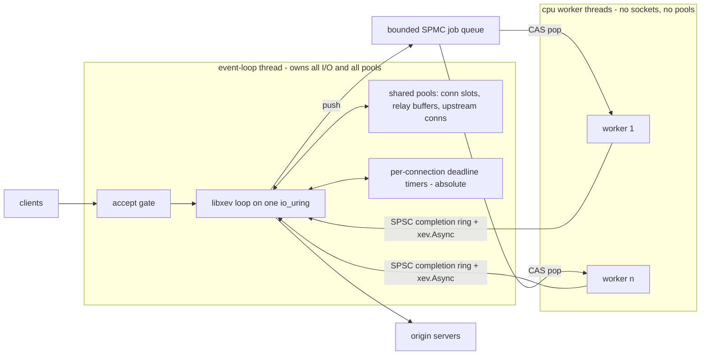

# zoxy — bullet-proof L4/L7 proxy

An L4/L7 proxy in Zig 0.16 in the spirit of Cloudflare's Pingora, with two
hard constraints: **nothing allocates on the hot path** and **exhaustion
sheds load — it never crashes, never queues unboundedly, never allocates.**
Steady-state operation issues zero heap allocations and zero allocating
syscalls; total memory is a startup-time function of the static limits.

Simplicity is prioritized over feature-richness. The coding rules live in
[`docs/TIGER_STYLE.md`](TIGER_STYLE.md). The previous iteration of this
project ([zoxy-io/zoxy@main](https://github.com/zoxy-io/zoxy)) shipped an
L7-only, share-nothing, thread-per-core proxy directly on `io_uring`; its
measured lessons — paid for with implementation time and simulator seeds —
are folded into the relevant sections below as constraints, not
suggestions, and its dead ends are not revisited.

This document is the settled design. Phasing and future work live in
[`PLANS.md`](PLANS.md); measured findings and shelved experiments in
[`IMPLEMENTATION_NOTES.md`](IMPLEMENTATION_NOTES.md).

---

## 1. Goals and non-goals

Goals, in priority order:

1. **Bullet-proof.** No crash, no OOM, no unbounded queue — ever. Every
   resource has a static limit; hitting a limit sheds load at a well-defined
   point with a well-defined answer (§8).
2. **Zero allocation after startup.** All memory is reserved at `init`;
   the serving path allocates nothing. Enforced by a test-time gate, not
   aspired to.
3. **Minimal memory consumption.** Pools are *shared*, sized for concurrent
   *activity*, not for open-connection worst cases multiplied by core count
   (§5). Total memory is a closed-form function of `src/constants.zig`.
4. **Simplicity.** One event loop, one ring, one writer for every pool.
   Fewer moving parts than the previous iteration, not more.
5. **L4 (TCP relay) and L7 (HTTP/1.1 reverse proxy)** serving, with
   keep-alive and shared upstream connection reuse.

Non-goals (deliberate, recorded so they are decisions rather than drift):

- HTTP/2, HTTP/3, gRPC, WebSocket — deferred until the L4/L7 core is proven.
- Feature parity with Envoy/NGINX. Pingora's lesson is that a small, sharp
  proxy core beats a configurable monolith.
- Caching, compression, request transformation.
- Windows/macOS *production* support. Production is Linux + `io_uring`;
  libxev's kqueue backend keeps macOS usable as a dev box only.
- Multi-process orchestration, xDS, hot restart — until operability demands
  them (the previous iteration's Phase-4 machinery is a known-good recipe
  when they do).
- Config reload. Config is parse-once immutable (§5); a change is a
  process restart — consistent with process-per-port scale-out (§3). Hot
  restart / drain-to-successor stays deferred ([PLANS.md](PLANS.md)).
- Dynamic DNS for upstreams. Cluster endpoints are static socket
  addresses resolved once at config load (§7); re-resolution waits for a
  demonstrated need.

## 3. Topology — one loop, one ring, shared pools

The user-visible promise: *one io_uring serves everything; workers exist
only for CPU-heavy jobs; every pool is shared.*



**The decision.** One event-loop thread owns the single `io_uring` (via
libxev) and performs *all* socket I/O: accepts, recvs, sends, connects,
timers. A small, fixed set of CPU worker threads exists only for jobs that
burn milliseconds of CPU (TLS handshakes, when TLS lands in Phase 3); they
never touch a socket, a pool, or the ring. Until Phase 3 the worker set is
empty and the binary is single-threaded.

<details>
  <summary><b>Why this is the simplest topology that satisfies the goals</b></summary>

- **Zero-alloc and single-writer become structural.** Only the loop thread
  acquires and releases pool slots, so pools need no locks, no atomics, no
  cache-line padding on the data path — plain code. The previous iteration
  spent a hardware-counter investigation earning this property; here it
  holds by construction.
- **Minimal memory.** One shared pool sized for the global limit replaces
  N per-core pools each sized for a local worst case. Idle keep-alive
  connections hold a slot and a head buffer, not relay buffers (§5) —
  memory follows *activity*, not connection count.
- **Perfect connection reuse.** Pingora's headline win over NGINX was
  sharing upstream connections across all threads; the previous iteration
  measured this as its single biggest performance lever (~3× req/s), which
  is why the upstream pool here is first-class, not an add-on (§7). With one
  loop, every upstream connection is visible to every request — maximal
  reuse with zero synchronization, better than work-stealing can do.
- **No accept balancing.** One accepting loop distributes nothing, so the
  SO_REUSEPORT small-sample imbalance that plagued the previous iteration
  (hottest worker 23% of connections; H2 made shared accepts mandatory)
  cannot exist.
- **Load shedding has one choke point.** Every admission decision happens
  on one thread with a consistent view of every pool — no cross-worker
  budget splitting, no per-worker limits that sum to surprising totals.

**Why one core is enough (back of the envelope).** A proxy is
network-bound. A relay copies each byte twice through userspace
(recv + send); at 10 GbE line rate (~1.25 GB/s) that is ~2.5 GB/s of memory
traffic against tens of GB/s of per-core bandwidth. At 100 k req/s a
request costs ~4–6 ring ops → ~500 k SQE/s, well inside a single ring's
capability, batched one submit per loop tick. The previous iteration
measured itself latency-bound with CPU headroom on the data path; the only
CPU-heavy work is the TLS handshake (~1–2 ms), which is exactly what the
worker seam is for. **Horizontal scaling is N independent zoxy processes
behind SO_REUSEPORT** — share-nothing at the process boundary, where the
kernel actually isolates — not N loops in one process.

**Why not one ring per worker.** Ring-per-worker with *shared* pools is the
hybrid to avoid: the moment several ring-owning threads acquire/release pool
slots, every pool op needs atomics or locks and the pool headers/free lists
become multi-writer cache lines — the previous iteration measured that exact
class at ~50–60× HITM snoop amplification *within a single socket*. Pingora
pays this cost with Rust async and mutex-guarded pools; in a zero-alloc,
assertion-dense Zig codebase the two coherent designs are
share-nothing-per-core (previous iteration — multiplies memory by core
count) or single-writer-shared (this one). Ring-per-worker also re-imports
the accept-balancing problem, splits shedding budgets per worker (the
previous iteration documented "budget = configured × worker count" as a
wart), and — decisively for §9 — makes execution nondeterministic, demoting
the simulator from replayable proof to stress test.

**NUMA.** A single pinned loop deliberately does not scale across sockets —
scale-out is **process-per-NUMA-node**: N independent zoxy processes, each
pinned to a node with pools faulted node-local, sharing the port via
SO_REUSEPORT (optionally eBPF/`SO_INCOMING_CPU` steering and NIC IRQ
affinity to the same node). That is the *best-case* NUMA topology — zero
cross-node cache traffic, kernel-level fault isolation — whereas in-process
ring-per-worker over shared pools is the *worst* case: pool memory homed on
one node, remote writers paying cross-node HITM on every hot-path op. The
honest cost: upstream connection reuse becomes per-process rather than
global. It stays maximal within each process, and single-node deployments —
the common case — keep the fully global reuse win.

**Worker seam — one shared job queue, not per-worker queues.** Loop →
workers: the **job queue**, one bounded SPMC ring (single producer: the
loop; consumers: workers CAS-pop) of job descriptors — pointers into
the requesting connection's slot, whose scratch memory is part of the slot,
so enqueue allocates nothing. Workers futex-wait on the queue when empty.
Worker → loop: a per-worker SPSC **completion ring** plus one `xev.Async`
to wake the loop (completions stay single-producer/single-consumer, so
that direction needs no CAS). A full job queue is an exhaustion signal
like any other: the job is shed (§8), never blocked on.

The trade study, since Pingora offers both shapes (per-worker queues with
work stealing — the Go/Tokio runtime model — or one shared queue):

- **Work stealing solves a problem we don't have.** Stealing pays off when
  tasks *spawn tasks* on the worker they run on, creating local imbalance
  that must be re-spread. Here every job originates from exactly one
  producer (the loop) and spawns nothing; there is no locality to preserve
  (a handshake job's cache lines live in the connection slot, foreign to
  every worker equally) and nothing to steal back. Stealing would add the
  hardest concurrency artifact in the design (Chase–Lev deques + the
  victim-selection loop) for zero expected benefit.
- **Per-worker SPSC without stealing is simpler but strands work:** the
  loop must pick a worker at enqueue time, and a job pinned behind a slow
  neighbour waits while other workers idle — head-of-line blocking that
  turns into spurious sheds under the very burst (handshake storm) the
  workers exist for. It also splits the exhaustion signal into N queue-full
  conditions, muddying the shed ladder's single-choke-point property.
- **One shared queue is the fit:** jobs are few and coarse (~ms-scale TLS
  handshakes, not µs-scale tasks), so one CAS per pop is noise against the
  job body; idle workers self-balance by construction (exactly the
  behaviour the previous iteration had to *build* as `accept_mode=shared`
  for accepts); and one queue = one depth = one shed rung. The known cost —
  producer/consumer contention on the queue's cache lines — matters at
  millions of tiny ops/s, two orders of magnitude past the handshake rate.
  Determinism (§9) is untouched either way: workers are off the data path
  and virtualized in the simulator.

If profiling ever shows queue contention (it should not at handshake
rates), the escape hatch is per-worker queues *fed round-robin by the
loop* — still no stealing — traded knowingly for the head-of-line cost
above.

</details>

## 4. I/O — libxev behind a thin seam

[libxev](https://github.com/mitchellh/libxev) is a proactor: work is
submitted, completions are called back — the same shape as the previous
iteration's hand-rolled TigerBeetle pattern, and the same shape as
`io_uring` itself.

**Dependency policy: Zig-first only.** The TIGER_STYLE zero-dependency rule
takes its recorded exceptions here, and both are pure Zig, vendored by
content hash in `build.zig.zon`: **libxev** (this section) and **hparse**
(the HTTP/1.1 head parser — as a hardened fork, §7). No C-FFI dependency
exists in the codebase; any future one (a TLS stack is the known
Phase-3 candidate — [PLANS.md](PLANS.md)) is a
separate deliberate decision, not a default. The pinned hash is an
*audited commit*, never a branch tip — libxev's Zig 0.16 support is a
self-described compatibility shim (PR #220) with real fixes still
unmerged behind it, so the pin moves only after re-audit.

- **Caller-owned completions.** Every `xev.Completion` is embedded inline
  in the connection slot; submitting an op writes it in place. Zero
  per-operation allocation — verified property of libxev's io_uring
  backend, and the reason it fits this project at all.
- **Ring sizing is explicit.** `ring_entries` — the SQ — lives in
  `src/constants.zig` (libxev caps entries at 8191, requires a power of
  two). The completion queue is sized *independently* of the SQ through
  the audited fork's `IORING_SETUP_CQSIZE` option (`Options.cq_entries`),
  so it is not tied to the kernel's default 2 × SQ. XevIo requests
  `completionQueueDepthFor` of the *effective* config — a shallow ring
  for a small deployment, up to the kernel maximum (65536) at the c10k
  ceiling — which is exactly what decouples the concurrent-connection
  ceiling from the submission-queue depth (§5, §8). When the kernel SQ is
  full, libxev parks submissions in an intrusive userspace list bounded by
  in-flight completions — which live in pool slots — so the
  no-unbounded-queue rule holds by construction. The in-flight op budget
  that keeps CQ overflow unreachable is part of the startup printout (§8).
  How much of that CQ the in-flight ops may fill is ⅞ by default
  (`cq_fill_eighths_default` — the fill the c10k ceiling is derived at);
  `limits.cq_fill_eighths` lowers it per deployment toward ⅛ to reserve
  more burst headroom, at a lower feasible connection ceiling (§5).
- **Ring setup flags.** The ring is created with `SINGLE_ISSUER`,
  `COOP_TASKRUN`, and `DEFER_TASKRUN`: completion task-work stays on
  the loop thread and is batched at the reap point instead of
  interrupting it. Sound by construction here — the loop thread is the
  only submitter (§3), and the loop always enters the kernel waiting
  (GETEVENTS), which is where deferred task-work is flushed. Kernels
  older than 6.1 reject the flags with EINVAL; startup degrades to a
  plain ring rather than refuse to start. (Measured win:
  `IMPLEMENTATION_NOTES.md`.)
- **Backend selection.** Production: `io_uring` (Linux ≥ 5.11). Dev box:
  kqueue (macOS) — same API, same callbacks, so day-to-day development
  does not need a VM. Correctness claims are only made for Linux.
- **Our own `Io` seam on top, not `std.Io`.** The data path never names
  `xev` directly; it calls `src/io/io.zig`, a comptime-selected facade with
  two backends: `XevIo` (production) and `SimIo` (deterministic
  simulation — virtual sockets, virtual clock, seeded adversarial
  scheduler, §9). The Zig 0.16 std landscape still rules out building this
  on `std.Io` directly — `std.Io.Threaded` allocates per task, the
  evented executor has stubbed networking and offers only work-stealing
  scheduling, and `std.crypto.tls` is client-only — each re-verified
  against the pinned toolchain, not assumed from the previous iteration.
  The seam is thin — accept/recv/send/connect/shutdown/close/timer/async/
  signal, caller-owned completions — deliberately mirroring xev so it
  costs nothing in production. `signal` is how SIGTERM reaches the loop: a
  `sigaction` handler does an async-signal-safe wake (`xev.Async.notify`,
  an eventfd write) and the loop's callback starts the drain (§8) —
  never `loop.stop()`, which does not wake a blocked loop from another
  thread (libxev #173). `SimIo` delivers drain as just another scheduled
  event.
- **The data path never sees a file descriptor.** The seam hands out an
  opaque `Io.Socket` handle; the fd itself never leaves `src/io/`, so a
  direct data syscall from the data path is unrepresentable. This
  matters because libxev's io_uring backend deliberately keeps sockets
  *blocking* (non-blocking fds risk EAGAIN surfacing in completions) —
  a "quick" direct `write` could stall the whole loop. That choice is
  kept: O_NONBLOCK is never set. The control ops the design needs are
  seam methods instead — `setNodelay`, `setLingerRst` (§8's
  accept-and-RST), `shutdown(.both)` (which must bypass
  `xev.TCP.shutdown`, hardcoded to SHUT_WR, for the low-level op) —
  direct non-blocking syscalls in `XevIo`, virtual-socket state changes
  in `SimIo`, so the simulator can witness RST-on-shed and half-close
  (§9). A build-time lint enforces the boundary (§9).
- **TCP_NODELAY always.** Set on every socket via `setNodelay`, no
  config knob. Nagle's algorithm plus delayed ACK cost a warm pooled
  connection a hard 40 ms stall — invisible on a connection's first
  request, measured repeatedly on reused ones in the previous iteration.
- **Run to completion.** Callbacks never suspend (TigerStyle: assertions
  hold across the whole body). Completions are drained in bounded batches
  per loop tick; a callback may enqueue more work but never runs another
  callback inline.
- **Clock.** `Io.now_ns` is refreshed once per loop tick (the previous
  iteration measured per-callback `clock_gettime` at ~3% of data-path CPU)
  and is the seam the simulator's virtual clock replaces. The refresh
  reads the *coarse* monotonic clock — every consumer is a second-scale
  deadline, and the precise read was measured at ~7% of on-CPU
  (`IMPLEMENTATION_NOTES.md`). Anything
  computed from it may be stale by up to one tick's completion batch —
  deadline logic must stay correct under that bound, and the simulator
  makes the staleness adversarial (§9).
- **Deadlines.** One timer per connection holding an *absolute* deadline.
  A state transition only *stores* the new deadline value — the armed op
  is never touched. When the timer fires, the callback compares the
  stored deadline against `Io.now_ns`: not yet due → re-arm for the
  remainder with a fresh submit (libxev's `.rearm` return reuses the
  stale absolute time and is never used); due → the deadline action.
  A timer is canceled in exactly **two** places: teardown (§5 release
  rule) and an L7 dial that re-bases the head-read deadline *down* to the
  tighter connect budget (§8) — the lazy rule moves a deadline later for
  free but must cancel+re-arm to move it earlier. Both drain race-free:
  the cancel op and the timer's own Canceled both land, whichever is last
  re-arms at the stored target, and a teardown that overtakes an in-flight
  re-base drains it through the same `isTearingDown` checks.
  libxev cancellation is internally cancel+resubmit and consumes its own
  caller-owned completion, embedded in the slot like every other op.
- **Plain ops only.** Multishot accept/recv, buffer rings, `send_zc`,
  `splice` stay behind measurement — the previous iteration never became
  CPU-bound without them, and this one is latency-bound with CPU
  headroom. Each has since been evaluated: verdicts and revisit
  conditions live in [`PLANS.md`](PLANS.md), the measurements behind
  them in [`IMPLEMENTATION_NOTES.md`](IMPLEMENTATION_NOTES.md).

## 5. Memory — shared pools, fixed at startup

Every limit is a named constant in `src/constants.zig`; total memory is a
closed-form function of those numbers, printed at startup. Per-worker
reservation — sizing a pool per core for a worst case that never co-occurs
on every core at once — multiplies memory by core count for nothing; the
previous iteration paid that cost, and shared pools sized for concurrent
*activity* rather than worst-case-per-core are the fix and the reason this
iteration exists.

Three shared pools, all owned and touched only by the loop thread:

1. **Connection slots — `Pool(Conn)`.** One contiguous object per
   connection: state machine, embedded completions (one per overlappable
   op — the previous iteration grew a field per proven race — including
   the timer-cancel completion, §4), the deadline timer, and a small
   fixed **head buffer** (L7 request/response heads; idle on L4
   connections, which relay through pool 2 only). Acquired at accept,
   released at teardown once the slot's armed-op set is empty (release
   rule below). Intrusive free list, LIFO reuse for cache warmth.
2. **Relay buffers — `Pool(RelayBuffer)`.** The large per-direction
   buffers for body/stream relaying, *decoupled from connection slots*.
   L7: acquired when a relay starts, **released when the connection goes
   idle on keep-alive** — an idle connection costs a slot + head buffer
   only. L4: acquired at accept, held for the connection's life (a recv
   must always have a buffer posted). This decoupling is where shared
   pools buy their memory win: buffers are sized for concurrent *relays*,
   not for open connections.
3. **Upstream connections — `Pool(Upstream)` + per-endpoint idle lists.**
   Checked out by any request, parked on keep-alive, one shared pool for
   the whole process (§3: the Pingora reuse win). **A parked upstream has
   no armed op** — deliberately no per-connection poll, which would cost
   an in-flight op per idle upstream in the ring budget (§8) for a race
   that is already covered: the parked connection's deadline timer serves
   as an idle timeout (kept below typical origin keep-alive windows, so
   most origin-side closes are pre-empted), a close that slips through is
   detected at checkout and absorbed by the stale-replay rung (§7), and
   active health checks — when they land ([PLANS.md](PLANS.md)) — close
   the parked connections of ejected endpoints.

Sizing shape. The comptime constants are the hard, budget-asserted
*ceilings*; the config `limits` block sizes the *effective* pools anywhere
from 1 up to them. An omitted block takes the lean **defaults**, so the
out-of-box footprint is small (~32 MiB) and an operator opts into more
concurrency — up to the c10k ceiling — through `limits`, never a rebuild.
The fd budget and the requested CQ depth track the effective sizes too
(§4/§8), so a small deployment neither reserves nor demands the ceiling's
resources; only a deployment that configures up toward the ceiling needs
a raised `RLIMIT_NOFILE`:

| pool | default | ceiling (c10k) | unit size |
|---|---|---|---|
| conn slots | 1386 | 11259 | ~1.7 KiB state + 8 KiB head |
| relay buffers | 1386 | 11259 | 2 × 4 KiB |
| upstream slots | 1024 | 1024 | ~40 B state + 8 KiB head |
| **pool memory** | **~32 MiB** | **~203 MiB** | |

Rules:

- **Pools never grow.** Exhaustion is a shed signal (§8), never a realloc.
- **Limit relationships are comptime-asserted** in `src/constants.zig`
  (TIGER_STYLE): e.g. `relay_buffers ≤ conn_slots`,
  `worker_jobs_max ≤ conn_slots`. Note that `relay_buffers` — not conn
  slots — is the true bound on concurrent L4 connections plus active L7
  relays (§6).
- **The CQ fill is a headroom knob, not a pool shrink.**
  `limits.cq_fill_eighths` sets how many eighths of the completion queue
  the worst-case in-flight ops may fill: ⅞ (the default, the fill the c10k
  ceiling is derived at) packs the ring tightest, and lowering it toward ⅛
  reserves more burst headroom at the cost of a lower feasible conn-slot
  ceiling. Unlike the pool sizes it is the one `limits` field that does not
  shrink a pool; a fill whose ring would exceed the compiled one
  (`cqFillFits` false for the chosen conn/upstream slots and listeners) is
  rejected at load, not clamped (§4/§8).
- **The config arena is the only allocating region** — parse-once,
  immutable, shared read-only. (Carried verbatim; it worked.)
- **The config surface has a generated JSON Schema.** `zig build schema`
  reflects over the `*Json` parse structs and their co-located metadata
  (`src/config_schema.zig`) to emit a draft 2020-12 schema — structure,
  `required`, `additionalProperties: false` (the parser is strict), enums,
  and every numeric bound traced back to `src/constants.zig`. It is a
  release-only asset, never committed (so it cannot drift); the emitter's
  tests run under `zig build ci`, and `assert_meta_matches` fails the build
  if a field lacks schema metadata. It intentionally stops at what JSON
  Schema can express: the loader's semantic checks (canonical
  prefixes/hosts, address literals, reserved header names, port ≠ 0) and
  the "exactly one of" forks stay the loader's job, so passing the schema
  means well-shaped, not accepted.
- **A slot is released only when its armed-op set is empty.** Teardown is
  where the races live — a lesson paid for in implementation time and
  simulator seeds last iteration. Every op references a completion
  embedded in the slot, and the slot header tracks which are armed.
  Teardown is a *state*, not an event: shutdown both fds — a pending recv
  never completes otherwise — cancel the timer (§4 — teardown and the §8
  dial re-base are the only cancels), then wait — the
  last terminal completion (success, error, or cancellation) releases
  the slot. An active completion is never resubmitted (libxev's
  intrusive queues corrupt on re-enqueue) — overlapping ops on the same
  connection get their own completions instead of sharing one — and LIFO
  reuse turns a straggler completion landing in a recycled slot into
  memory corruption — so slots carry a generation counter asserted on every
  completion delivery, and the simulator asserts no completion is ever
  delivered to a freed or reused slot (§9).
- **No cross-thread sharing of pool memory.** Workers receive pointers
  into a slot that is *parked* (no data I/O in flight) for the duration
  of the job; ownership transfers through the job queue (loop → worker)
  and that worker's completion ring (worker → loop), one owner at a time.
  **A completion arriving for a parked slot never touches slot memory:**
  the deadline timer stays armed on the loop, and its firing (or any
  straggler completion) only sets a flag in the loop-owned slot header —
  the state machine acts on flags when the job's completion returns
  ownership. Teardown of a parked slot is deferred, never concurrent.

## 6. L4 data path — TCP relay

The minimal proxy, and Phase 0's deliverable:

```
accept → admit (slots? buffers?) → route by listener → connect upstream
       → bidirectional relay → teardown on either EOF/error/deadline
```

- A listener is bound to a cluster in config; no parsing, no inspection.
- Relay buffers (one per direction) are acquired at admission and held
  for the connection's life — a recv must always have a buffer posted —
  so `relay_buffers`, not connection slots, bounds concurrent L4
  connections. The slot's head buffer is not used on the L4 path.
- **Strict `recv → send → recv` per direction over one fixed buffer
  each.** The next chunk is never read until the current one is fully
  written, so a slow side stalls the fast side through TCP flow control
  and per-connection memory is constant regardless of stream size.
  (Carried: stronger than watermark schemes because there is no read-ahead
  to disable.)
- Half-close is honored (`shutdown` propagates FIN); the connection ends
  when both directions have drained or the deadline fires.
- Idle timeout and max-lifetime ride the single deadline timer.

## 7. L7 data path — HTTP/1.1 reverse proxy

Same skeleton as the previous iteration (it was measured sound), simplified
where Pingora's phase model lets us:

```
accept → admit → recv head → parse (zero-copy) → route (host/path → cluster)
       → upstream checkout | connect → send head+body → parse response head
       → framed relay back → park upstream, idle downstream (keep-alive)
```

- **Zero-copy head parser: a hardened fork of
  [hparse](https://github.com/nikneym/hparse)** (pure Zig,
  SIMD-vectorized, never allocates or copies — picohttpparser-shaped
  API; "streaming" means detect-and-retry — partial input re-parses
  from byte 0, bounded by `head_bytes_max`). Upstream is not adoptable
  as-is; the fork must clear a recorded hardening gate before Phase 1
  lands: bounds-check the cursor (upstream dereferences one byte past
  the buffer on partial input — silent UB), accept HTAB in field values
  (RFC 9110), reject bare-LF line terminators (a smuggling ingredient),
  make header-array overflow distinguishable from malformed input (431
  vs 400), and open the closed method enum to extension tokens. The
  fork is vendored by audited commit like every dependency (§4); if
  hardening proves costlier than rewriting, the fallback is our own
  parser behind the same wrapper. It parses into a caller-owned bounded
  header array over the linear head buffer. Oversize request-line →
  414; oversize header field or total head → 431; never grow. hparse
  parses *syntax* only — framing semantics stay ours: the incremental
  chunked decoder and every strictness/smuggling
  check in the next bullet are zoxy code (`src/http/parser.zig` wraps
  hparse and owns them), and hparse's output is fuzzed *through* that
  wrapper (§9), so the trust boundary sits at our validation, not the
  dependency's.
- **Both directions framed** (RFC 9112 §6.3). Smuggling shapes (TE+CL,
  duplicate/garbage Content-Length) → 400 before any byte reaches an
  upstream. `Upgrade` → 501 (non-goal). Hop-by-hop headers stripped both
  ways; `Connection: close` injected when the proxy will close — announced,
  not silent, or a client pipelines into the close and reads the reset as
  an error instead of a clean end.
- **Path routing on the canonical path only** (settled 2026-07-19). An
  `http` listener maps the request path to a cluster through a
  per-listener longest-prefix route table (`"routes": [{ "prefix":
  "/api", "cluster": "api" }, …]`; the existing `"cluster"` field stays
  as sugar for a single catch-all route). The table is resolved at
  config load into an immutable arena table sorted longest-prefix-first
  — matching is a bounded linear scan, never an allocation — and
  `routes_max` caps it. No route matches → static `404` (§8). Matching
  consults only the **canonical path**, computed once in the trust
  boundary: the query splits off untouched (opaque to the proxy,
  forwarded verbatim); unreserved percent-escapes (RFC 3986 §2.3) are
  decoded and surviving escapes' hex uppercased; then dot-segments are
  collapsed. Structure-changing escapes are rejected as 400 — encoded
  slash (`%2F`), NUL (`%00`), truncated or non-hex escapes — and so is
  a path that climbs above the root. Duplicate slashes are preserved:
  `//a` names a different resource than `/a`, and consistency, not
  merging, is what makes it safe. The rendered upstream request line
  carries that same canonical path, so the router and the origin cannot
  disagree about which resource a request names — the `/api/../admin`
  confusion class dies structurally, not by backend convention.
- **Host is the route table's outer dimension** (settled 2026-07-20).
  A route gains an optional `host` (`{ "host": "api.example.com",
  "prefix": "/v2", "cluster": "v2" }`); a route with no `host` matches
  any host, exactly as today. Matching filters to the routes whose host
  equals the request's — falling back to the any-host routes when none
  does — then takes the longest prefix within that set, so a
  host-specific route always beats an any-host route and `host + path`
  composes without a second routing pass. This is the nginx `server` /
  Envoy `virtual_host` nesting (host contains routes), *not* a parallel
  host-picks-cluster path: **cluster selection is the route table's
  alone**, so there is one precedence rule to reason about. Host is
  matched on its **canonical form** — lowercased and port-stripped (RFC
  9110 §4.2.3 makes `Host` case-insensitive, and the authority's port is
  not part of the routing name) — computed once in the trust boundary
  like the path. Unlike the path, the `Host` header is **forwarded
  verbatim**: an origin virtual-host may legitimately be case- or
  port-sensitive, and the proxy has no per-origin knowledge to justify
  rewriting it — the canonical form is a routing *key*, not a
  replacement. A request with no `Host` (legal in HTTP/1.0) or an empty
  one matches only the any-host routes; config hosts must themselves be
  canonical (rejected at load otherwise), so a request host compares
  byte-for-byte against them.
- **Early responses are legal.** An origin may answer before the request
  body finishes (RFC 9110 — e.g. 413 mid-upload): the response head is
  forwarded when it arrives, and the remaining request body is drained or
  the upstream closed per its framing. The state machine plans for this
  from the start instead of assuming strict request-then-response.
- **Phases, Pingora-style but compile-time.** The request lifecycle
  exposes fixed extension points — `admit`, `route`, `upstream_pick`,
  `settle` — as plain function calls, one module per concern: admission
  in `Server.zig`, path → cluster in `http/router.zig`, endpoint pick
  in `balancer.zig`, settlement in `http/proxy.zig`. (Phase 0 sketched
  these as a single `phases.zig`; they materialized as separate seams,
  which is the same design with better boundaries.) Not a runtime
  filter chain: programmability is added by extending the owning module
  at compile time; the proxy core stays generic and small.
- **Configurable filters/rules: filters are data, not code.**
  Zero-alloc extensibility means no plugins,
  no closures, no dynamic dispatch chains — instead, a rule is *compiled
  at config time* into bounded, immutable tables in the config arena
  (match programs over method/host/path/header slices; action lists drawn
  from a closed enum: reject-with-status, add/remove/set header, rewrite
  path prefix), each with a static limit
  (`rules_per_route_max`, `actions_per_rule_max`, `header_edits_max`).
  Cluster selection is deliberately *not* a filter action: the route
  table (host + path) is the single mechanism that decides which backend
  serves a request, so there is one precedence rule, not two engines
  competing.
  At request time the phase points *interpret* those tables against the
  parsed head — bounded loops over arena data, zero-copy matches on head-
  buffer slices. Mutations never edit the head buffer in place: the
  upstream head is *rendered* (already required for hop-by-hop stripping
  and `Connection` injection), so header edits are applied during
  rendering into the same fixed staging area, and a head that no longer
  fits after edits → 431. A path rewrite changes *only what is forwarded*:
  routing already chose the cluster from the original canonical path, so a
  rewrite never re-routes and never chains (first-applicable rule wins, like
  the reject verdict — a later rule matches the original path, not the
  rewritten one). Both prefixes are validated canonical at load and the
  replacement is a *segment-correct* join (stripping a prefix to root gives
  `/x`, not the distinct resource `//x`), so the forwarded path is canonical
  by construction. Evaluation cost is bounded and load-shed like
  everything else. This is nginx/HAProxy's config-rule model, not Envoy's
  runtime filter chain — WASM/scripting is explicitly out (an interpreter
  with unbounded fuel or an embedded allocator cannot satisfy the gate);
  anything beyond the closed action enum is a Zig function added to the
  owning phase module at compile time.
- **Resilience is minimal by design:** per-request and per-try deadlines
  (head-read gets its own deadline, so a slowloris meets the clock or
  `head_bytes_max`, whichever comes first; each dial — the first try and
  the replay's — runs under its own connect deadline); one free replay
  of a request that hit a stale pooled connection — only when the
  connection was a *reused* checkout, no response byte was received, and
  the request leg never entered the body pump, so the whole try still
  sits byte-reconstructible in the head buffer. "May have begun
  processing" is settled as "a response byte arrived or relay chunks
  flowed" — the standard replaying-proxy reading (Go/nginx/HAProxy),
  applied to non-idempotent methods too: a send that landed in the
  kernel buffer of an already-FIN'd parked connection replays, because
  the FIN-before-checkout race is overwhelmingly the real cause. The
  replay is spent before its try begins (no loop) and always dials
  fresh — the endpoint's whole idle list may be stale the same way. The
  endpoint pick is per-cluster config: `p2c` (two uniform candidates
  from a fixed-seed PRNG, the lower leased count wins) by default, `rr`
  for strict rotation. Cluster endpoints are static socket addresses
  resolved once at config load, never on the loop (dynamic DNS is a
  non-goal, §1). Circuit breakers, outlier ejection, retry budgets,
  health checks are *deferred* — the previous iteration proved them
  buildable in this architecture; simplicity says they wait for a
  demonstrated need.

## 8. Load shedding — the exhaustion ladder

The defining behavior: **when a resource is exhausted, zoxy degrades the
newest work, keeps serving admitted work, and never allocates, blocks, or
dies.** Every ladder rung is a static decision at a single choke point on
the loop thread.

| resource exhausted | detected at | shed action |
|---|---|---|
| connection slots | accept completion | close immediately (SO_LINGER 0 → RST); accept stays armed |
| relay buffers (L4) | accept admission | close immediately |
| relay buffers (L7) | request admission on a kept-alive conn | static `503` from the head buffer, then keep or close per pressure |
| upstream slots / dial concurrency | upstream checkout | static `503` (L7) / close (L4) |
| worker job queue | job enqueue | shed the job's connection (TLS handshake → close) |
| request deadline | timer completion | `504` if no response byte was sent — a timed-out dial included; teardown once a response byte is on the wire or the stall is the client's own body |
| kernel memory pressure (ENOBUFS/ENOMEM from ring) | any completion | treat as that op's failure → teardown that connection; counter |

- **Static error responses.** `400`/`404`/`414`/`431`/`501`/`503`/`504`
  are comptime byte arrays sent directly from static memory — never
  staged through
  the connection's head buffer, whose bytes the parsed head's zero-copy
  slices may still reference (§7). Shedding costs one send, no
  allocation, no copy.
- **Accept never pauses.** Accept-and-RST is preferred over un-arming the
  accept: the kernel backlog stays drained, clients get an immediate
  signal instead of a timeout, and there is no re-arm state machine.
  The one exception is an accept that *fails* with a kernel-pressure
  error (ENFILE-class): there is no socket to shed and the failed
  connection stays in the backlog, so an immediate re-arm would complete
  instantly with the same error — a tight spin. That path re-arms after
  a short backoff (`accept_retry_delay_ms`).
- **Watermarks before walls.** Each pool flips a `pressure` flag at its
  high watermark (ceil 3/4, released at floor 1/2 — hysteresis), one
  rule for all three: *relay-buffer* and *conn-slot* pressure are
  downstream pressure — the idle timeout divides, so idle downstream
  connections return the buffers and slots they pin. *Relay-buffer*
  pressure alone also stops honoring keep-alive, because the next
  request on a kept-alive connection claims a relay buffer. Conn-slot
  pressure never suppresses keep-alive: a conn pool held by serving
  connections is the steady state of a keep-alive workload, and closing
  them churns the whole population into synchronized reconnect waves
  (measured — IMPLEMENTATION_NOTES.md "Occupancy is not overload");
  slot scarcity is answered by the idle division and the admit-time
  RST wall, the same norm nginx and haproxy follow. *Upstream-pool*
  pressure shortens parked-connection deadlines (and the sweep
  interval), reaping idle parked sockets so their slots free for fresh
  dials. Each bias sheds *idle* capacity before the wall must shed
  *work*; each engage crossing has a counter.
- **Metrics witness every shed.** Every rung has a counter, written only
  by the loop thread as a relaxed atomic — one writer, any number of
  readers, so a metrics/admin thread can read without a data race and
  single-writer stays intact. The simulator asserts counters reconcile
  (admitted = completed + shed + in-flight) under every seed. Counters
  live in `counters.zig` (§10); Phase 0 exposure is a SIGUSR1-triggered
  dump (through the seam's `signal` primitive, §4) — the admin plane
  stays deferred ([PLANS.md](PLANS.md)).
- **File descriptors are pre-budgeted, not shed.** The fd count is
  closed-form — listeners + connection slots + upstream slots + ring,
  async and signal fds — evaluated on the *effective* config
  (`fdsRequired`, so a lean deployment demands only what it uses) and
  asserted against `RLIMIT_NOFILE` at startup, next to the memory
  printout, so `EMFILE` is unreachable rather than a ladder rung.
- **The ring is pre-budgeted, not shed.** The in-flight op count is
  closed-form — per-connection ops (bounded by the strict relay
  discipline) × conn slots + parked upstreams + timers — evaluated on the
  effective config, printed at startup next to the memory and fd budgets,
  and made to fit the completion queue the ring was set up with
  (`completionQueueDepthFor` of the same effective config, §4), so CQ
  overflow — kernel-side NODROP buffering, an allocating path — is
  unreachable rather than a ladder rung. libxev surfacing
  `error.CompletionQueueOvercommitted` is therefore an invariant
  violation (assert), not load.

**Drain, not just death.** SIGTERM (delivered through the seam's
`signal` primitive, §4) → close listeners (stop accepting),
stop honoring downstream keep-alive (`Connection: close` injection), let
admitted work finish under one drain deadline (`drain_deadline_ms`), then
tear down stragglers and exit. Drain reuses the pressure machinery — it
is maximum pressure — and the zero-alloc gate runs it (§9).

## 9. Testing — required from day 0

The deterministic-simulation seam is the single highest-leverage testing
decision the previous iteration made: the data path is written against an
`Io` facade from the first commit (§4) so a seeded, adversarial,
virtual-socket backend can run the *real* code, not a mock of it. All four
gates exist as `build.zig` steps from the first commit; a
feature without its gate is not done. The three deterministic gates
(simulation, fuzz, zero-alloc) plus the fd-boundary lint run on every
change as `zig build ci`. The benchmark gate (Tier 1) is **run at
merge, not on every change**: its verdict is a *band comparison across
runs* (§Tier 1 below), which a single shared-runner pass cannot make —
so `zig build bench` is invoked deliberately against a real origin, and
its hard invariants (flat RSS, clean drain, sub-1% socket-error rate)
are the pass/fail part. `zig build ci` deliberately excludes it.

1. **Deterministic simulation — `zig build sim -- [seed] [iterations]`.**
   The `SimIo` backend (§4) runs the real data path against virtual
   sockets and a virtual clock under a seeded adversarial scheduler:
   partial reads/writes down to 1 byte, delayed/refused/black-holed
   connects, resets at every point in every exchange, misbehaving origins.
   Mixed L4 and L7 clients share one server. L4 clients carry a token
   echoed into the body and verified byte-exact. L7 clients run HTTP
   request scripts — the valid shapes, the §7 reject shapes, and the
   keep-alive/pipelined/silent patterns — against scripted origins
   (sized, chunked, until-close, truncated, reset, mute, and instant
   origins that answer before the request finishes), and every byte they
   receive must be a prefix of a legal transcript. A quarter of seeds run
   clean — adversary off, origin well-behaved — hardening the L7 oracle
   from prefix-legality to each script's exact golden outcome, so a
   silently torn-down exchange that should have been answered fails the
   seed instead of passing as a cut. The origins are oracles too: no
   malformed byte (§7) ever reaches one. Invariants per seed: no slot
   leaks (all pools drain to
   zero), no deadlock, counters reconcile, every shed is witnessed, no
   completion is delivered to a freed or reused slot (slot generations
   checked on every delivery, §5), and no loop-side write ever lands in
   a parked slot's scratch (the scheduler deliberately fires deadlines
   while worker jobs are in flight, §5). A failure prints its seed; the same seed replays the
   exact schedule.
   `zig build sim -- fuzz` runs forever on entropy-derived seeds.
2. **Fuzzing — `zig build test --fuzz`.** `std.testing.fuzz` on every
   parser edge: HTTP/1.1 head parser, chunked decoder, config parser.
   Assertion: never panic, never overrun a bound, reject-or-parse with no
   third outcome.
3. **Benchmarks — [zrk](https://github.com/floatdrop/zrk), three tiers.**
   The load generator is zrk — a pure-Zig wrk2 rewrite: *constant-throughput*
   (open-loop) pacing with coordinated-omission-corrected HdrHistogram
   latency, so a stalling proxy accrues the stall instead of hiding it.
   h2load returns only if/when HTTP/2 does.
   - **Tier 0 (micro, decision tool) —
     [poop](https://github.com/andrewrk/poop) over `bench/micro/`.**
     Standalone binaries exercising one hot function each (parser wrapper,
     pool acquire/release, relay chunking) in a fixed loop; poop A/Bs two
     builds on hardware counters — cycles, instructions, cache and branch
     misses — the "counters, not vibes" instrument the previous iteration's
     HITM investigation proved necessary. Exists from day 0 so every
     hot-path alternative is decided by measurement; **not a CI gate**
     (counter deltas on shared runners are noise) — the Tier-1 band is
     what merges are held to. hyperfine is not used: wall-time-only, and
     poop subsumes it on Linux.
   - **Tier 1 (merge gate, run on demand) — `bench/run.zig`, loopback.**
     (Tooling in Zig, per TIGER_STYLE — no shell harness.) nginx origin
     (or `--origin host:port`), direct baseline vs proxied path (L4 and
     L7, keep-alive and `Connection: close`), roles pinned to disjoint
     cores. Compare *bands* across runs, never single numbers (p50 swings
     3× between identical back-to-back runs) — which is why this is not a
     blind per-change CI step. A PR that regresses the band explains
     itself or does not merge. The run's *hard* invariants are machine-
     checked and exit non-zero: flat RSS (the zero-alloc promise from
     outside), a clean SIGTERM drain, and a sub-1% proxied socket-error
     rate.
   - **Tier 2 (comparison, on demand) — same harness + HAProxy.** The dev
     shell provides `haproxy` as a Nix package; the script runs the
     identical scenario through it on the same pinned cores. No
     docker-compose: bridge/veth networking adds virtualization overhead
     to exactly the thing being measured, and Nix already gives
     reproducible binaries. Envoy/Traefik/Caddy comparisons stay out of
     the repo.
   - **Tier 3 (headline numbers) —
     [zoxy-io/benchmark](https://github.com/zoxy-io/benchmark).** The
     multi-host cloud fleet (disjoint hosts, saturation self-checks,
     HAProxy/Envoy/Traefik/Caddy). Run per release, never per PR.

4. **Zero-alloc gate.** The full serving path — including a drain — runs
   in tests under a failing/counting allocator; baseline allocation count
   must equal the final count. Steady state also asserts zero allocating
   syscalls (no mmap/brk after init) via counters.

Alongside the gates, a build-time lint asserts the fd boundary of §4:
`std.posix`/`os.linux` may be named only under `src/io/`, with an
explicit allowlist for `main.zig` startup work (the `RLIMIT_NOFILE`
assert, `sigaction`). Cheap, and it turns "no direct syscalls on the
data path" from prose into CI.

## 10. Module map (target)

```
src/
  main.zig            // startup: config → reserve pools → print memory → run loop
  Server.zig          // composition root: pools, listeners, admission, teardown;
                      // generic over Io so the simulator instantiates it whole
  constants.zig       // every static limit; total memory is f(these)
  config.zig          // strict JSON → arena-owned immutable Config
  io/
    io.zig            // the seam: comptime backend select
    XevIo.zig         // production: libxev (io_uring / kqueue)
    SimIo.zig         // simulation: virtual sockets + clock + adversary
  mem/
    Pool.zig          // Pool(T): startup alloc, intrusive free list
  net/
    Conn.zig          // connection slot: state, completions, head buffer
    relay.zig         // strict recv→send→recv relay (L4 + L7 bodies)
    upstream.zig      // shared upstream pool + endpoint idle lists
  http/
    parser.zig        // hparse wrapper: strictness + framing + chunked decoder
    render.zig        // §7 head rendering: hop-by-hop strip + close injection
    router.zig        // §7 path routing: canonical-path longest-prefix table
    proxy.zig         // L7 state machine over phases
  balancer.zig        // upstream endpoint pick: per-cluster rr | p2c (§7)
  shed.zig            // exhaustion ladder: decisions + static responses
  counters.zig        // per-rung counters: loop-written, relaxed-atomic reads
  worker.zig          // SPMC job queue + SPSC completion rings (Phase 3)
sim/                  // simulator harness + invariants
bench/                // micro benches (poop) + loopback harness (zrk), §9
```

## 11. Key references

- [libxev](https://github.com/mitchellh/libxev) — proactor event loop,
  io_uring/kqueue backends, caller-owned completions.
- Cloudflare, [How we built Pingora](https://blog.cloudflare.com/how-we-built-pingora-the-proxy-that-connects-cloudflare-to-the-internet/)
  and [pingora-proxy phases](https://github.com/cloudflare/pingora/blob/main/docs/user_guide/phase.md)
  — connection sharing across threads, the request-phase model.
- TigerBeetle [TIGER_STYLE](https://github.com/tigerbeetle/tigerbeetle/blob/main/docs/TIGER_STYLE.md)
  and [A Database Without Dynamic Memory](https://tigerbeetle.com/blog/a-database-without-dynamic-memory)
  — static allocation and deterministic simulation discipline.
- [hparse](https://github.com/nikneym/hparse) — pure-Zig SIMD HTTP/1.1
  head parser (zero-alloc, zero-copy); adopted as a hardened fork
  behind the recorded gate in §7.
- [zrk](https://github.com/floatdrop/zrk) — pure-Zig constant-throughput
  load generator (wrk2 model, coordinated-omission-corrected); the bench
  driver. [zoxy-io/benchmark](https://github.com/zoxy-io/benchmark) — the
  multi-host comparison fleet (Tier 3).
- [RFC 9112](https://www.rfc-editor.org/rfc/rfc9112) — HTTP/1.1 framing
  (§6.3) and close announcement (§9.6).
