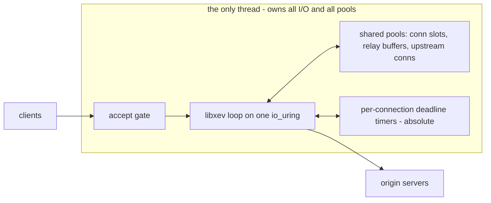

# zoxy — bullet-proof L4/L7 proxy

An L4/L7 proxy in Zig 0.16 in the spirit of Cloudflare's Pingora, with two
hard constraints: **nothing allocates on the hot path** and **exhaustion
sheds load — it never crashes, never queues unboundedly, never allocates.**
Steady-state operation issues zero heap allocations and zero allocating
syscalls; zoxy's own memory is a startup-time function of the static
limits (the kernel's per-socket buffers are outside that form — §5).

Simplicity is prioritized over feature-richness. The coding rules live in
[`docs/TIGER_STYLE.md`](TIGER_STYLE.md). The previous iteration of this
project ([zoxy-io/zoxy@main](https://github.com/zoxy-io/zoxy)) shipped an
L7-only, share-nothing, thread-per-core proxy directly on `io_uring`; its
measured lessons — paid for with implementation time and simulator seeds —
are folded into the relevant sections below as constraints, not
suggestions, and its dead ends are not revisited.

This document is the settled design — what is shipped and how it works.
Planned features are tracked as GitHub issues; measured findings, shelved
experiments, and open technical questions live in
[`IMPLEMENTATION_NOTES.md`](IMPLEMENTATION_NOTES.md).

---

## 1. Goals and non-goals

Goals, in priority order:

1. **Bullet-proof.** No crash, no OOM, no unbounded queue — ever. Every
   resource has a static limit; hitting a limit sheds load at a well-defined
   point with a well-defined answer (§8).
2. **Zero allocation after startup.** All memory is reserved at `init`;
   the serving path allocates nothing. Enforced by a test-time gate, not
   aspired to.
3. **Minimal memory consumption.** Pools are *shared*, sized for concurrent
   *activity*, not for open-connection worst cases multiplied by core count
   (§5). Pool memory is a closed-form function of `src/constants.zig`
   (kernel socket buffers are outside it — §5).
4. **Simplicity.** One thread, one event loop, one ring, one writer for
   every pool — no worker threads, no cross-thread queues (§3). Fewer
   moving parts than the previous iteration, not more.
5. **L4 (TCP relay) and L7 (HTTP/1.1 reverse proxy)** serving, with
   keep-alive and shared upstream connection reuse.

Non-goals (deliberate, recorded so they are decisions rather than drift):

- HTTP/2, HTTP/3, gRPC — deferred until the L4/L7 core is proven. WebSocket
  was deferred on the same line and is not any more (#180, §7): the
  condition was met, and carrying it needs no new I/O machinery — a
  tunnel is the L4 relay this proxy already runs, entered from an L7
  exchange. What it does need is its own resource model, which is why it
  is a §5 pool rather than a §7 detail.
- Feature parity with Envoy/NGINX. Pingora's lesson is that a small, sharp
  proxy core beats a configurable monolith.
- Caching, compression, request transformation.
- Windows/macOS *production* support. Production is Linux + `io_uring`;
  libxev's kqueue backend keeps macOS usable as a dev box only.
- Multi-process orchestration, xDS, hot restart — until operability demands
  them (the previous iteration's Phase-4 machinery is a known-good recipe
  when they do).
- **In-process worker threads and cross-thread job queues.** The design
  reserved a CPU-worker seam for TLS handshakes; measurement retired it
  (§3, settled 2026-07-25) and it is deleted, not dormant. The binary is
  single-threaded and CPU scale-out is process-per-core behind
  SO_REUSEPORT. Re-adding threads is a from-scratch decision behind a
  measured gate, not un-commenting a seam.
- Config reload. Config is parse-once immutable (§5); a change is a
  process restart — consistent with process-per-port scale-out (§3). Hot
  restart / drain-to-successor is out of scope for the same reason.
  SIGHUP is therefore free for the conventional log-rotation meaning and
  carries only that (§8): reopen the access log's file sink.
- Dynamic DNS for upstreams. Cluster endpoints are static socket
  addresses resolved once at config load (§7); re-resolution waits for a
  demonstrated need.

## 3. Topology — one thread, one loop, one ring, shared pools

The user-visible promise: *one thread owns one io_uring and every pool;
nothing else runs.*


```mermaid
flowchart LR
    subgraph loop_thread [the only thread - owns all I/O and all pools]
        A[accept gate] --> L[libxev loop on one io_uring]
        L <--> P[shared pools: conn slots, relay buffers, upstream conns]
        L <--> T[per-connection deadline timers - absolute]
    end
    C[clients] --> A
    L --> O[origin servers]
```

**The decision.** One event-loop thread owns the single `io_uring` (via
libxev) and performs *all* socket I/O — accepts, recvs, sends, connects,
timers — and *all* CPU work, TLS handshakes included. There are no other
threads: no worker pool, no job queue, no cross-thread completion rings.
The design reserved that seam for TLS handshakes on a ~1–2 ms
per-handshake estimate; that was an RSA number, so RSA server certs are
excluded by policy (ECDSA only) and measurement retired the seam
(settled 2026-07-25, IMPLEMENTATION_NOTES.md): a full ECDSA handshake is
~100–400 µs of asymmetric crypto, and a terminated L7-over-TLS hop
measured at HAProxy parity on steady-state keep-alive load — ~20k req/s,
p50 110–122 µs against its 101–105 µs, one core each, same fixture
certificate and origin. Handshake-heavy load has a lower ceiling that is
measurably *not* a CPU wall: it scales with connection count, so what
binds is a per-connection stall — since identified as a Nagle/delayed-ACK
deadlock, fix pending (IMPLEMENTATION_NOTES.md) — which no amount of
threading would remove. Where handshake CPU does eventually bind, the
levers are session resumption (µs-class for returning clients) and then
more cores — which this design buys as **N independent processes behind
SO_REUSEPORT**, never as threads sharing pool memory. Single-threaded is
a property of the design, not a phase of it; should a workload ever
demand in-process parallelism, that re-entry is a from-scratch decision,
not a resumed one.

<details>
  <summary><b>Why this is the simplest topology that satisfies the goals</b></summary>

- **Zero-alloc and single-writer become structural.** Only the loop thread
  acquires and releases pool slots, so pools need no locks, no atomics, no
  cache-line padding on the data path — plain code. The previous iteration
  spent a hardware-counter investigation earning this property; here it
  holds by construction — there is no second thread that could violate it.
- **Minimal memory.** One shared pool sized for the global limit replaces
  N per-core pools each sized for a local worst case. Idle keep-alive
  connections hold a slot — no relay buffers, no head buffer (§5) —
  memory follows *activity*, not connection count.
- **Perfect connection reuse.** Pingora's headline win over NGINX was
  sharing upstream connections across all threads; the previous iteration
  measured this as its single biggest performance lever (~3× req/s), which
  is why the upstream pool here is first-class, not an add-on (§7). With one
  loop, every upstream connection is visible to every request — maximal
  reuse with zero synchronization, better than work-stealing can do.
- **No accept balancing.** One accepting loop distributes nothing, so the
  SO_REUSEPORT small-sample imbalance that plagued the previous iteration
  (hottest worker 23% of connections; H2 made shared accepts mandatory)
  cannot exist.
- **Load shedding has one choke point.** Every admission decision happens
  on one thread with a consistent view of every pool — no cross-worker
  budget splitting, no per-worker limits that sum to surprising totals.

**Why one core is enough (back of the envelope).** A proxy is
network-bound. A relay copies each byte twice through userspace
(recv + send); at 10 GbE line rate (~1.25 GB/s) that is ~2.5 GB/s of memory
traffic against tens of GB/s of per-core bandwidth. At 100 k req/s a
request costs ~4–6 ring ops → ~500 k SQE/s, well inside a single ring's
capability, batched one submit per loop tick. The previous iteration
measured itself latency-bound with CPU headroom on the data path; the
only CPU-heavy work is the TLS handshake, measured at ~100–400 µs of
crypto with ECDSA certs and at HAProxy parity through the whole
terminated hop in steady state (IMPLEMENTATION_NOTES.md, which also
records the per-connection handshake stall that is *not* CPU — mechanism
identified, fix pending). The loop absorbs it in steps between completions, and the
worst single uninterruptible step — ~275 µs of P-256 sign — is what
bounds tick inflation. **Horizontal
scaling is N independent zoxy processes behind SO_REUSEPORT** —
share-nothing at the process boundary, where the kernel actually
isolates — not N loops, and not N worker threads, in one process.

**Why not one ring per worker.** Ring-per-worker with *shared* pools is the
hybrid to avoid: the moment several ring-owning threads acquire/release pool
slots, every pool op needs atomics or locks and the pool headers/free lists
become multi-writer cache lines — the previous iteration measured that exact
class at ~50–60× HITM snoop amplification *within a single socket*. Pingora
pays this cost with Rust async and mutex-guarded pools; in a zero-alloc,
assertion-dense Zig codebase the two coherent designs are
share-nothing-per-core (previous iteration — multiplies memory by core
count) or single-writer-shared (this one). Ring-per-worker also re-imports
the accept-balancing problem, splits shedding budgets per worker (the
previous iteration documented "budget = configured × worker count" as a
wart), and — decisively for §9 — makes execution nondeterministic, demoting
the simulator from replayable proof to stress test.

**NUMA.** A single pinned loop deliberately does not scale across sockets —
scale-out is **process-per-NUMA-node**: N independent zoxy processes, each
pinned to a node with pools faulted node-local, sharing the port via
SO_REUSEPORT (optionally eBPF/`SO_INCOMING_CPU` steering and NIC IRQ
affinity to the same node). That is the *best-case* NUMA topology — zero
cross-node cache traffic, kernel-level fault isolation — whereas in-process
ring-per-worker over shared pools is the *worst* case: pool memory homed on
one node, remote writers paying cross-node HITM on every hot-path op. The
honest cost: upstream connection reuse becomes per-process rather than
global. It stays maximal within each process, and single-node deployments —
the common case — keep the fully global reuse win.

**Why no CPU worker threads.** This section used to specify a worker
seam: one bounded SPMC job queue, per-worker SPSC completion rings, an
`xev.Async` wake, and the parked-slot ownership rules that went with it
in §5. It existed for exactly one workload — TLS handshakes — and the
TLS handshake measurements (above) took that workload away, so the seam
is **deleted, not kept dormant.** A dormant design is not free: it leaves
ownership rules in §5, a rung in §8, and a module in §10 that no code
exercises and no gate proves, and every later change has to stay
compatible with a mechanism that may never exist. What replaces it is
policy: the binary has one thread, and CPU scale-out is process-per-core
(above). The honest cost is that a sustained handshake storm cannot
borrow an idle core in-process — the answers there are resumption first,
more processes second, and neither needs a shared-memory concurrency
model. The retired trade study (one shared queue vs per-worker queues vs
work stealing, and why stealing solves a problem this design does not
have) is in git history; re-adding threads means re-deriving it against
the measurement that retired it (above).

</details>

## 4. I/O — libxev behind a thin seam

[libxev](https://github.com/mitchellh/libxev) is a proactor: work is
submitted, completions are called back — the same shape as the previous
iteration's hand-rolled TigerBeetle pattern, and the same shape as
`io_uring` itself.

**Dependency policy: Zig-first, with a scoped C exception for proven
crypto primitives.** The TIGER_STYLE zero-dependency rule takes its
recorded exceptions here, all vendored by content hash in `build.zig.zon`
as zoxy-io forks: **libxev** (this section), **hparse** (the HTTP/1.1 head
parser — as a hardened fork, §7), and **zssl** (the TLS 1.3 engine, below).
libxev and hparse are pure Zig. zssl carries the codebase's one C surface,
and takes the deliberate decision this section reserved: **battle-tested C
crypto *primitive* libraries — the libcrypto family (OpenSSL / AWS-LC /
BoringSSL) — are acceptable dependencies.** The trust split runs the right
way round: constant-time primitives want the most-watched assembly on
earth, while the protocol state machine — where TLS CVEs actually live —
stays auditable Zig behind our own wrapper.

The scope is strict. Primitives only, never a C *protocol* layer (libssl
and picotls stay out). The C binding lives inside the dependency, so
zoxy's own tree never names a C symbol and `@cImport` stays lint-forbidden
(§9) — a second C surface opened here would not be behind anyone's audited
Zig. libcrypto's internal allocations are routed to a fixed startup arena
(`CRYPTO_set_mem_functions`) so §5's zero-allocation gate keeps its teeth.
What does *not* backstop this surface, deliberately, is Zig's C
undefined-behaviour sanitizer: libcrypto is built with `sanitize_c` off in
every mode (build.zig). Left on, ReleaseSafe compiles ~17000 trap sites
into it, and the one OpenSSL cannot satisfy — an indirect call through a
cast function pointer, the idiom `OPENSSL_sk_pop_free` has always used —
killed v0.6.0 at key load (#283). Every other libcrypto on earth is built
without it too, which is the point of trusting these primitives
institutionally rather than instrumenting them; the safety this surface
does get is the audited Zig above it, the fixed heap beside it, and §9's
`smoke-release` running the mode that ships.
And the pinned hash is an *audited commit*, never a branch tip — libxev's
Zig 0.16 support is a self-described compatibility shim (PR #220) with
real fixes still unmerged behind it — so a pin moves only after re-audit;
for zssl that audit means the Zig protocol layer read line by line, the C
primitives trusted institutionally.

- **Caller-owned completions.** Every `xev.Completion` is embedded inline
  in the connection slot; submitting an op writes it in place. Zero
  per-operation allocation — verified property of libxev's io_uring
  backend, and the reason it fits this project at all.
- **Ring sizing is explicit.** `ring_entries` — the SQ — lives in
  `src/constants.zig` (libxev caps entries at 8191, requires a power of
  two). The completion queue is sized *independently* of the SQ through
  the audited fork's `IORING_SETUP_CQSIZE` option (`Options.cq_entries`),
  so it is not tied to the kernel's default 2 × SQ. XevIo requests
  `completionQueueDepthFor` of the *effective* config — a shallow ring
  for a small deployment, up to the kernel maximum (65536) at the c10k
  ceiling — which is exactly what decouples the concurrent-connection
  ceiling from the submission-queue depth (§5, §8). When the kernel SQ is
  full, libxev parks submissions in an intrusive userspace list bounded by
  in-flight completions — which live in pool slots — so the
  no-unbounded-queue rule holds by construction. The in-flight op budget
  that keeps CQ overflow unreachable is part of the startup printout (§8).
  How much of that CQ the in-flight ops may fill is ⅞ by default
  (`cq_fill_eighths_default` — the fill the c10k ceiling is derived at);
  `limits.cq_fill_eighths` lowers it per deployment toward ⅛ to reserve
  more burst headroom, at a lower feasible connection ceiling (§5).
- **Ring setup flags.** The ring is created with `SINGLE_ISSUER`,
  `COOP_TASKRUN`, and `DEFER_TASKRUN`: completion task-work stays on
  the loop thread and is batched at the reap point instead of
  interrupting it. Sound by construction here — the loop thread is the
  only submitter (§3), and the loop always enters the kernel waiting
  (GETEVENTS), which is where deferred task-work is flushed. Kernels
  older than 6.1 reject the flags with EINVAL; startup degrades to a
  plain ring rather than refuse to start. (Measured win:
  `IMPLEMENTATION_NOTES.md`.)
- **Backend selection.** Production: `io_uring` (Linux ≥ 5.11). Dev box:
  kqueue (macOS) — same API, same callbacks, so day-to-day development
  does not need a VM. Correctness claims are only made for Linux.
- **Our own `Io` seam on top, not `std.Io`.** The data path never names
  `xev` directly; it calls `src/io/io.zig`, a comptime-selected facade with
  two backends: `XevIo` (production) and `SimIo` (deterministic
  simulation — virtual sockets, virtual clock, seeded adversarial
  scheduler, §9). The Zig 0.16 std landscape still rules out building this
  on `std.Io` directly — `std.Io.Threaded` allocates per task, the
  evented executor has stubbed networking and offers only work-stealing
  scheduling, and `std.crypto.tls` is client-only — each re-verified
  against the pinned toolchain, not assumed from the previous iteration.
  The seam is thin — accept/recv/send/connect/shutdown/close/timer/async/
  signal, caller-owned completions — deliberately mirroring xev so it
  costs nothing in production. `signal` is how SIGTERM reaches the loop: a
  `sigaction` handler does an async-signal-safe wake (`xev.Async.notify`,
  an eventfd write) and the loop's callback starts the drain (§8) —
  never `loop.stop()`, which does not wake a blocked loop from another
  thread (libxev #173). `SimIo` delivers drain as just another scheduled
  event.
- **The data path never sees a `sockaddr` either.** `connect` takes an
  `Io.Address` — an IP address or a Unix socket path (#303, §7) — and
  each backend turns it into whatever the syscall wants. A union rather
  than a `connectUnix` beside `connect`: every dial site stays one call,
  and the family branch lives in the only file allowed to know what a
  `sockaddr_un` is. The pinned libxev could not express the family at
  all — its `connect` op carries an address union whose members top out
  at 28 bytes against a `sockaddr_un`'s 110 — so this is where the fork
  gained its sixth commit, priced in `build.zig.zon`'s audit note and in
  the banner (§5): a completion grew 128 → 152 bytes, which is 144 B per
  connection slot.
- **The data path never sees a file descriptor.** The seam hands out an
  opaque `Io.Socket` handle; the fd itself never leaves `src/io/`, so a
  direct data syscall from the data path is unrepresentable. This
  matters because libxev's io_uring backend deliberately keeps sockets
  *blocking* (non-blocking fds risk EAGAIN surfacing in completions) —
  a "quick" direct `write` could stall the whole loop. That choice is
  kept: O_NONBLOCK is never set. The control ops the design needs are
  seam methods instead — `setNodelay`, `setLingerRst` (§8's
  accept-and-RST), `shutdown(.both)` and `shutdown(.read)` (both of
  which must bypass `xev.TCP.shutdown`, hardcoded to SHUT_WR, for the
  low-level op) —
  direct non-blocking syscalls in `XevIo`, virtual-socket state changes
  in `SimIo`, so the simulator can witness RST-on-shed and half-close
  (§9). A build-time lint enforces the boundary (§9).
- **TCP_NODELAY always.** Set on every socket via `setNodelay`, no
  config knob. Nagle's algorithm plus delayed ACK cost a warm pooled
  connection a hard 40 ms stall — invisible on a connection's first
  request, measured repeatedly on reused ones in the previous iteration.
- **Run to completion.** Callbacks never suspend (TigerStyle: assertions
  hold across the whole body). Completions are drained in bounded batches
  per loop tick; a callback may enqueue more work but never runs another
  callback inline.
- **Clock.** `Io.now_ns` is refreshed once per loop tick (the previous
  iteration measured per-callback `clock_gettime` at ~3% of data-path CPU)
  and is the seam the simulator's virtual clock replaces. The refresh
  reads the *coarse* monotonic clock — every consumer is a second-scale
  deadline, and the precise read was measured at ~7% of on-CPU
  (`IMPLEMENTATION_NOTES.md`). Anything
  computed from it may be stale by up to one tick's completion batch —
  deadline logic must stay correct under that bound, and the simulator
  makes the staleness adversarial (§9).
- **Deadlines.** One timer per connection holding an *absolute* deadline.
  A state transition only *stores* the new deadline value — the armed op
  is never touched. When the timer fires, the callback compares the
  stored deadline against `Io.now_ns`: not yet due → re-arm for the
  remainder with a fresh submit (libxev's `.rearm` return reuses the
  stale absolute time and is never used); due → the deadline action.
  A timer is canceled in exactly **two** places: teardown (§5 release
  rule) and an L7 dial that re-bases the head-read deadline *down* to the
  tighter connect budget (§8) — the lazy rule moves a deadline later for
  free but must cancel+re-arm to move it earlier. Both drain race-free:
  the cancel op and the timer's own Canceled both land, whichever is last
  re-arms at the stored target, and a teardown that overtakes an in-flight
  re-base drains it through the same `isTearingDown` checks.
  libxev cancellation is internally cancel+resubmit and consumes its own
  caller-owned completion, embedded in the slot like every other op.
- **Three seam ops exist for the access log** (§8) and for nothing else.
  `logWrite` puts the sink on the ring like every other write, so a log
  reader that stalls cannot stall the loop. `peerAddress` is asked once
  per admitted connection rather than at log time, when the socket may
  already be closed and the fd number reused. `nowWallNs` is a *second*
  clock: precise and uncached, where `now_ns` is coarse and refreshed once
  per tick. Both of those properties are wrong for a log — a line needs a
  date, which a monotonic clock cannot give, and a duration measured
  against the tick would read 0 µs for every request served inside one
  completion batch. It costs two vDSO reads per logged request, against
  `now_ns`'s one per tick, and only when a deployment turns the log on.
- **Plain ops only.** Multishot accept/recv, `send_zc`, `splice` stay
  behind measurement — the previous iteration never became CPU-bound
  without them, and this one is latency-bound with CPU headroom. Each
  has since been evaluated; verdicts, revisit conditions, and the
  measurements behind them live in
  [`IMPLEMENTATION_NOTES.md`](IMPLEMENTATION_NOTES.md). One graduation:
  single-shot buffer-select — the buffer-ring mechanism without
  multishot — carries the seam's `recvGroup` (§5's head-buffer ring),
  adopted 2026-08-01 for density rather than throughput; the notes
  record why that does not reopen the multishot closure. Every
  completion still disarms.

## 5. Memory — shared pools, fixed at startup

Every limit is a named constant in `src/constants.zig`; **zoxy's own**
memory is a closed-form function of those numbers, printed at startup.

That qualifier is load-bearing. The closed form covers what this process
allocates — the pools below, and the startup arena. It does **not** cover
the kernel's per-socket buffers, which are charged to the connection and
scale with it: on a stock Linux the defaults are 144 KiB per socket and
an L7 connection holds two, so a deployment sized at the printed default
carries an order of magnitude more socket memory than the budget names,
growing further under receive autotuning. The failure mode
is not OOM but `tcp_mem` pressure, where the kernel starts collapsing
queues — invisible to this budget, and with no counter of ours on it.
Closing that gap means setting `SO_RCVBUF`/`SO_SNDBUF` explicitly so the
per-socket cap becomes a named constant like everything else; the
measurement, the autotuning trade-off, and the revisit condition are in
[`IMPLEMENTATION_NOTES.md`](IMPLEMENTATION_NOTES.md). Per-worker
reservation — sizing a pool per core for a worst case that never co-occurs
on every core at once — multiplies memory by core count for nothing; the
previous iteration paid that cost, and shared pools sized for concurrent
*activity* rather than worst-case-per-core are the fix and the reason this
iteration exists.

Three shared pools and one kernel-fronted ring, all owned and touched
only by the loop thread:

1. **Connection slots — `Pool(Conn)`.** One contiguous object per
   connection: state machine, embedded completions (one per overlappable
   op — the previous iteration grew a field per proven race — including
   the timer-cancel completion, §4), and the deadline timer. Acquired at
   accept, released at teardown once the slot's armed-op set is empty
   (release rule below). Intrusive free list, LIFO reuse for cache
   warmth.
2. **Relay buffers — `Pool(RelayBuffer)`.** The large per-direction
   buffers for body/stream relaying, *decoupled from connection slots*.
   L7: acquired when a relay starts, **released when the connection goes
   idle on keep-alive** — an idle connection costs a slot only. L4:
   acquired at accept, held for the connection's life (a relay recv must
   always have a buffer posted). This decoupling is where shared pools
   buy their memory win: buffers are sized for concurrent *relays*, not
   for open connections.
2b. **Head buffers — the provided-buffer ring (`limits.head_buffers`).**
   The L7 request/response head buffers, decoupled from connection slots
   by the same argument as the relay buffers — but where a relay recv
   must carry a buffer, a head recv need not: the seam's `recvGroup`
   (§4, single-shot buffer-select) arms with *no* buffer, and the kernel
   binds one from the registered ring only when the client actually
   speaks. Bound at the first byte of a request, returned at the
   keep-alive turnaround, before a static response goes out, at
   teardown — and, the one held-through-a-send case, after a #176
   redirect delivers: its response renders *into* the buffer (the
   Location may carry the request's own path), so the buffer goes back
   in the write continuation instead of before the arm — so an idle
   connection holds no head bytes at all, an L4
   connection never binds one, and the ring is sized for concurrent
   *request heads*, not for open connections. Returning a buffer is a
   tail bump, no syscall. The ring empty at a client's first byte is the
   `l7_shed_head_buffers` rung (§8) — the one shed that always closes,
   because the bytes it refused are still unread in the socket. The
   server owns the in-use accounting (the kernel cannot report it) and
   the lingering-close drain discards into one shared sink, aliasing on
   purpose: recv targets nobody reads may.
3. **Upstream connections — `Pool(Upstream)` + per-endpoint idle lists.**
   Checked out by any request, parked on keep-alive, one shared pool for
   the whole process (§3: the Pingora reuse win). The slot carries ~48 B
   of scalars; its head buffer — the request-head render target and
   response-head accumulator — lives in its own pool
   (`limits.upstream_head_buffers`), acquired with the slot and released
   before the slot parks, so a parked origin connection holds a socket
   and scalars, never 8 KiB of head. App-side `Pool(HeadBuffer)` rather
   than the seam's kernel ring, because its first use is synchronous: a
   render needs the bytes now, and a kernel-selected buffer only arrives
   with a delivery. Exhaustion is the `l7_shed_upstream_head_buffers`
   rung, with the ordinary keep-or-close rules — unlike the client ring,
   this request was fully read. **A parked upstream has
   no armed op** — deliberately no per-connection poll, which would cost
   an in-flight op per idle upstream in the ring budget (§8) for a race
   that is already covered: the parked connection's deadline timer serves
   as an idle timeout (kept below typical origin keep-alive windows, so
   most origin-side closes are pre-empted), a close that slips through is
   detected at checkout and absorbed by the stale-replay rung (§7), and
   active health checks (§7) close the parked connections of an endpoint
   at its ejection — a parked socket to a dead origin is a stale replay
   waiting to be spent.

Defaults shape. **A working config is a listener and a cluster.** Every
other block — `timeouts`, `limits`, `access_log` — is optional, and so is
every field inside them, so tuning is what an operator opts into rather
than what they must supply to start. The rule for whether a field gets a
default is what zoxy can honestly answer: `connect_ms` and `idle_ms` have
conventional figures to borrow (nginx ships 60 s and 75 s for the same
budgets), so they default; `request_ms` is a policy set against a
particular origin's latency, so it defaults *off* rather than to a guess.
`drain_deadline_ms` is the interesting one — nginx, HAProxy and Caddy all
wait indefinitely by default, Traefik picks 10 s and Envoy 600 s, and a
sixty-fold spread across mature implementations is not a consensus
waiting to be found. It defaults to `0`, "no cap", and the supervisor
that sent the signal keeps the upper bound it already enforces with
`SIGKILL`. Where a zero would break rather than disable — a 0 ms dial,
idle, or probe interval — it stays rejected.

`head_ms` (#235) is the one field whose default is *derived* rather than
borrowed or refused, and the reason is that its neighbours already fix
the band it may sit in. Ten seconds is the figure — a head read is a
client mid-sentence, where nothing legitimate is slow, and the window is
exactly a slowloris's budget — but a flat ten seconds would break two
shapes of existing config: one whose whole `idle_ms` is smaller, and one
whose `connect_ms` is *larger*, whose dial budget would then be quietly
cut to the head budget at the re-base. So the default is that figure
clamped between the two, which is what lets the field arrive without
changing any config that predates it. Splitting it out at all is the
point: one value served both the head read and the keep-alive idle
window, they want opposite figures, and the one an operator tunes is the
idle window — so the slowloris budget silently inherited it, and the
conservative choice was the insecure one.

*Orderings* are enforced alongside those zeroes, and they are the only
cross-checks between configured values in the loader: `connect_ms` must
sit strictly below `head_ms`, which must sit at or below `idle_ms` — and
so, transitively, strictly below `idle_ms` as before. A connection's first deadline is
armed at the dial budget and the dial's completion re-stores it to the
idle one, but the single lazy timer never moves *earlier* once armed
(§4) — only the stored target does. So the reverse order does not
shorten at the handoff: the idle window waits out the connect-phase
timer still counting down and fires late, by up to
`connect_ms - idle_ms`. Rejected at load, not clamped (the same choice
the `limits` block makes): a clamp would answer a config zoxy cannot
honor with a log line, and one this proxy will not honor should not
start. The relation holds however a config was built — the loader
rejects it, `Server.init` asserts it, and `constants` asserts it of the
defaults the loader hands back when the block is absent.

Sizing shape. The comptime constants are the hard, budget-asserted
*ceilings*; the config `limits` block sizes the *effective* pools anywhere
from 1 up to them. An omitted block takes the lean **defaults**, so the
out-of-box footprint is small (~33 MiB) and an operator opts into more
concurrency — up to the c10k ceiling — through `limits`, never a rebuild.
The fd budget and the requested CQ depth track the effective sizes too
(§4/§8), so a small deployment neither reserves nor demands the ceiling's
resources; only a deployment that configures up toward the ceiling needs
a raised `RLIMIT_NOFILE`:

| pool | default | ceiling (c10k) | unit size |
|---|---|---|---|
| conn slots | 1386 | 11457 | ~1.7 KiB state |
| relay buffers | 1386 | 11457 | 2 × `relay_buffer_bytes` |
| upstream slots | 1311 | 11457 | ~48 B state |
| head buffers (ring) | = conn slots | 11457 | `head_buffer_bytes` + 1 B |
| upstream head buffers | = upstream slots | 11457 | `head_buffer_bytes` + 24 B |
| tls engines | 0, or min(conn slots, 1024) | 1024 | ~91 KiB + plaintext |
| tunnels | 0 (off) | 11457 | 2 × `relay_buffer_bytes` |
| **pool memory** | **~66 MiB** | **~653 MiB** | |

The **pool memory** row excludes tunnels, which are off unless a listener
allows an upgrade — a feature nobody asked for costing nothing is the
point of the separate pool, and including a ceiling nobody reaches would
misprice the common case. A deployment that does configure tunnels at the
ceiling pays the same `relay_buffer_bytes` term twice. Both figures track
that knob: measured at the ceiling with tunnels and TLS off, the banner
prints 290 MiB at 4 KiB against 559 MiB at the 16 KiB default, the
268.5 MiB difference being the relay pool alone.

`relay_buffer_bytes` defaults to 16 KiB and is the operator's to size, as
`head_buffer_bytes` below is. It sets how many round trips a body costs —
§6's strict recv→send→recv relay is correct at any size, so a 256 KiB
response is 16 round trips at the default and 64 at 4 KiB — and, because
`tls_app_chunk_bytes` rides the same number, the size of the TLS records
a terminating listener emits against RFC 8446 §5.1's 2^14 ceiling. Held
at 4 KiB, the two together measured ~40% of bulk latency
(IMPLEMENTATION_NOTES.md). It is also the term the c10k ceiling
multiplies hardest: 11457 pairs is ~358 MiB of relay pool at the default
against ~90 MiB at 4 KiB, which is why a deployment moving small bodies
at high concurrency is exactly who should turn it down. The ceiling is
one TLS
record, and that is an IMPLEMENTATION bound rather than a protocol one:
RFC 8446 caps a record, not a buffer, but `transformOut` hands a whole
chunk to `sendApp` as a single record with no loop around it (§4). A
plaintext deployment needs no such cap and would take a larger buffer
happily; the limit is global because `limits` is. Lifting it means
chunking inside the transform, or making the bound conditional on whether
any listener terminates TLS — neither done here.

`head_buffer_bytes` defaults to 8 KiB and is the largest head accepted
(oversize → 414/431, §7), with a 1 KiB floor and a 1 MiB ceiling: a size
knob is operator-visible behaviour, not only memory. The head-sized side
buffers ride the same knob — the serving path's two canonicalization
scratches, and one response buffer for each of the health prober's
concurrent probes (§7, #132) — and appear in the banner as their own
term.

The **tunnel pool** (§7, #180) is the one that exists because a tunnel
has the opposite shape to everything else here. Every pool above is
sized for concurrent *activity*: a keep-alive connection holds no head
buffer, a parked upstream holds no head, and that is the whole reason
these numbers look the way they do. A tunnel inverts it — it pins its
buffers for the connection's entire life and can never return to the
keep-alive pool, so thousands of mostly-idle long-lived connections is
the pathological case for the model. Drawing them from the shared pools
would cap tunnels at the upstream-slot count *and starve ordinary HTTP
on the way there*: not a tuning problem, but two workloads with opposite
shapes sharing one budget.

So a tunnel draws its relay buffer from a pool of its own — the same
element the shared pool holds, reserved apart from it, which is the
point rather than an accident of it — and the request is refused **up
front** when that pool is full rather than admitted and torn down later
(§8). Its upstream socket needs no pool: a tunnel is an accepted client
connection, and `fdsRequired` already charges every connection the pair
it holds. Three properties
follow, and they are why the pool is worth the extra concept: tunnels
cannot starve HTTP, because they never touch its pools; the cost stays
closed-form and printable in the startup banner like every other row;
and "unbounded long-lived connections", which §1 rules out, becomes "a
bounded number of long-lived connections an operator explicitly paid
for".

`limits.tunnels` is zero — the feature entirely free — unless some
listener allows an upgrade token, and it has **no derived default** when
one does. Every other optional pool resolves an omitted field to
something (head buffers to conn slots, engines to conn slots capped);
this one is rejected at load instead, because the others' derived value
is a worst case that *cannot shed*, while a tunnel count is a capacity
decision with no honest guess available — how many long-lived sessions
an origin fleet should carry is not something this proxy can infer from
a connection count. The one bound it does carry is `≤ conn_slots`: a
tunnel is still an accepted client connection occupying a slot, so
sizing tunnels above the connections that could hold them describes a
proxy that cannot exist.

That bound is also what keeps the **fd and ring budgets unchanged**,
which is worth stating rather than leaving a reader to verify: a tunnel
pool costs ~358 MiB at the ceiling — the same `relay_buffer_bytes` term
the relay pool pays, so it moves with that knob — and nothing else.
`fdsRequired`
already charges `2 × conn_slots` — a client socket and an upstream one
for every connection — and a tunnel holds exactly that pair, so its
upstream socket is an fd the budget has always reserved; the separate
`upstream_slots` term covers *parked* pooled connections, which have no
connection of their own and which a tunnel by definition is not.
`inFlightOps` needs nothing either: `conn_ops_max` is 4 precisely
because one of its two tying peaks is "a relay teardown holds both data
ops, the deadline and the deadline-cancel", which is a tunnel's steady
state and its teardown exactly. So this pool costs memory, and the two
budgets that would otherwise have to grow beside it do not — but only
while `tunnels ≤ conn_slots` holds, which is why that is a rejection at
load rather than advice.

The **TLS engine pool** (§4) is the one whose default is not "one per
connection", and the row above says so: an engine is ~91 KiB of zssl
record and reassembly buffers plus *two* plaintext destinations —
`max(head_buffer_bytes, 32 KiB)` for the head, which the response head
then renders back over, and a further 32 KiB for the request body, which
§7 lets run concurrently with that render and so cannot share it. Two
orders of magnitude past a head buffer. One-per-slot at the c10k ceiling would be gigabytes, so the
default is conn slots *capped* at 1024 and a deployment past that sheds
rather than reserves. It is zero — the whole feature free — unless some
listener carries a `tls` block. Beside the per-engine cost sits one
process-wide reservation: the fixed heap libcrypto allocates from, which
is what makes zero-allocation-after-startup provable with a C library
underneath (§4). It is sized *from the engine pool* — 2 MiB plus 8 KiB
per engine, so 10 MiB at the 1024-engine default — because its occupancy
is per concurrent session rather than per process. It was a flat 4 MiB
until #222: that number came from measuring *sequential* handshakes,
where each one's blocks return to their size class before the next asks
and the frontier never grows. Concurrent sessions each hold their own, so
the heap ran out at ~675 of them — and the process livelocked rather than
shed, because the dependency retried that allocation failure forever.

Session resumption adds nothing to either. A resumption ticket has to
carry its session's PSK back to us, and the obvious shape — a table keyed
by ticket id — is memory that grows with traffic and a lookup on the
handshake path, both of which this budget would have to cover. So the
ticket *is* the state: the PSK is sealed into the bytes handed to the
client, and the server keeps only the two rotating keys that seal them.
Sixty-four bytes, whatever the traffic. That trade puts the security
question on the sealing key rather than on a table, which is why a key
stops sealing before it stops opening and why none of them ever reaches
disk — a restart costs every returning client one full handshake, and
makes a stolen disk worthless.

The interval a key seals for is that security question's answer: six
hours, against a ticket lifetime of one. Rotation is driven from the seal
rather than from a timer, because what the bound is *about* is how long
one key goes on sealing — a proxy serving no handshakes seals nothing, so
a rotation it slept through would buy nothing, while a periodic timer
would buy an armed op the drain has to cancel and quiescence has to
count. Six hours being several lifetimes is what makes two slots enough:
a ticket sealed the instant before a rotation stays openable for every
second it is valid, and the constants assert that relation rather than
leaving it to whoever edits one of them next.

The access log (§8) adds one fixed reservation beside the pools — two
staging buffers, 64 KiB together by default — and nothing at all when it
is off. It is in the printed total, because §5's promise is that the
total covers everything this process holds for its life, not only what is
shaped like a pool. Roughly half a kilobyte of the conn-slot state above
is its per-request capture: the method, host and path a line reports live
in the head buffer, which the response head renders over (§7) and the
turnaround returns to the ring, so they have to be copied out while they
are still there.

The labeled metrics (§8, #179) add one more reservation on the same
promise: the per-endpoint counter tables with their prebuilt label
strings, and the two render staging buffers — the admin scrape response
and the exit tally. The buffers stopped being comptime constants when
the exposition gained labels: the rendered text's length depends on
endpoint count, cluster-name length and address literals, none known
before config load. The term stays closed-form — `Server.metricsBytes`
prices the same labels `init` builds, through the same renderer, so the
banner's prediction is met exactly — and it is deliberately its own
line: the cost of labelling your metrics sits next to everything else
you pay for.

The config arena is in that total for the same reason — it is never
freed — but it is the one term that is **measured rather than derived**,
and the banner labels it so. There is no constant bounding a config
file's size: what the operator writes is what it costs, so the only
honest thing the budget can do is report it. Every other term is still
closed-form in `src/constants.zig`.

The ceilings sit on one completion-queue line — a conn slot costs
`conn_ops_max` ring ops, an upstream slot one — and the upstream ceiling
is **pinned to the conn ceiling**, so that line has a single divisor:
`conn_ops_max + 1` ring ops per admitted connection, 11457 of them. On
the L7 path a connection that is mid-exchange holds an upstream slot as
well as its conn slot, and at saturation every admitted connection can be
mid-exchange at once — so an upstream ceiling below the conn ceiling is
admission capacity that cannot be served, and one above it is a pool that
can never be drawn down. Both clear 10k, which is what §1 asks for: c10k
*reachable*, not a shape tuned for it.

The two moved apart twice before they were pinned: upstream slots were
1024 at both default and ceiling until 2026-07-27, which made that pool
the one thing an operator could only shrink, and then 8192 against a conn
ceiling of 12282, which left ~2200 conn slots idle while the pool they
depend on pinned. Both measurements are in IMPLEMENTATION_NOTES.md.
Whether the ceiling should be ours to choose at all is an open question,
recorded there.

The *defaults* are not pinned to each other, and deliberately: the
out-of-box shape is bounded by the stock 4096 `RLIMIT_NOFILE` rather than
by admission (matching 1386 would cost 4168 fds), so the upstream default
sits at 1311 — the largest value that still stays strictly under that
line with the access log's possible file sink counted (§8; naming a log
file is not tuning, so the lean promise holds with one) — rather than at
the conn default. An L4 deployment never touches
the upstream pool at all — an L4 dial holds no upstream slot. A
deployment that means to fill its conn pool raises both together through
`limits`.

Rules:

- **Pools never grow.** Exhaustion is a shed signal (§8), never a realloc.
- **Limit relationships are comptime-asserted where they can be** in
  `src/constants.zig` (TIGER_STYLE): e.g. `relay_buffers_max ≤
  conn_slots_max`, and the same for the defaults. Note that
  `relay_buffers` — not conn slots — is the true bound on concurrent L4
  connections plus active L7 relays (§6).

  "Where they can be" is a real qualifier, not hedging. A budget that is
  a property of one constant is asserted at build time. A budget that is
  a property of a *combination the config chooses* has no compile-time
  point to assert — there is no listener, cluster or endpoint ceiling to
  evaluate it at — so it is refused at load instead: `cqFillFits` for the
  ring (`LimitConnSlotsOverCqFill`) and `ensureFdBudget` for the fds.
  Same arithmetic, refused milliseconds later. The compiled ceilings
  `conn_slots_max`/`upstream_slots_max` are therefore stated at *zero*
  configured listeners, and each listener a config declares spends from
  the same budget.
- **`--check` runs that gauntlet without taking a port** (#301). Refusing
  at startup rather than warning is the right trade, and it is also what
  makes the pre-flight worth having: a config can be valid JSON, valid
  semantically, and still not start *on this box* — and config is
  parse-once immutable (§1), so the blast radius of finding that out the
  hard way is an outage rather than a failed reload. `--check` loads the
  config, opens every file it names, prices the pools and measures the fd
  demand against the observed `RLIMIT_NOFILE`, prints the banner to
  stdout and exits: `0` if it would start here, `1` if the config is
  wrong, `2` if the config is right and this machine cannot fit it. It is
  the same code path and not a second validator — a pre-flight that
  agreed with the binary only by construction would be worse than none —
  and the live gate (§9) runs it over the config it then serves, which is
  the only place that agreement can be observed.
- **The CQ fill is a headroom knob, not a pool shrink.**
  `limits.cq_fill_eighths` sets how many eighths of the completion queue
  the worst-case in-flight ops may fill: ⅞ (the default, the fill the c10k
  ceiling is derived at) packs the ring tightest, and lowering it toward ⅛
  reserves more burst headroom at the cost of a lower feasible conn-slot
  ceiling. Unlike the pool sizes it is the one `limits` field that does not
  shrink a pool; a fill whose ring would exceed the compiled one
  (`cqFillFits` false for the chosen conn/upstream slots and listeners) is
  rejected at load, not clamped (§4/§8).
- **A listener is a tagged shape, not a flat struct** (#305). `protocol`
  used to be a string beside eleven fields, seven of which were valid only
  on one of its two values — a discriminated union modeled as a struct,
  with the discrimination left to seven loader errors no emitted schema
  could carry. The tag is the body's own key now: `bind` and `tls` are
  shared (an address is an address, and termination is a phase ahead of
  what the terminated stream speaks, so `resolveTls` never asked which
  protocol it was), and everything else lives inside the `http` or `l4`
  body that gives it meaning. `{"l4": {"max_body_bytes": 500}}` is
  refused by the shape rather than by a rule written twice, the seven
  errors are gone rather than reworded, and `protocol`'s pre-L7 default
  of `"l4"` went with them — a listener states what it speaks. This is
  also what unblocks L4 SNI routing (#298): an `l4` route table and an
  `http` one are different types in different bodies, so `Route.prefix`
  stays non-optional.
- **`tls` means terminate on a listener and originate on a cluster**
  (#305). One key at both levels with disjoint field sets, the side read
  from position — which is the `proxy_protocol` precedent already in the
  tree, where `{mode}` on a listener receives and `{send}` on a cluster
  sends. Inside the listener's block, #297's certificate set is a
  `certificates` list and #304's `client_ca` is that list's sibling
  rather than a certificate's, because verifying a peer is per-listener
  and not per-credential; writing #304 against today's one-pair shape
  would mean relocating a field it had just added. The cluster's block
  carries the server name to verify and send as SNI, which §7's endpoints
  cannot supply — they are resolved addresses, and an address is not an
  identity. Decided here, implemented with the features that need it: a
  key with no feature behind it is not a freeze, it is a promise.

  All three of those features ship *after* 1.0.0, which turns this record
  from a convenience into the contract they are held to. Two of them add
  keys and are additive by nature. The certificate set is not: today's
  `tls` is one `{cert, key}` pair, and a freeze means a config that was
  valid at 1.0.0 stays valid. So `cert`/`key` survive as the one-pair
  spelling of `certificates`, the way `endpoints` already accepts a bare
  literal beside its object form and `pick` accepts a bare policy beside
  its object — sugar for the common case, one general form underneath.
  Breaking it instead would be the freeze meaning nothing the first time
  it was tested.
- **An address is a string, and `unix:` extends its grammar** (#303,
  #305). `bind` and `endpoints` stay single scalars rather than becoming
  tagged objects or gaining a second key — they are the two most-written
  fields in any config, nginx and HAProxy already spell a socket path
  this way, and a `unix:` prefix cannot collide with an IP literal. The
  endpoint object form that carries a #174 weight is unaffected, so the
  grammar grows at one parse site and nothing that parses today changes
  shape.
- **The config arena is the only allocating region** — parse-once,
  immutable, shared read-only. (Carried verbatim; it worked.)
- **The config surface has a generated JSON Schema.** `zig build schema`
  reflects over the `*Json` parse structs and their co-located metadata
  (`src/config_schema.zig`) to emit a draft 2020-12 schema — structure,
  `required`, `additionalProperties: false` (the parser is strict), enums,
  and every numeric bound traced back to `src/constants.zig`. It is a
  release-only asset, never committed (so it cannot drift); the emitter's
  tests run under `zig build ci`, and `assert_meta_matches` fails the build
  if a field lacks schema metadata. It intentionally stops at what JSON
  Schema can express — but where that line sits is a decision, not a
  property of JSON Schema, and it has moved once. The three "exactly one
  of" forks (a listener's `cluster`/`routes`, a header predicate's kind, a
  filter action's kind) were conceded in prose for as long as nothing
  emitted `oneOf`; they are emitted now (#305), and the emitter's tests
  hold the remaining concessions at a counted number, so a new one has
  to be deliberate rather than quiet. What stays the loader's is what is
  genuinely semantic: canonical prefixes and hosts, address literals,
  reserved header names, port ≠ 0. Passing the schema still means
  well-shaped, not accepted. The one concession strictness makes to
  the schema is a root `$schema` key: it is a declared, optional field that
  the loader parses and ignores, so an editor can point a config at the
  document without the proxy refusing to start over the pointer. It buys no
  general laxity — `$schemas`, or a `$schema` nested inside any other
  object, is still an unknown field.
- **The schema and the loader are held to each other by a differential
  gate** (#305 Part 2). Counting concessions in prose was the cheap half;
  the expensive half is checking that the emitted document and the loader
  actually agree, and it runs on every rejection stated through
  `expectParseError` — which is most but not all of them: a handful of
  `ValidationError` members have no test, and four are asserted against
  `parse` directly, so the measured gap list is a floor rather than a
  census of the error set.
  `src/json_schema.zig` validates the dialect the emitter emits — not a
  general validator, which would be a dependency (§4) or a second
  reading of a spec nobody here has open, but a closed keyword set whose
  `census` walks a rendered document and fails on anything it does not
  implement. That census is what makes the gate mean something: a
  validator that skips what it does not recognise reports "valid" by not
  looking.
  Two directions, and they are not symmetric. **The schema must accept
  whatever the loader accepts** — no exemptions, ever: a schema that
  refuses a working config is not conservative, it is a lie told to
  every editor that reads it, and the operator who believes it deletes a
  key that was fine. **What the loader refuses, the schema should refuse
  too** — and where it cannot, `schema_gaps` names the rejection and why.
  Seven of its categories are closed by what a schema *is*: no document
  grammar parses an address, sums a list of weights against a budget,
  resolves a name into another block, computes canonical equality, reads
  the filesystem, bounds an object *key*, or holds two blocks at once.
  Two are **debt** — a fork inside one block that `oneOf` could carry,
  and a bound the emitter does not derive yet — and their counts are
  pinned, so the shape work that remains is a number rather than an
  opinion. The pin runs one way: removing a row that is still needed
  fails the build, while a row whose rule *became* expressible has to be
  struck by whoever made it so, because one error is raised by several
  cases and the schema catching one of them proves nothing about the
  rest. That is the measurable definition of the
  freeze being done, and it replaces a review's judgement with a build
  failure.
- **A slot is released only when its armed-op set is empty.** Teardown is
  where the races live — a lesson paid for in implementation time and
  simulator seeds last iteration. Every op references a completion
  embedded in the slot, and the slot header tracks which are armed.
  Teardown is a *state*, not an event: shutdown both fds — a pending recv
  never completes otherwise — cancel the timer (§4 — teardown and the §8
  dial re-base are the only cancels), then wait — the last terminal
  completion (success, error, or cancellation) empties the armed set,
  closes both fds synchronously (no op references them any more, so the
  closes need no ring completions of their own), and releases the slot. An active completion is never resubmitted (libxev's
  intrusive queues corrupt on re-enqueue) — overlapping ops on the same
  connection get their own completions instead of sharing one — and LIFO
  reuse turns a straggler completion landing in a recycled slot into
  memory corruption — so slots carry a generation counter asserted on every
  completion delivery, and the simulator asserts no completion is ever
  delivered to a freed or reused slot (§9).
- **Pool memory has exactly one owner, always.** With one thread in the
  binary (§3) there is no cross-thread handoff to get right: no parked
  slots, no ownership transfer, no flag protocol for completions that
  arrive while another thread holds a slot. Single-writer pools are a
  state the design cannot represent violating, not a rule the code has to
  remember — which is why the worker seam was deleted rather than left
  dormant (§3).

## 6. L4 data path — TCP relay

The minimal proxy:

```
accept → admit (slots? buffers?) → route by listener
       → [require? read PROXY header] → connect upstream
       → bidirectional relay → teardown on either EOF/error/deadline
```

- A listener is bound to a cluster in config; no parsing, no inspection
  *of the payload*. Two exceptions, both opt-in, both ahead of the relay
  rather than inside it, and after either the relay is as blind as ever:
  a `proxy_protocol` listener consumes one bounded PROXY-protocol header
  before the dial (below), and an `l4` listener with a route table peeks
  the client's ClientHello for its `server_name` and picks the cluster
  from it (#298). They compose in that order — the header is the outer
  envelope, the hello the payload it wraps.

  The peek is deliberately **not** termination, and the distinction is
  the whole value: no key material, no `Engine`, no `limits.tls_engines`,
  no libcrypto heap, no handshake CPU. The parser reads a prefix and the
  relay forwards it *unchanged*, which is `pump.zig`'s existing
  pre-owed-debt entry rather than a transform, so the backend completes
  the session with the client exactly as it would with no proxy in the
  path. It is how one `:443` fronts several TLS services without holding
  any of their private keys — and the only way to front a backend whose
  certificate this proxy must not be able to present. Terminating and
  peeking on one listener is refused at load: a handshake consumes the
  hello the peek exists to read.

  Mechanically it costs what the header phase costs, for the same
  reasons: it stages in the relay buffer's client→upstream half, runs
  under the connect budget, re-parses from byte 0 per delivery against a
  parser whose verdicts are monotonic, and enters the relay with the
  staged bytes pre-owed as the first send. What differs is that nothing
  is consumed — the header is stripped and uncounted because the origin
  never receives it, where every byte of the hello reaches the backend
  and so counts toward `bytes_in`. Bounded by
  `client_hello_bytes_max`; a listener whose relay buffer cannot stage
  one is refused at load rather than dropping the clients whose hellos
  happen to be large.
- Relay buffers (one per direction) are acquired at admission and held
  for the connection's life — a recv must always have a buffer posted —
  so `relay_buffers`, not connection slots, bounds concurrent L4
  connections. An L4 connection never binds a head-ring buffer.
- **Strict `recv → send → recv` per direction over one fixed buffer
  each.** The next chunk is never read until the current one is fully
  written, so a slow side stalls the fast side through TCP flow control
  and per-connection memory is constant regardless of stream size.
  (Carried: stronger than watermark schemes because there is no read-ahead
  to disable.)
- Half-close is honored (`shutdown` propagates FIN); the connection ends
  when both directions have drained or the deadline fires.
- Idle timeout and max-lifetime ride the single deadline timer.
- **Receiving PROXY protocol** (`"proxy_protocol": { "mode": "require" }`,
  #142). Behind another proxy the observed peer is that proxy, and the
  client address is a *routing input* — §7's `hash` keys on it, so an LB
  in front does not merely blur the logs, it collapses the whole fleet
  onto one endpoint. A `require` listener demands every connection open
  with a PROXY protocol header (v1 or v2 — what AWS NLB, GCP and HAProxy
  emit) announcing the real client, parsed before the dial because the
  dial consumes the address. The trust shape is `forwarded`'s (§7),
  inverted to the receive side: per listener, no default, and **no
  sniffing arm** — a listener that accepted a header only when one shows
  up would let any client choose the address that routing, the access
  log, and the origin then believe, which the spec forbids of receivers.
  `require` therefore closes any connection that does not open with a
  valid header, making the listener unusable by anything but the proxy
  configured in front of it — that is the point. A header that announces
  nothing (v1 `UNKNOWN`, v2 `LOCAL` — how a fronting balancer's own
  health checks arrive) is accepted and keeps the observed peer.
  Mechanically the phase costs nothing new: it stages in the relay
  buffer's client→upstream half (held since admission, idle until the
  relay starts), runs under the connect budget — the fronting proxy
  speaks immediately after connecting, and the hand-over's fresh dial
  deadline then only ever moves *later*, which the lazy timer absorbs
  without a rebase (§4) — re-parses from byte 0 per delivery against a
  parser whose verdicts are monotonic (a prefix of a valid header is
  never `invalid`), and enters the relay with any coalesced payload
  pre-staged as the first send. The header is bounded by
  `proxy_header_bytes_max` (512: admits both specs' largest fixed
  address blocks and real TLVs — the v2 length field is the peer's
  number, the cap is ours) and never counts toward `bytes_in`; the
  verdicts are `l4_proxy_header_accepted` / `l4_proxy_header_invalid`,
  the latter deliberately outside the `shed_` gate identity because the
  connection was admitted before it could be judged (§9). IPv4-mapped
  IPv6 announcements unwrap to the IPv4 address they are — the accept
  path's own normalization — so one client hashes one way however its
  address was conveyed.
- **Sending PROXY protocol** (a cluster's
  `"proxy_protocol": { "send": "v1"|"v2" }`, #142). The receive half's
  mirror, and its machinery pays for the whole thing: the header —
  composed by the same module's writers, pinned to the parser by
  round-trip tests so a chained zoxy always accepts what another sends —
  is prepended at the dial to the client→upstream direction's debt, and
  the relay's pre-owed-debt entry sends it before any relayed byte. No
  new state, no new op, no new memory beyond a stack buffer; the
  destination field is the client socket's local address, asked through
  the seam (`localAddress`) at the one moment it is needed. Per
  *cluster* — HAProxy's `send-proxy` unit — because it states what the
  origin reads, not who connects; and the identity it names is whatever
  zoxy believes, so behind a `require` listener the announced-in client
  is the announced-out client, one identity across the chain. The
  restriction is *reachability*, enforced at load: an http listener may
  not route to a sending cluster, because a pooled L7 upstream is shared
  across clients (§3) and a per-connection header naming one client
  would lie to every other. Two honest edges: a mixed-family pair
  (an IPv4 client on an IPv6-local socket) promotes both addresses to
  INET6 with the v4 side mapped, which receivers unwrap; and health
  probes do not send the header — the dial-only tcp check is unaffected,
  an http check against a sending cluster probes bare.

## 7. L7 data path — HTTP/1.1 reverse proxy

Same skeleton as the previous iteration (it was measured sound), simplified
where Pingora's phase model lets us:

```
accept → admit → recv head → parse (zero-copy) → route (host/path → cluster)
       → upstream checkout | connect → send head+body → parse response head
       → framed relay back → park upstream, idle downstream (keep-alive)
```

- **Zero-copy head parser: a hardened fork of
  [hparse](https://github.com/nikneym/hparse)** (pure Zig,
  SIMD-vectorized, never allocates or copies — picohttpparser-shaped
  API; "streaming" means detect-and-retry — a partial head returns
  Incomplete and the caller comes back with more bytes, bounded by
  `limits.head_buffer_bytes`. That retry used to re-parse from byte 0,
  which made head parsing quadratic in the number of segments a head
  arrives in — segmentation the *client* picks, so it was CPU burn the
  shed ladder had no rung for. `http.parser.HeadCursor` carries the
  search forward per connection; the parse itself still happens once,
  over a head already known to be complete). Upstream was
  not adoptable as-is; the fork cleared a recorded hardening gate
  before landing:
  bounds-check the cursor (upstream dereferences one byte past
  the buffer on partial input — silent UB), accept HTAB in field values
  (RFC 9110), reject bare-LF line terminators (a smuggling ingredient),
  hold a header field name to RFC 9110 §5.6.2's `token` grammar (the
  fork's table listed what was *invalid*, so the separators and every
  byte 0x80-0xff reached a backend as a field name — a name the backend
  tokenizes differently is the same smuggling shape as disagreeing about
  a line terminator, and a denylist is how it got in), hold the
  request-target to RFC 3986 `pchar` (the same denylist shape, and the
  same fix: it admitted `"<>\^`{|}` and every byte 0x80-0xff. The one
  that matters is `\` — IIS, .NET and browser URL parsing normalize it
  to `/`, so routing on `/public\..\admin` while the origin resolves
  `/admin` reads two different paths out of one target. `validateTarget`
  checks the target's *form*, never its character class, so nothing here
  caught it. Refusing raw 0x80-0xff is the deliberate cost: UTF-8 in a
  path is common despite the RFC, and those requests now draw 400.
  This is byte-level agreement only — percent-encoding and dot-segments
  are still `canonicalTarget`'s job, below), make
  header-array overflow distinguishable from malformed input (431
  vs 400), and open the closed method enum to extension tokens. The
  fork is vendored by audited commit like every dependency (§4); the
  fallback, had hardening proved costlier than rewriting, was our own
  parser behind the same wrapper. It parses into a caller-owned bounded
  header array over the linear head buffer. Oversize request-line →
  414; oversize header field or total head → 431; never grow. hparse
  parses *syntax* only — framing semantics stay ours: the incremental
  chunked decoder and every strictness/smuggling
  check in the next bullet are zoxy code (`src/http/parser.zig` wraps
  hparse and owns them), and hparse's output is fuzzed *through* that
  wrapper (§9), so the trust boundary sits at our validation, not the
  dependency's.
- **Both directions framed** (RFC 9112 §6.3). Smuggling shapes (TE+CL,
  duplicate/garbage Content-Length) → 400 before any byte reaches an
  upstream. An `Upgrade` this listener does not allow → 501 (below).
  Hop-by-hop headers stripped both
  ways; `Connection: close` injected when the proxy will close — announced,
  not silent, or a client pipelines into the close and reads the reset as
  an error instead of a clean end.
- **A chunked trailer is a field section, not relay bytes** (#244). RFC
  9112 §7.1.2 spells it `*( field-line CRLF )`, and the scanner holds it
  to exactly that: a token name, a colon, a forwardable value. So the
  `X-Bad : v` shape a head earns a 400 for is refused here too, and a
  line that is no field-line at all never reaches the far side. A
  trailer *naming* a header §7 decides — protected, hop-by-hop, or one
  the render writes itself (`X-Forwarded-For`, `Max-Forwards`) — is
  refused outright; RFC 9110 §6.5.1 already forbids the sender to
  generate one. Refused rather than stripped, and that is the design
  point rather than a shortcut: the relay forwards a *prefix* of what
  framing consumed, so there is no seam at which a trailer could be
  removed instead — stripping would mean a compacting transform in both
  body legs, over the TLS transform already in each, to suppress a field
  the sender was told not to send. One scanner serves both directions,
  so one verdict covers both: a client cannot hand the origin a
  `Content-Length` this proxy never committed to, and an origin cannot
  hand one to the client. Ordinary trailers — the checksums and
  signatures the section exists for — still forward untouched. The
  visible shape follows §7's usual rule that a status needs a leg which
  has not committed: a request body arriving with its head earns a 400
  and a streamed one a teardown; a response earns a 502 while nothing
  has reached the client, and past that the client's connection ends
  with the chunked body unterminated, which is how a truncation is
  meant to read.
- **Path routing on the canonical path only** (settled 2026-07-19). An
  `http` listener maps the request path to a cluster through a
  per-listener longest-prefix route table (`"routes": [{ "prefix":
  "/api", "cluster": "api" }, …]`; the existing `"cluster"` field stays
  as sugar for a single catch-all route). The table is resolved at
  config load into an immutable arena table sorted longest-prefix-first
  — matching is a bounded linear scan, never an allocation. The scan's
  bound is the table's own length, fixed once config load returns; there
  is no constant capping it, because the table sizes nothing but its own
  arena slice. No route matches → static `404` (§8). Matching
  consults only the **canonical path**, computed once in the trust
  boundary: the query splits off untouched (opaque to the proxy,
  forwarded verbatim); unreserved percent-escapes (RFC 3986 §2.3) are
  decoded and surviving escapes' hex uppercased; then dot-segments are
  collapsed. Structure-changing escapes are rejected as 400 — encoded
  slash (`%2F`), NUL (`%00`), truncated or non-hex escapes — and so is
  a path that climbs above the root. Duplicate slashes are preserved:
  `//a` names a different resource than `/a`, and consistency, not
  merging, is what makes it safe. The rendered upstream request line
  carries that same canonical path, so the router and the origin cannot
  disagree about which resource a request names — the `/api/../admin`
  confusion class dies structurally, not by backend convention.
- **Host is the route table's outer dimension** (settled 2026-07-20).
  A route gains an optional `host` (`{ "host": "api.example.com",
  "prefix": "/v2", "cluster": "v2" }`); a route with no `host` matches
  any host, exactly as today. Matching filters to the routes whose host
  equals the request's — falling back to the any-host routes when none
  does — then takes the longest prefix within that set, so a
  host-specific route always beats an any-host route and `host + path`
  composes without a second routing pass. This is the nginx `server` /
  Envoy `virtual_host` nesting (host contains routes), *not* a parallel
  host-picks-cluster path: **cluster selection is the route table's
  alone**, so there is one precedence rule to reason about. Host is
  matched on its **canonical form** — lowercased and port-stripped (RFC
  9110 §4.2.3 makes `Host` case-insensitive, and the authority's port is
  not part of the routing name) — computed once in the trust boundary
  like the path. Unlike the path, the `Host` header is **forwarded
  verbatim** (with the one absolute-form exception below): an origin
  virtual-host may legitimately be case- or
  port-sensitive, and the proxy has no per-origin knowledge to justify
  rewriting it — the canonical form is a routing *key*, not a
  replacement. A request with no `Host` (legal in HTTP/1.0) or an empty
  one matches only the any-host routes; config hosts must themselves be
  canonical (rejected at load otherwise), so a request host compares
  byte-for-byte against them.
- **The header is the table's third dimension** (#302), between the two
  above: **host, then header, then prefix**. A route gains an optional
  `header` — `{ "name": "X-Canary", "present": true }` or an `equals` —
  and the three keys are a **conjunction**: every one a route states must
  hold. Cluster selection stays the route table's alone (a `cluster`
  filter action would be the second engine §7 refuses), so a pinned
  canary is a narrower *route* rather than a competing mechanism. What
  weights (#174) already cover is the probabilistic case; this is the
  pinned one, which is not probabilistic and cannot be expressed by a
  share.

  The ordering is a decision, and worth recording as one because **no
  peer proxy makes it**. Envoy and HAProxy match routes in *config
  order*, first match wins; Traefik sorts by rule length or an explicit
  priority. Where a specificity ranking exists at all it is within one
  dimension — Envoy's domain search order, nginx's `location`
  precedence — never across two. This table faces the question only
  because it sorts at load, which is what makes an answer independent of
  the sequence an operator wrote the rules in — for every pair the tiers
  can separate. Two routes sharing a host and a prefix while naming
  different headers are distinct rules (not duplicates) of equal
  specificity, and a request carrying both matches both; there the
  earlier route wins, which is config order doing for one case what
  every peer does for all of them. The comparator says so explicitly
  rather than inheriting it from `std.mem.sort` being stable. Host outermost is Envoy's
  own nesting, where a `virtual_host` is chosen by domain and header
  matching happens on the routes inside it, and it reads right for the
  case: a canary is a variant of a service, not a different service.

  Two kinds of predicate, not the three `filters` carry: `equals` is one
  `mem.eql` on a zero-copy head slice and `present` is one lookup, where
  `contains` is a scan whose cost grows with what a client sent, on a
  table every request walks. The predicate type and its evaluator live in
  `router.zig` so the two matchers cannot disagree about whether a
  request carries a header — the same argument that made `prefixMatches`
  public for filters to share. A header is a routing key *and* is
  forwarded: the origin sees it and can log which side of a cut served
  the request, unlike the canonical `Host`, which is a key only.
- **`TRACE` is refused, and `Max-Forwards` is spent** (#240). RFC 9110
  §7.6.2 is one of the few places the spec names intermediaries
  directly: a hop in an `OPTIONS` or `TRACE` chain MUST check the
  budget, MUST answer as the final recipient at zero, and MUST forward
  its own decrement otherwise.
  `TRACE` closes half of it by being refused outright — `501`, the
  answer `CONNECT` already earns and for a related reason. Reflecting a
  request back is the Cross-Site Tracing vector, and a gateway has
  nothing truthful to reflect anyway: by the time the echo returned, the
  request line would have been rewritten, the hop-by-hop headers
  stripped and an `X-Forwarded-For` added, so what came back would not
  be the message the client sent. Refusing it makes this proxy the final
  recipient of every `TRACE` chain unconditionally.
  That leaves `OPTIONS`, where the budget is read and spent. Zero is
  answered here — `200` with an `Allow` naming *this hop*, since "stop
  here and describe yourself" is what a zero budget means and the origin
  is deliberately never dialled — and anything higher travels
  decremented. The value is checked before any resource is acquired, so
  a budget that ran out costs no origin connection.
  The field is read for `OPTIONS` alone. RFC 9110 lets a recipient
  ignore it elsewhere, and reading it everywhere would let a garbage
  value on a `POST` reject a request the spec never asked this proxy to
  look at. Where it *is* read, an unparseable or duplicated budget is a
  `400`: two readings of one number is not something to guess between.
  Decrementing means **rewriting a header's value**, which the §7 render
  could not do — filter edits write constants by design. `Max-Forwards`
  therefore becomes the second header this proxy writes on the client's
  behalf, on `X-Forwarded-For`'s pattern: a parser tag, suppression of
  the inbound copy by tag during the render, one computed value
  appended, and the name barred from filter edits so a rule cannot
  restate a number that must count down.
  Both references ignore this requirement entirely. That is a reason to
  weigh it, not to skip it: §12 exists so a MUST is a decision written
  down, and this one was cheap enough that recording a deviation would
  have cost more argument than the code.
- **An absolute-form target names its own authority, and that authority
  wins** (#233). RFC 9112 §3.2.2 makes accepting `GET
  http://api.example/v2/x HTTP/1.1` a MUST for a server, and it arrives
  from clients that believe they are talking to a forward proxy — a JVM
  with `http.proxyHost` set, a synthetic-check agent, an old cache. The
  target is split at the same trust boundary that validates every other
  form: the authority comes off, and the origin-form remainder goes
  through the same canonicalization as any other path (an absent path is
  the root). Only `http` and `https` are admitted — §7 speaks those two,
  and a target naming another scheme is refused 400 rather than routed
  by its path alone — and the authority must be a bare host, so a
  userinfo prefix or a fragment is a 400 too.
  The authority then **replaces the `Host`**: it is what routes, what
  filters match, what the access log records, and what the forwarded
  request carries as its one `Host` line. That is the RFC's own
  prescription (a recipient ignores the received Host in favour of the
  target's authority) and it is the only reading that keeps this
  section's promise — the router and the origin cannot disagree about
  which resource a request names — when a request names one twice. It is
  also the single place the proxy rewrites a `Host`, which is why the
  verbatim-forwarding rule above names it as its exception. An HTTP/1.1
  request must still carry a `Host` at all (RFC 9112 §3.2, a separate
  rule); the authority overrides its *value*, not the requirement.
- **An allowed upgrade becomes a tunnel** (#180). The proxy does not
  speak WebSocket and will not: it forwards the handshake, recognises
  `101 Switching Protocols`, and relays bytes both ways for the rest of
  the connection's life — which is the L4 relay of §6, entered from an
  L7 exchange. So this is a **state transition, not new I/O machinery**:
  the exchange ends in `.relaying`, the state a `l4` listener's
  connections already live in, half-close and all.
  Three things make that transition correct, and each is a rule the
  ordinary path would otherwise get wrong. **101 is terminal, not
  interim.** The parser already frames a `< 200` status as bodiless, so
  a 101 *parses* today — but the state machine would treat the exchange
  as complete and go read the next request, which is precisely the
  desynchronisation §7 exists to prevent. 100 continues an exchange; 101
  ends the HTTP conversation on that connection forever, and that
  distinction is the actual change. **A participating `Upgrade` survives
  hop-by-hop stripping.** `Connection` and `Upgrade` are hop-by-hop by
  definition and are stripped both ways today; a handshake this proxy is
  choosing to forward is the one case where they name *this* hop's
  intent and must travel. **The bytes past the boundary are relayed, not
  dropped.** A client may pipeline its first frame straight behind the
  handshake, and the origin's 101 may arrive with frame bytes behind it
  in the same read; the head buffer already holds "parsed head plus
  possibly more", so the remainder is handed to the relay rather than
  discarded with the head.
  **The allowed tokens are a per-listener allowlist, empty unless the
  config names one**, over a closed vocabulary whose only member today is
  `websocket`. Two separate statements, and worth keeping apart because
  reading them as one lands the opposite, security-relevant behavior: no
  listener carries an upgrade it was not told to carry, exactly as
  `proxy_protocol` defaults off per listener despite `require` being its
  only mode. After 101 the connection is opaque bytes:
  filters, routing, header rules and canonicalisation no longer apply to
  anything on it, so "tunnel any upgrade token" is a policy escape
  hatch, not a convenience. `h2c` is the sharp case — it would tunnel
  HTTP/2 to an origin this proxy cannot parse, past every rule the
  config expresses. Same instinct as `proxy_protocol`'s single `require`
  mode: the permissive reading is the one that hands control to the
  caller. An `Upgrade` naming a token the listener does not allow keeps
  today's answer, `501` counted as `l7_not_implemented`, which fails at
  the proxy with a status that means what happened rather than failing
  confusingly at an origin that never saw the handshake. `CONNECT` is
  unchanged and stays a 501: it asks this proxy to open an arbitrary
  destination, which is a forward-proxy behaviour and a different
  decision from carrying a protocol upgrade to a *routed* cluster.
  **The upgraded upstream connection leaves the pool and never returns
  to it** (§5): it is no longer an interchangeable origin connection but
  one client's session. It leaves by *releasing its upstream slot while
  keeping its socket* — the two are separable, and separating them is
  what lets §5's claim and the next sentence both be true. Holding the
  slot would mean tunnels drawing on the pool ordinary exchanges shed
  against, which is exactly what the tunnel pool exists to prevent.
  And `max_inflight` still counts a tunnel for its whole life, which is
  correct — the backend really is carrying it — because the endpoint is
  charged the way an **L4 connection** is charged: a per-endpoint count
  held by a live connection rather than by a pool lease. That is not a
  special case invented for this. After 101 a tunnel *is* an L4 relay,
  and §7's in-flight total already sums L7 leases and live L4
  connections precisely because both are work the origin is carrying.
  The access log writes one line at close, carrying the request facts
  that opened the tunnel plus the byte counts each way, because a line
  written at 101 would name a transfer that had not happened yet.
  Tunnels established, the live gauge, and upgrades refused for want of
  capacity are each counted — and the §9 census is what makes that a
  requirement rather than an intention: a counter no scenario reaches
  fails the sweep, so the simulator has to carry the L7→L4 transition
  and the trailing-bytes case before any of this can land.
- **A `1xx` is interim: it is relayed, and the exchange goes on** (#232).
  The state machine had no status branch at all on the response path, so a
  `100 Continue` parsed as a complete bodiless keep-alive response and the
  exchange *settled* on it. Which way that broke depended only on whether
  the request body had finished. Mid-body — `Expect: 100-continue`, which
  curl sends automatically for any body over 1 KiB and nginx honours — the
  client got the interim and then a close. Body already sent, the interim
  was rendered as the answer and the upstream **parked with the real
  response still unread in its socket**, so the next checkout read one
  client's answer as another's. The stale check at checkout detects a FIN,
  not pending data, so nothing caught it.
  Relayed rather than absorbed, which is what nginx and HAProxy both do
  and the only useful half to copy: a `103 Early Hints` is worthless to a
  client that never sees it, and a `100` is precisely what a client
  blocked on `Expect` is waiting for. `Expect` itself needs no handling —
  it travels to the origin like any other header and the origin decides.
  Answering `100` locally would commit this proxy to admitting a body the
  origin may be about to refuse, which is the worse trade.
  **Bounded, which neither reference is.** An origin streaming `103`s
  forever is an unbounded loop on the one thread (§3), so
  `interim_responses_max` caps them per exchange and the overrun takes the
  same path an unparseable origin head does. `101` is the exception at
  both ends: a protocol switch rather than a continuation, terminal when
  this proxy asked for it (#180) and a failed exchange when it did not,
  because relaying it as interim would carry on reading bytes that are no
  longer HTTP.
- **One client connection serves a bounded number of requests** (#237).
  `limits.keepalive_requests`, 1000 by default — nginx's figure, and one
  zoxy can honestly borrow because unlike a body cap it bounds *this
  proxy's* slot occupancy rather than stating anything about an origin.
  It is the only bound that reaches a **busy** connection: `idle_ms`
  reaps one that stopped speaking, `max_lifetime_ms` one open too long,
  and neither touches one that keeps asking — which is exactly the
  connection holding a conn slot and, per request, a head buffer and an
  upstream lease. That matters more here than it would elsewhere,
  because §5's pools are sized for concurrent *activity* and §8's
  watermark biases all shed **idle** capacity, so a population that is
  never idle is the shape none of those levers reach. A count rather
  than more time, because it is the bound that is fair under an
  adversarial client: the same reconnect whether it is fast or slow,
  where a time cap punishes the slow-but-honest one and lets a fast
  abusive one hold its slot indefinitely. Enforced where the response's
  persistence is decided, so the last request a connection serves is the
  one whose header announces the close — never a silent reset. A parked
  *upstream* connection is deliberately uncapped: it is shared across
  clients and carries the reuse win §3 cites, so churning it has a cost
  churning a client's does not.
- **A request body is bounded, and the bound is the origin's** (#236).
  Nothing here needs it: §6's strict recv → send → recv relay keeps
  per-connection memory constant whatever the stream size, so an
  unbounded upload costs one relay buffer and no more. What it protects
  is the backend, and "the proxy in front bounds it" is what most
  application stacks assume — which is why the default is borrowed from
  the reference that also ships one on (nginx's `client_max_body_size`,
  one MiB) rather than derived from anything in this process. It is a
  *listener* field, not a `limits` one: §5's line is that `limits` sizes
  what the process reserves, and this reserves nothing.
  Two paths, one cap, and the difference is what the head declared. A
  `Content-Length` over the cap is knowable before the dial and refused
  there — the §8 tunnel rung's reasoning, that admitting first and
  shedding after spends an origin connection to produce a worse answer —
  and the connection closes, because the declared body is unread in the
  socket and draining it only to reject it is the wrong trade at this
  size. A chunked body declares nothing, so it is measured as it
  arrives: over the cap before the response leg is armed it still earns
  the `413`, and over it later it can only be a teardown, since §7 has
  no status left to send. Catching only the declared case would leave a
  limit any client bypasses by choosing an encoding, which reads as
  protection and is not.
- **Early responses are legal.** An origin may answer before the request
  body finishes (RFC 9110 — e.g. 413 mid-upload): the response head is
  forwarded when it arrives, and the remaining request body is drained or
  the upstream closed per its framing. The state machine plans for this
  from the start instead of assuming strict request-then-response.
- **Phases, Pingora-style but compile-time.** The request lifecycle
  exposes fixed extension points — `admit`, `route`, `upstream_pick`,
  `settle` — as plain function calls, one module per concern: admission
  in `Server.zig`, path → cluster in `http/router.zig`, endpoint pick
  in `balancer.zig`, settlement in `http/proxy.zig`. (Phase 0 sketched
  these as a single `phases.zig`; they materialized as separate seams,
  which is the same design with better boundaries.) Not a runtime
  filter chain: programmability is added by extending the owning module
  at compile time; the proxy core stays generic and small.
- **Telling the origin who the client is: `X-Forwarded-For`, and the
  trust rule is config.** A proxy is the last component that knows the
  client's address, so without this an origin's logs, allowlists and rate
  limits all see zoxy. A per-listener `forwarded` block turns it on;
  absent, the header travels exactly as it arrived, which is what every
  config predating the feature keeps doing.
  **There is deliberately no default mode**, because the two answers are
  each a security bug in the other's position and no proxy can tell from
  the inside which position it occupies. `replace` states the peer this
  proxy observed and discards whatever arrived — correct at the edge,
  where an inbound chain is client-controlled and honoring it would let a
  caller choose the address every downstream allowlist and audit log then
  believes. `append` extends the inbound chain — correct exactly when
  every hop in front is one the operator owns, and a forgery anywhere
  else. The setting lives on the *listener* rather than the cluster
  because it describes what sits in front of that socket; one cluster may
  be reachable from an edge listener that must not trust a chain and an
  internal one that must.
  The chain is **bounded** (`forwarded_chain_bytes_max`): it grows by an
  address per hop and the protocol bounds it nowhere, so a client would
  otherwise decide how much of the head buffer its request occupies. Past
  the bound the chain is dropped *whole* rather than truncated — a
  truncated chain reads as complete and is not — leaving the line stating
  only the observed peer, which is the `replace` behavior and the
  fail-safe direction. `forwarded_chain_dropped` witnesses it.
  Two supporting decisions. The header is classified in the parser like
  every other proxy-managed name, so the render suppresses inbound copies
  by tag rather than by comparing this spelling against every header of
  every request. And filter edits may not name it: a filter can only
  write a *constant*, so an edit here would encode one fixed address for
  every client — forwarding's exact opposite — and barring the name means
  one mechanism owns the header rather than two that can disagree.
- **Configurable filters/rules: filters are data, not code.**
  Zero-alloc extensibility means no plugins,
  no closures, no dynamic dispatch chains — instead, a rule is *compiled
  at config time* into bounded, immutable tables in the config arena
  (match programs over method/host/path/header slices; action lists drawn
  from a closed enum: reject-with-status, add/remove/set header, rewrite
  path prefix). The rule table, a rule's action list and a rule's header
  matches carry no static limit: each is an arena slice at exactly the
  length the config asked for, and evaluation is a bounded loop over
  that length. `header_edits_max` is the one static limit here, and the
  difference is the rule — it bounds a *fixed buffer* the renderer
  materializes the matched rules' edits into, so it must be known before
  the config is read.
  Cluster selection is deliberately *not* a filter action: the route
  table (host + path) is the single mechanism that decides which backend
  serves a request, so there is one precedence rule, not two engines
  competing.
  At request time the phase points *interpret* those tables against the
  parsed head — bounded loops over arena data, zero-copy matches on head-
  buffer slices. Mutations never edit the head buffer in place: the
  upstream head is *rendered* (already required for hop-by-hop stripping
  and `Connection` injection), so header edits are applied during
  rendering into the same fixed staging area, and a head that no longer
  fits after edits → 431. A path rewrite changes *only what is forwarded*:
  routing already chose the cluster from the original canonical path, so a
  rewrite never re-routes and never chains (first-applicable rule wins, like
  the reject verdict — a later rule matches the original path, not the
  rewritten one). Both prefixes are validated canonical at load and the
  replacement is a *segment-correct* join (stripping a prefix to root gives
  `/x`, not the distinct resource `//x`), so the forwarded path is canonical
  by construction. Evaluation cost is bounded and load-shed like
  everything else. This is nginx/HAProxy's config-rule model, not Envoy's
  runtime filter chain — WASM/scripting is explicitly out (an interpreter
  with unbounded fuel or an embedded allocator cannot satisfy the gate);
  anything beyond the closed action enum is a Zig function added to the
  owning phase module at compile time.
- **A filter can match on who is connecting** (#177, settled
  2026-08-03). `match.client` is a CIDR list, any-of across the list
  and conjoined with the rest — "/admin from the office range and
  nowhere else" is one rule with a reject beneath it. It matches the
  connection's client address, which is §6's settled principle rather
  than a new trust decision: the observed peer, or the PROXY-announced
  client on a `proxy_protocol` listener — never an `X-Forwarded-For`
  chain, because an allowlist keyed on client-supplied text is not an
  allowlist. The prefix is mandatory and bounded per family — /32 for
  IPv4, **/64 for IPv6**, the same client identity a `source_ip`-keyed
  hash pick keys on, so two features cannot disagree about what a
  client is — and host bits past the prefix are refused: `10.0.0.1/8`
  is a typo for one of two different ranges, and the loader cannot know
  which. Containment is a masked-prefix compare over the compiled
  table, family-strict; the accept and PROXY paths both normalize
  mapped v6 forms before storage.
- **A filter can answer with a redirect** (#176, settled 2026-08-03).
  `redirect` beside `reject`, closed status set `301/302/307/308` —
  the four with distinct permanent/temporary × method-preserving
  semantics — and a target in one of two forms: a fixed `location`
  sent verbatim, or a composed one, `scheme` (required) and optionally
  `host` replaced with the request's own canonical path and query
  carried through, so `www` → apex and HTTP → HTTPS are one rule each
  and the config never restates the path. The scheme is never guessed:
  behind a TLS terminator every hop this proxy sees is plaintext, and
  a guess is wrong exactly when it matters. The first terminal action
  — reject or redirect — wins, top-down. The redirect is the one
  response this proxy originates whose bytes are not comptime-static,
  so it renders into the connection's own head buffer (§5, §8) and
  holds it through the send; a composed Location the buffer cannot
  carry is `414` — the URI's own fault, answered on a clean message
  boundary the ordinary keep rule then reads — and a composed target
  on a request with no authority (HTTP/1.0, no Host) is `400`.
  `l7_redirected` counts it and the access log says `redirected`,
  deliberately apart from `l7_filtered`/`rejected`: "policy refused
  this" and "policy relocated this" are opposite directions on a
  dashboard.
- **Response filters are a second table, not a scope marker** (#175,
  settled 2026-08-03). `request_filters` (né `filters`, hard-renamed
  while no deployed config existed to break) runs before routing;
  `response_filters` runs after the origin's head parses — and its
  deciding predicate, the response's own status (`header_set` on 5xx
  only), is temporally impossible in a table evaluated before any
  response exists. That is what settled the shape: a shared table with
  a scope field would carry match fields that cannot be evaluated at
  their own application point, the exact conditionally-dead-fields
  hole this loader refuses everywhere else. A response match is a
  conjunction over exact statuses, a status class (`"1xx"`..`"5xx"`)
  and response-header predicates — the request side's own header
  vocabulary, evaluated by the same code — and the actions are exactly
  the three header verbs: reject and rewrite have no meaning on the
  way out, and the loader refuses those arms by name rather than
  ignoring them. Edits apply during the downstream re-render through
  the same suppress-and-append machinery, under the same
  `header_edits_max` bound on the table's total — the render accepts
  one slot past it (`response_edits_max`), reserved for #178's
  Set-Cookie stamp, which rides this machinery rather than owning a
  second injection path; the proxy-managed
  names (framing, hop-by-hop, `X-Forwarded-For`) stay barred by the
  same validator, since a hand-written `Content-Length` would
  desynchronise the relay. A head that no longer fits after edits is
  the response side's oversize verdict: **502, not 431** — an origin
  response the proxy cannot re-render is not the client's fault, and
  it takes the exact path the close-injection overflow already took.
  Response edits carry no counter of their own, deliberately: they
  reject nothing and shed nothing, and the render they ride is already
  witnessed by `l7_responses`. Static responses (§8's sheds and
  rejects) bypass the response render and therefore the edits — the
  simulator's client oracle holds that boundary from outside, and the
  live gate holds both directions per listener: the http leg must
  carry a configured stamp, the l4 leg must not, because byte
  transparency is that leg's whole claim.
- **Resilience is minimal by design:** per-request and per-try deadlines
  (head-read gets its own deadline, so a slowloris meets the clock or
  `limits.head_buffer_bytes`, whichever comes first — the buffer answers
  `431`, and the clock is **answered `408`** rather than reset, §8's
  rule being that a client reading a reset
  where a status was due reports an error it cannot attribute. That
  answer is why §4 has a read-half shutdown at all: the op in the way is
  a recv on the socket the answer goes out on, ops are never cancelled
  but forced (§5), and `.both` would take the write half the verdict
  needs. A connection that said *nothing* is owed no status and gets
  none — it was never under the budget, which starts mid-head, and that
  is the distinction HAProxy needed `option http-ignore-probes` to make
  after monitoring agents earned a `408` apiece; each dial — the
  first try and the replay's — runs under its own connect deadline);
  one free replay of a request that hit a stale pooled connection —
  only when the
  connection was a *reused* checkout, no response byte was received, and
  the request leg never entered the body pump, so the whole try still
  sits byte-reconstructible in the head buffer. "May have begun
  processing" is settled as "a response byte arrived or relay chunks
  flowed" — the standard replaying-proxy reading (Go/nginx/HAProxy),
  applied to non-idempotent methods too: a send that landed in the
  kernel buffer of an already-FIN'd parked connection replays, because
  the FIN-before-checkout race is overwhelmingly the real cause. The
  replay is spent before its try begins (no loop) and always dials
  fresh — the endpoint's whole idle list may be stale the same way.
- **A refused dial is sent to another endpoint** (#181, settled
  2026-08-15). `"retries": 2` beside a cluster's endpoints, 0 by
  default and bounded by `cluster_retries_max`; without it one
  refusing endpoint in a three-endpoint cluster fails roughly a third
  of requests, for `fall × health_interval_ms` with checks configured
  and **forever with them off**, which is the default.
  This is the *safe* kind of retry, and §7 above is what settles it
  rather than a new argument: "may have begun processing" is already
  "a response byte arrived or relay chunks flowed", and a failed
  connect is neither — the request reached no application, so a
  re-send is safe for every method including `POST`, with no
  idempotency analysis and no knob naming which methods may replay.
  Exactly two of the four `ConnectError`s qualify. `Refused` and
  `Unreachable` are the origin's verdict. `Unexpected` is *our* own
  exhaustion, witnessed as kernel pressure: another dial meets the same
  wall, and §8 says shed rather than spend more of what has run out.
  `Canceled` is the dial deadline, and the reason it cannot retry is
  the budget rule below.
  **The tries share one connect deadline.** A retry chain is one client
  waiting for one answer, so every dial in it runs under the budget the
  first one armed rather than arming its own — the worst-case dial wait
  stays `connect_ms` however many endpoints a request walks, and
  `retries` never multiplies the time a client can be kept. That is
  also why a *timed-out* dial does not retry: it has already spent the
  budget a retry would carry, so "does a timeout retry" needs no rule
  of its own. The cost is that a black-holed endpoint — a partitioned
  or wedged backend, which a TCP health check cannot see either — is
  still answered `504` rather than routed around; detecting that from
  live traffic is passive ejection's job, not this one's.
  The retry destination is **the cluster's own configured pick, re-run
  over the eligible set minus what this request already tried** —
  untried joining health and capacity as a third predicate, applied
  before health so fail-open cannot resurrect the endpoint that just
  refused. Each policy therefore keeps its contract, and `hash` is the
  one that matters: rendezvous over the smaller set drops each key to
  its own next-best score, which is precisely the redistribution
  ejection produces later, so retry and ejection agree instead of the
  behavior shifting when the prober catches up. Running out of untried
  endpoints answers `502`, not a shed `503`: the origins were reachable
  enough to refuse, which is a different sentence from "they are full".
  `upstream_retried` and `upstream_retries_exhausted` witness both, and
  the first has to exist — without it `upstream_connect_failed` climbs
  while requests succeed, and an operator reads a recovery as an
  outage. Only the L7 path spends the budget: an L4 connection dials
  once and relays what the dial produced, with no request to send
  somewhere else. Aggregate retry *budgets* — bounding the extra load a
  cluster-wide failure pushes onto the survivors — stay deferred below.
- **The endpoint pick is per-cluster config**: `p2c` (two weight-biased
  candidates from a fixed-seed PRNG — uniform at the default weights —
  the lower **in-flight total** wins: L7 leases and live L4 connections
  summed, since both are work the origin is carrying) by default, `rr`
  for smooth weighted rotation (strict rotation at equal weights),
  `hash` for stickiness. `pick` takes two spellings (#178): the bare
  policy string for the keyless policies, or an object —
  `{ "policy": "hash", "key": …, "name": … }` — that names what a
  `hash` cluster is sticky on. A bare `"hash"` is rejected at load:
  the old source_ip default read as "sticky" and quietly was not
  behind NAT, so the key is the operator's sentence to write.
  Cluster endpoints are
  static socket addresses resolved once at config load, never on the
  loop (dynamic DNS is a non-goal, §1), each optionally weighted — two
  bullets below — and in either family: an `IP:port` literal, or the
  path of a Unix socket, the bullet after that.
- **An endpoint may be a Unix socket** (#303, settled 2026-08-27).
  `unix:/run/app.sock` beside `10.0.0.1:8080`, both spellings mixing
  freely in one cluster. The prefix on the existing string is #305's
  settled grammar: `endpoints` and `bind` are the two most-written
  fields in any config and stay single scalars, nginx and HAProxy
  already spell a socket path this way, and a prefix cannot collide with
  an IP literal. What motivates it is not aesthetics — a proxy in front
  of a local app exhausts the loopback's ephemeral range, suddenly and
  while the backend is healthy, and a socket file has no port. The other
  two reasons are filesystem permissions as the ACL, and no checksum or
  TCP state machine on the leg that runs every request.
  The seam takes an **address union** rather than a second entry point
  (§4): one `connect` per dial site, with the branch pushed down to
  where the syscall is, so `Server`, the L7 proxy and the health checker
  are unchanged. Above the dial nothing knows: a Unix stream socket is a
  stream socket, so framing, pooling, retries, health checks and
  `max_inflight` all run as they were. `hash` stickiness keys on the
  path, folded through the same finalizer the IP arms use, so a rolling
  restart cannot re-shuffle which client lands on which socket.
  The path is validated **at load, not repaired at the dial** (§5):
  absolute, because a relative path resolves against a working directory
  the operator did not name; within `unix_socket_path_bytes_max` (103 —
  the smaller of Linux's 108 and macOS's 104, minus the terminator),
  because the kernel would take a truncated path as a *different*
  socket and could not say so; and free of interior NULs, which
  truncate one layer down. The abstract namespace is out of scope: it
  carries no filesystem permissions, which is most of the argument for
  the feature.
  **A listener takes the same grammar**, and answers the question that
  half turns on: a request arriving on a socket file has no client IP,
  because the kernel has none to give. `Conn.client_address` becomes
  optional rather than acquiring a sentinel — a fabricated `0.0.0.0`
  would be believed by every consumer — and the loader refuses the four
  features that would have to read one: a `forwarded` block, a filter
  matching on `match.client` (#177), a route to a cluster sticky on
  `source_ip`, and a route to a cluster announcing a PROXY header (which
  names a source *and* a destination, and this listener has neither).
  The last two are asked of every cluster the listener can *reach*, and
  `routes` is not that set: an l4 listener with an SNI table (#298)
  resolves `routes` to one provisional entry — the admitted cluster —
  while `finishSniPeek` replaces the exchange's cluster with the matched
  one before any dial, so a check reading only `routes` would hold the
  first name to the rule and wave every other one through.
  Each is a startup error naming the pair; the access log states `null`
  for the same reason it does for an unpicked `upstream`, and every
  unwrap left in the serving path cites the rule that makes it sound.
  **The socket file's lifecycle is startup's problem, not the loop's.**
  A path that does not exist is created; one that *is* a socket is
  removed first, because a killed process leaves its file behind and
  `EADDRINUSE` forever is a proxy that cannot return after the incident
  that killed it; and one that is anything else — a file, a directory, a
  symlink, judged as itself rather than followed — refuses the start. The
  conditional is the point: a typo in `bind` must never be a delete. A
  clean `listenClose` removes what it made, which is tidiness rather than
  correctness — the startup rule is what makes an unclean stop survivable.
  An optional `mode` chmods the socket after the bind, taken as an octal
  *string* because `0660` is not JSON and `660` is decimal, and the two
  readings differ eightfold in the direction that widens access.
  One thing this family cannot do: **`SO_REUSEPORT` does not reach it**
  (§3). Two processes cannot bind one path, so a socket-file listener is
  for chaining on one host, never for spreading across processes.
- **A pick chooses among the endpoints that are both healthy and under
  capacity**, in that order, and the two filters differ in what an empty
  result means. Health fails **open**: a cluster with every endpoint
  ejected balances as if none were — and since #230 that rung is
  reachable in a config with no prober at all, because real traffic can
  eject too. `max_inflight` (§8) fails **closed**:
  every endpoint at its cap refuses the request rather than dialing one.
  The asymmetry is the point — an ejection says *we do not know whether
  these work*, so trying beats refusing, while a cap says *we know they
  are full*, and the whole reason it exists is to not send more. Capacity
  is judged over whatever health left, so a cluster that fails open still
  respects its caps. The in-flight total both this and `p2c` read counts
  L7 leases and live L4 connections alike, which is what lets an L4-only
  deployment be protected and load-balanced at all.
- **Endpoints carry weights, and every policy honors them** (#174,
  settled 2026-08-02). An endpoint is the bare `"IP:port"` string —
  weight 1, the homogeneous common case — or `{ "address": …,
  "weight": 3 }`, bounded by `endpoint_weight_max` (256, HAProxy's own
  ceiling). Each policy absorbs the weight without changing character,
  and each unit-weight path is bit-identical to the unweighted algorithm
  it grew from, so existing clusters keep their draws, rotations and
  client mappings. `rr` runs nginx's smooth weighted rotation — weight 3
  beside weight 1 serves a,a,b,a, never three in a burst, and at unit
  weights it is exactly the strict rotation it replaced. `p2c` draws its
  two candidates in proportion to weight and leaves the in-flight
  comparison untouched: a heavier endpoint is likelier to be
  *considered*, and load still outranks share. `hash` scores one replica
  hash per weight point and keeps the best — proportional by
  construction, integer-only (no float log whose libm could re-home the
  fleet across builds) — and re-weighting an endpoint disrupts only the
  clients it gains or loses, so the 1/n property survives weighting.
  A weight of `0` **drains** its endpoint: never picked, not even
  through fail-open — a drain is an operator's statement where an
  ejection is only a probe's verdict — while the prober keeps probing
  it, so recovery is still observed. A cluster whose weights are all
  zero is rejected at load (`EndpointWeightsAllZero`) rather than
  accepted as one that can never answer.
- **`hash` is rendezvous hashing, and it is stateless because it has to
  be.** Client-to-backend stickiness is normally a *table* — the proxy
  records which server a client went to. That mechanism cannot work
  here. Scale-out is N independent processes behind SO_REUSEPORT (§3),
  and the kernel picks the listening socket by hashing the connection's
  4-tuple, source port included, so one client's connections land on
  *different processes*. A per-process table would be filled by whichever
  process saw that client first and consulted by processes that never
  did. HAProxy documents exactly this — stick-tables are per process and
  never shared, and the peers protocol cannot sync processes on one host
  — and its answer was to abandon multi-process for threads sharing
  memory, which §1 rules out here.
  So the endpoint is a *pure function* of the key and the eligible set:
  every process computes the same answer with nothing shared, which is
  what makes stickiness correct under this process model rather than
  merely cheap. The pick object's `key` names the identity. `source_ip`
  is all four bytes of an IPv4 address and the **/64 prefix** of an
  IPv6 one, since RFC 8981 privacy addressing rotates the interface
  identifier and hashing it whole would re-home mobile clients on a
  timer. `header` is rendezvous over the named header's value (a
  pinned FNV-1a folded through the same pinned finalizer — `std.hash`
  makes no cross-version promise, and a rolling restart runs two
  builds side by side): stickiness on an identity the client *states*
  — a tenant, a user id — which survives NAT, the exact place
  `source_ip` fails. `cookie` is the third key and its own bullet
  below. The request-derived keys read a parsed head, so the loader
  rejects them on clusters any `l4` listener routes to — the
  `proxy_protocol` reachability rule in the other direction — and a
  request *missing* its keyed material (no such header, first request
  of a cookie session) is placed by load instead, the same weighted
  two-choice draw `p2c` runs: cross-process agreement is not needed
  there, because a keyless population has no identity to be sticky on.
  Rendezvous rather than a ring or Maglev because both of those answer
  from a precomputed table, and a table must be *rebuilt* whenever
  membership changes — which here is every health-check ejection and
  recovery, on the one thread that must not stall (§3). Rendezvous scans
  the eligible set the health mask already produced: no table, no
  rebuild, and only the clients of an ejected endpoint move (the 1/n
  optimum — measured at 13.1% of clients for a 1-of-8 ejection). The
  cost is O(n) per pick instead of O(log n), which is why a cluster's
  endpoint count is a cost the operator chooses: 71 ns per pick at 64
  endpoints, against a request served in ~100 µs, and linear in the
  count from there. Nothing caps it — the pick simply gets slower, and
  that trade is visible where it is made. Weights turn the same dial:
  a weighted pick scores one hash per weight point, so the scan is
  O(sum of weights), bounded per endpoint by `endpoint_weight_max` and,
  like the count, priced by the operator's own config. Jump consistent
  hash is excluded outright — it can only add or remove the *last*
  bucket, and an ejection removes an arbitrary one.
  Two honest costs. Stickiness holds only while processes agree on the
  eligible set, and each probes independently (below), so a health flap
  opens a divergence window — confined, by the same 1/n property, to the
  clients of the flapping endpoint, who are already affected by it.
  And source-IP hashing balances by *client*, not by request: NAT puts
  many clients on one address, and one heavy client cannot be split —
  which is what the `cookie` key exists for, next bullet.
  It also balances by the *observed* client: behind another proxy every
  connection carries that proxy's address, so the key is one value and
  the whole cluster hashes to a single endpoint — stickiness inverted,
  not degraded. `proxy_protocol` on the listener (§6) is what makes
  `source_ip` mean the real client there.
- **Cookie stickiness: the client holds the assignment** (#178, settled
  2026-08-03). Where `source_ip` breaks — corporate NAT, CGNAT, mobile
  carriers, exactly where stickiness is most wanted — the standard
  answer is a cookie the proxy sets (HAProxy's `cookie SRV insert`),
  and it fits this design unusually well: §3's argument against a
  stickiness table is that no process can share one, and a cookie is
  the client carrying the state instead, the table-free property
  rendezvous has, achieved a second way. The named cookie holds an
  **endpoint tag**: 16 lowercase hex of the endpoint's rendezvous
  identity — a function of its address, so it is stable across
  restarts, processes and config reordering, and leaks a hash rather
  than the address. A request whose tag names a healthy,
  under-capacity endpoint goes there, whatever the load says —
  stickiness is the point, and load had its say at placement. A
  request with no usable tag is placed by load (the first request of a
  session deserves the calmest endpoint), and one naming an ejected,
  drained, capped or removed endpoint re-homes the same way. Then the
  response answers: `Set-Cookie: <name>=<tag>; Path=/; HttpOnly`, as
  one `add` edit riding the #175 render machinery (an origin's own
  Set-Cookie rides beside it), on every exchange whose request did not
  already name the endpoint that served it — and *only* those, so a
  settled session is never re-stamped. `Secure` rides a terminated
  connection and only that one (§4): where zoxy terminates it knows
  the scheme is https, and a routing cookie without the attribute is
  one the browser hands back over plaintext to the same host. On a
  plaintext listener it is still absent, because there the original
  reasoning holds — something in front may have terminated, and
  `Secure` on a cookie the client can only return over http is a
  cookie it never returns. Three counters partition a cookie cluster's
  forwarded responses — `l7_sticky_followed` / `assigned` /
  `repicked` — and a repick *rate* is the operational signal:
  endpoints flapping under a sticky population. Forgery is priced
  consciously: a tag is not signed, because a client can only choose
  which backend serves *itself*, and only from the eligible set — a
  keyed variant is a config knob for later if that ever matters. The
  tag grammar is strict (exactly the minted spelling parses), the mint
  is pinned by test vectors and re-proved by the simulator against a
  frozen literal, and the live gate round-trips assignment, echo and
  forgery against the shipped binary.
- **Active health checks** are per-cluster opt-in (a `check` block —
  HAProxy's model) so a request is not routed to an endpoint known to be
  down:

  ```json
  "api": { "endpoints": ["10.0.0.1:80"],
           "check": { "type": "http", "path": "/health",
                      "expect_status": 200, "fall": 3, "rise": 2 } }
  ```

  One prober per server sweeps every checked endpoint, with **as many
  probes in flight as the config has endpoints to check**, capped at
  `health_probe_concurrency_max` (#132). Sweeps pace sweep-end to
  sweep-start on `timeouts.health_interval_ms`; one probe is bounded by
  the check's `timeout_ms`, which defaults to `connect_ms`.

  The concurrency is derived rather than configured, because how many
  probes to run at once is not a question an operator can answer while
  how many endpoints to check is one they have already answered. It
  matters most where a serial sweep is worst: a **black-holed** endpoint
  — accepted by no one, refused by no one — costs a probe its whole
  budget, and swept in sequence ten of them add ten budgets to every
  pass. Detection time was therefore a function of endpoint count, which
  was tolerable only while a compiled ceiling bounded that count; #133
  removed it.

  Budgeted like the admin plane (§8: `health_probe_ops_max` ring ops and
  one fd *per probe*), except that the count is the config's rather than
  a constant. The compiled ceilings reserve
  `health_probe_concurrency_max` probes' worth — that is what
  `conn_slots_max` is derived against — while the fd and ring demands a
  process actually makes are computed from the endpoints this config
  checks. A deployment with no `check` block anywhere reserves one
  probe, exactly as it did before the ceiling existed, which is what
  keeps "reserved unconditionally" true of it.

  What a probe proves is the operator's choice. A **`tcp`** check dials:
  a SYN/ACK passes, and refused, unreachable, timed out or kernel
  pressure (witnessed §8) fails. It proves the port accepts, which an
  origin that is listening but answering 500s also does. An **`http`**
  check therefore sends `GET <path>` and requires the configured status,
  reading the response with the data path's own head parser (§7) — so a
  probe accepts exactly the heads this proxy would forward. Its legs run
  in sequence, dial then send then recv, which is why the op budget is
  the same for both kinds.

  `fall` consecutive misses eject the endpoint from balancing and close
  its parked pooled connections (§5); `rise` consecutive passes restore
  it. Endpoints start healthy — probing demotes, it never gates startup
  — and the pick **fails open**: a cluster with every endpoint ejected
  balances as if none were, because routing nowhere would turn a probe
  verdict into an outage of its own.

- **Passive ejection** (a `passive_ejection` block, #230) ejects an
  endpoint that *real traffic* reports dead, and it is the load-bearing
  detector rather than an optimisation over probes. A `tcp` check passes
  whenever the kernel accepts — which it does from the backlog even when
  the application never calls `accept()` — so a wedged process, an
  exhausted thread pool and a GC-stalled backend all look perfectly
  healthy to it while every real request against them times out. An
  `http` check catches that but cannot be a default: there is no path to
  guess. Real traffic is the only ground truth, and a probe tests one
  path with one method.

  ```json
  "api": { "endpoints": ["10.0.0.1:80", "10.0.0.2:80"],
           "passive_ejection": { "fall": 5, "recovery_ms": 30000 } }
  ```

  Two signals, both the endpoint's own fault: a **dial that failed** for
  its reasons rather than ours, and an exchange that produced **no
  response byte**. An origin `5xx` is never a signal — a bad deploy
  answering 500s is a software bug, not an unhealthy endpoint, and
  conflating the two ejects healthy backends for it. That exclusion is
  structural rather than a rule to remember: this proxy will not answer
  `504` once a response has started, so a status that arrived cannot
  reach the path. `error.Unexpected` is excluded for the mirror-image
  reason — that is *this* process out of sockets or memory, and ejecting
  a backend for it turns our exhaustion into their outage.

  An **absolute consecutive count** suffices where Envoy needs
  success-rate outlier detection with a panic threshold, and fail-open
  is why: a cluster with every endpoint ejected balances as if none
  were, so the correlated-failure objection is already answered. That is
  what keeps this two numbers rather than a windowed statistics model.

  **Recovery is where active checks earn their place.** Passive
  detection needs traffic and an ejected endpoint receives none, so it
  cannot observe its own recovery: `recovery_ms` is a cooldown, after
  which traffic is let back to judge the endpoint again and `fall` more
  failures put it straight out. The cooldown is checked once per health
  interval, so it is honoured to within one interval and never expires
  early. A cluster that would rather spend one probe than up to `fall`
  requests re-testing a still-dead backend configures `check` as well,
  and its `rise` restores from probe traffic. Hence the division of
  labour: **passive detects failure, active detects recovery** — not
  redundant, and why a deployment wants both without either being a
  workaround for the other.

  Both verdicts write one mask through one ejection path, so an endpoint
  is out or it is not and `health_endpoint_down` counts either, with a
  cause partition saying which. A **drained** endpoint (weight `0`)
  accrues no passive verdict at all: it is never picked, so it sees no
  traffic to be judged by — the drain filter running before health is
  what makes that true rather than a special case.

  Opt-in, like `check`, and for a reason worth stating: passive ejection
  removes capacity by *inference*. The failure it prevents is visible
  and diagnosable; the failure it can cause — ejecting a healthy backend
  during a blip — is subtle and worse. That is an operator's call. The
  consequence is that a default deployment still has the gap, so the §5
  banner **states** it as a fact rather than warning about it:

  ```
  config  1 listener(s), 3 cluster(s), 0 error page(s), access log off, 1 cluster(s) without failure detection
  ```

  A cluster counts only if two of its endpoints are actually reachable
  — undrained, weight non-zero. One reachable endpoint means nowhere to
  eject *to*, fail-open makes the ejection a no-op, and flagging it
  would be noise on the config the number has nothing to tell; weights
  are final because config never reloads (§1), so `[1, 0]` is the
  single-endpoint case under a longer spelling. A warning on a valid
  config would decay into noise and take the rest of stderr with it;
  the banner is what a bug report pastes, so "why did traffic keep going
  to a dead backend?" becomes answerable without a round trip.

- **Still deferred**: circuit breakers, Envoy-style *outlier detection*
  (success-rate and stddev maths, panic thresholds) and *aggregate*
  retry budgets. The previous iteration proved them buildable here;
  simplicity says they wait for a demonstrated need, and fail-open plus
  a consecutive count is why the simple thing sufficed. The per-request
  dial retry above is not one of them: it bounds itself per request and
  per connect deadline, where a retry budget is the cluster-wide cap
  that keeps a partial outage from pushing its whole load onto the
  endpoints still answering.

## 8. Load shedding — the exhaustion ladder

The defining behavior: **when a resource is exhausted, zoxy degrades the
newest work, keeps serving admitted work, and never allocates, blocks, or
dies.** Every ladder rung is a static decision at a single choke point on
the loop thread.

| resource exhausted | detected at | shed action |
|---|---|---|
| connection slots | accept completion | close immediately (SO_LINGER 0 → RST); accept stays armed |
| relay buffers (L4) | accept admission | close immediately |
| head buffers | a client's first byte, before the parse | static `503`, then **always close** — the refused bytes are still unread in the socket, and a kept connection would shed them forever |
| relay buffers (L7) | request admission on a kept-alive conn | static `503` from static memory, then keep or close per pressure |
| upstream slots / dial concurrency | upstream checkout | static `503` (L7), then keep or close per pressure / close (L4) |
| upstream head buffers | beside the slot, as it is obtained | static `503`, then keep or close per pressure |
| **origin capacity** — every endpoint at its `max_inflight` | endpoint pick | static `503` (L7) / close (L4) |
| tunnels | the upgrade request, **before** it is forwarded | static `503`, then keep or close per pressure |
| request deadline | timer completion | `504` if no response byte was sent — a timed-out dial included; teardown once a response byte is on the wire or the stall is the client's own body |
| head-read budget | timer completion | `408` for a client that began a head and stopped; **silence earns none** — a connection that said nothing was never under the budget |
| kernel memory pressure (ENOBUFS/ENOMEM from ring) | any completion | treat as that op's failure → teardown that connection; counter |

Most rungs shed on a *resource of this proxy's* running out. That was
once every rung, and it was a real gap — measured, not theorised: at
c10k the upstream pool's ceiling was the only thing saying no, and once
it was given enough headroom to stop firing (§5), nothing bounded an
overloaded exchange at all — latency grew until the *client* gave up,
and this proxy went on spending CPU answering requests whose callers had
left. The numbers are in IMPLEMENTATION_NOTES.md.

Two rungs answer on something else. One is **time** (below). The other
is the **origin's** capacity rather than this proxy's: `max_inflight`
caps the work one endpoint may carry, counted across both protocols
(§7), and refuses past it. The distinction is the point — running out of
upstream slots says *widen the pool*, while a capped endpoint says *the
backend is full*, and the two have their own counters so an operator
cannot read one as the other.

The tunnel rung is the one that refuses **before** doing the work rather
than after: the check runs on the upgrade request, before the handshake
is forwarded, so a client that cannot be carried learns it from a `503`
instead of from a live tunnel torn down seconds later. That ordering is
the rung — admitting first and shedding after would spend an origin
handshake to produce a worse answer.

**Tunnels need their own timeout class**, and it is the same reasoning
that gives them their own pool. `idle_ms` defaults to 60 s and would
reap an idle WebSocket; `request_ms` and `max_lifetime_ms` would cut a
healthy one mid-session. A WebSocket may be legitimately idle for hours,
and its keepalive is application-layer ping/pong — bytes this proxy
cannot see, because after 101 they are opaque by construction. So
`timeouts.tunnel_ms` replaces all three for a connection that has
become a tunnel, exactly as HAProxy's `timeout tunnel` does, and the
substitution happens at the transition rather than being a fourth clock
running beside them.

The rung that answers on **time** rather than on exhaustion is the
request deadline, and `timeouts.request_ms` is what arms it: an absolute
cap on one exchange, from the moment a request head is routed to the
last response byte. It is deliberately **not** refreshed by activity —
that is the whole difference from `idle_ms`, which bounds a stalled
exchange but never a merely slow one. It rides the same per-connection
deadline timer, clamping it the way `max_lifetime_ms` does, and is
retired the moment any rung commits to an answer, so a deadline can
never cut short the delivery of the verdict it caused. `0` (the default)
disables it: what counts as too slow is a property of the operator's
origin, not one this proxy can pick for them.

- **Static error responses.** `400`/`404`/`414`/`431`/`501`/`503`/`504`
  are comptime-rendered byte arrays sent directly from server memory —
  never staged through
  the connection's head buffer, whose bytes the parsed head's zero-copy
  slices may still reference (§7). Shedding costs one send, no
  allocation, no copy. The #176 redirect is the one proxy-originated
  response that *does* stage through the head buffer — its Location is
  per-request — and it may do so only because its render runs after
  every read of those bytes: the Location is composed first, into the
  rewrite scratch, so nothing aliases what the render overwrites (§7).
- **Every proxy-generated response carries a `Date` and a `Server`**
  (#234, RFC 9110 §6.6.1 makes the first a MUST for a server with a
  clock, and §4 gives this one). The responses that most want a
  timestamp are exactly the ones this section originates: an operator
  placing a shed `503` against an incident timeline is reading the one
  response that had no time on it, and `Server` is the cheapest tell
  that a `503` is the ladder's rather than the origin's — the two are
  the same three digits and opposite events. A forwarded response is
  untouched: the origin's own `Date` travels through the §7 re-render.
  This **changes what the point above claims**, and the change is worth
  stating rather than burying. A `Date` is per-second, so a static
  response stops being `const` and gains a written region: the value is
  fixed-width (IMF-fixdate always is), so each response carries a slot
  at a comptime-known offset that the serving path patches in place —
  29 bytes, at most once per response. Nothing is acquired, assembled or
  copied per response, so the cost that mattered is unchanged; what the
  section can no longer say is that the bytes never change.
  The patch is **safe rather than merely conventional**, and that is the
  whole of the design. A submitted send holds a pointer the kernel may
  read at any moment before its completion, so a patch landing under one
  could put a *torn* date on the wire — nginx keeps one cached date
  string and lives with exactly that race. Here a slot is stamped only
  while no static send is in flight, which the server tracks as a
  per-connection claim, so the bytes a send was handed can never change
  under it. The cost lands the right way round: under a sustained shed
  storm the date goes stale, never malformed. Every slot is stamped once
  at startup, where nothing is in flight by construction, so no response
  is ever the first user of an un-stamped one.
- **A listener may make those responses name their cause** (#300, RFC
  9209). The ambiguity the point above settles with `Server` is only
  half-settled by it: `Server: zoxy` says *who* answered, not *why*, and
  an operator reading a `503` still cannot tell the shed ladder from a
  relayed origin failure without the access log. A `proxy_status`
  listener adds a `Proxy-Status` field naming the cause from 9209's
  registry, on the four rungs where the registry says something the
  status line does not: no route matched → `destination_not_found` (the
  origin was never asked), a §7 filter reject → `http_request_denied`
  (this proxy's policy, not the origin's answer), any rung of the ladder
  above → `connection_limit_reached` (they are one fact to a client:
  zoxy is full), the request deadline → `http_response_timeout`.
  The token is a function of the **rung, not the status**, and that is
  the load-bearing choice: `filter.reject_statuses` includes `404`, so a
  table indexed by status alone would have to answer a filter reject and
  an empty routing table identically — the same three digits, opposite
  causes, and the whole point of the field is telling them apart. The
  rung is comptime at every `respond` call site (its counter name *is*
  the identity, §9), so keying on it costs a template rather than a
  branch, and a shed rung added later inherits its token from the
  ladder's naming rule rather than from a table someone must remember.
  The **silences are the design**. A `400`, `413`, `414` or `431` that is
  the *request's own* fault gets no field: 9209's registry is written for
  what goes wrong *upstream*, so its only fitting token restates the
  status line, and a field that never distinguishes anything is worse
  than an absent one. (A `400` a filter *chose* is a different rung and
  does carry `http_request_denied` — which is the keying argument above,
  seen from the other side.) `502` is skipped
  for the opposite reason — a refused dial, a reset mid-response and a
  malformed origin head are three distinct 9209 causes answered at one
  call site, so any single token would be right by accident. `next-hop`
  is never sent: it would publish backend topology to every client that
  can provoke an error, and the endpoint is already in the access log.
  Structurally this is a **second rendering of the same table**, not a
  render path: the reachable (status, cause) pairs — seven of the
  forty-eight the two vocabularies could form — × two persistences of
  additional comptime templates and their stamped storage, selected at
  the same lookup by the listener's flag and the call site's cause. Shedding still costs one send from server memory,
  and §5's closed form grows by a bound the same comptime assert covers.
  Off by default and per listener, on `forwarded`'s reasoning: the field
  states which of *this proxy's* limits a caller hit, which is a
  diagnostic inside a mesh and a capacity disclosure at an edge, and a
  proxy cannot tell from the inside which it is behind.
- **Those responses can carry a body, and bodies are a named table**
  (#159, settled 2026-08-03). `bodies` maps a name to bytes — a `file`
  read once at startup or an `inline` string, exactly one, plus the
  `content_type` nothing infers — and every feature that serves content
  references one *by name*: `error_pages` maps a status to a body,
  a `respond` filter action answers with one. The indirection is the
  design, not ceremony: one body is one read, one charge against the
  cap, and one rendered buffer per (body, status) however many places
  serve it, while a dangling name is a load error rather than a
  silently empty page — the `clusters` idiom, applied to the same kind
  of thing.
  Each configured page is rendered **at load** into two complete
  responses — both persistence variants, status line through body, one
  contiguous arena buffer each — with the head length recorded so a
  `HEAD` request sends that same buffer's prefix. Serving one is
  therefore the comptime path unchanged: one send from immutable
  memory, nothing acquired. That is the whole reason bodies live in
  memory rather than being spliced from a file: an admitted `503` is
  raised *because* a pool ran out, and an error page whose delivery
  needed a pipe from another bounded pool would fail exactly when it is
  needed. `body_bytes_max` caps a body and marks the scope boundary —
  below it memory is the right answer, above it the page cache and a
  streaming path are, which is a different feature. The cost is per
  process, so N workers behind `SO_REUSEPORT` hold N copies; the banner
  prints the page count beside the measured config arena that holds
  them. A changed file needs a restart, like every other parse-once
  input (§1).
  Configuring a status is the **whole opt-in**, sheds included. A `503`
  does not grow a body by default: the cost is not arena bytes but
  kernel socket-buffer bytes, which §5 explicitly leaves outside the
  closed form, multiplied by the shed rate at the moment the proxy is
  under most pressure. Writing the page down is the operator saying
  they want that, so a second `send_body_on_shed` switch would only
  override a decision the config already expresses — the reasoning that
  makes `forwarded` an absent block rather than a `mode: "off"`.
  The `respond` action is the same machinery pointed at a different
  question: a maintenance page, a `robots.txt`, a health target served
  by the balancer itself. It is terminal like `reject` and `redirect`
  and stops the request before routing acquires anything, but it is
  deliberately *not* a body on `reject`: a reject is policy refusing
  traffic and a respond is this proxy being the origin, so they keep
  separate counters (`l7_responded`) and separate access-log outcomes
  (`responded`). Its status set is the error statuses plus `200`, the
  one status no rung raises. Response filters (#175) cannot carry the
  action at all — those rules run when an origin response already
  exists, and replacing it is not an edit.
- **A shed keeps the connection when it can.** Closing is not free: it
  costs the client a handshake and this proxy an accept, a conn slot and
  an admission — so an always-closing shed is *more* expensive per
  request than the work it sheds, and a transient overshoot locks itself
  in as a reconnect loop rather than settling into a plateau. A static
  response therefore keeps the connection whenever all four hold: the
  client's byte stream is still on a message boundary (a valid head
  parsed, no declared body left to read, nothing pipelined past it), the
  client asked for keep-alive, the proxy is not draining, and relay
  pressure has not suppressed keep-alive (#57). Otherwise the lingering
  close (§7) drains the client's inbound and closes. The
  head-framing rejects — `400` malformed, `414`, `431` — can never keep:
  where the next request begins is exactly what the parser could not
  determine, so keeping would hand a smuggler a desynchronized stream.
- **Accept never pauses.** Accept-and-RST is preferred over un-arming the
  accept: the kernel backlog stays drained, clients get an immediate
  signal instead of a timeout, and there is no re-arm state machine.
  The one exception is an accept that *fails* with a kernel-pressure
  error (ENFILE-class): there is no socket to shed and the failed
  connection stays in the backlog, so an immediate re-arm would complete
  instantly with the same error — a tight spin. That path re-arms after
  a short backoff (`accept_retry_delay_ms`).
- **Watermarks before walls.** Each pool flips a `pressure` flag at its
  high watermark (ceil 3/4, released at floor 1/2 — hysteresis), one
  rule for all three: *relay-buffer* and *conn-slot* pressure are
  downstream pressure — the idle timeout divides, so idle downstream
  connections return the buffers and slots they pin. *Relay-buffer*
  pressure alone also stops honoring keep-alive, because the next
  request on a kept-alive connection claims a relay buffer. Conn-slot
  pressure never suppresses keep-alive: a conn pool held by serving
  connections is the steady state of a keep-alive workload, and closing
  them churns the whole population into synchronized reconnect waves
  (measured — IMPLEMENTATION_NOTES.md "Occupancy is not overload");
  slot scarcity is answered by the idle division and the admit-time
  RST wall, the same norm nginx and haproxy follow. *Upstream-pool*
  pressure shortens parked-connection deadlines (and the sweep
  interval), reaping idle parked sockets so their slots free for fresh
  dials. Each bias sheds *idle* capacity before the wall must shed
  *work*; each engage crossing has a counter. The head-buffer ring flips
  the same flag on the same watermarks but drives no bias at all — an
  idle connection holds no head buffer, so there is no idle occupancy a
  timeout could evict; its flag and engage counter exist for the
  operator, who sizes `limits.head_buffers` by the crossings before the
  wall starts refusing.
- **Metrics witness every shed.** Every rung has a counter, written only
  by the loop thread as a relaxed atomic — one writer, any number of
  readers. The admin plane reads them on the loop itself (§3: there is no
  second thread); the relaxed atomic costs nothing on the write side and
  keeps any out-of-loop reader race-free by construction. The simulator
  asserts counters reconcile (admitted = completed + shed + in-flight)
  under every seed. Counters live in `counters.zig` (§10); exposure is
  the admin/metrics listener's Prometheus rendering (`admin.zig`, one
  reserved scrape slot off the shared pools), and nothing else while the
  process serves. A SIGUSR1 dump to stderr was the second reader until
  #310 removed it, for two reasons worth keeping written down: the
  exposition is a *snapshot*, so a second dump on one stream repeats
  every series and leaves a file no scraper can ingest — and it grew with
  clusters x endpoints (#179), reaching 1.6 MB, which a blocking write on
  a slow stderr pipe turned into a parked loop. The drain's exit tally
  survives both objections: once per process, after `run` has returned.
- **The exposition answers Rate, Errors and Duration** (#299). Of the RED
  triad a scrape could answer Rate thoroughly and Errors only about
  *zoxy* — every proxy-generated status had a counter and the origin's
  own had none, so a backend returning `500` to every request was
  invisible to metrics and visible only in the access log. Duration had
  no answer at all. `cluster_responses{class}` and a
  `cluster_duration_seconds` histogram close both.

  Labelled by cluster rather than endpoint, which is a measured trade
  rather than a taste: the per-endpoint families are the term that grows
  (5 MB of exposition at 4096 endpoints, against ~22 KB for these two at
  sixteen clusters), and per-endpoint `5xx` is already observed by
  passive ejection (#230). Buckets are compiled in — eighteen boundaries
  at a steady 2.5x from 25 us to 10 s — so every deployment's histogram
  is comparable, the render bound stays a closed form of the cluster
  count, and a ladder that suits one deployment badly still yields an
  exact mean through `_sum`/`_count`.

  Observed at `finishExchange` and nowhere else: that is where the
  response has reached the client in full, where `l7_responses` is
  incremented and where `ok` is earned, so `_count` equals the responses
  it measures **by construction** — an identity `reconciles` asserts on
  every seed rather than a convention. Only completed exchanges are
  observed, so p99 measures service rather than teardown; an aborted one
  is still witnessed by its outcome. The request's start is stamped
  whether or not an access log is configured, which it previously was
  not — a histogram that stopped when logging was off would have been
  worse than none.
- **The exposition says which backend, not only how many** (#179,
  settled 2026-08-02). Beside the process totals, labeled families:
  per-endpoint counters for dial failures, responses served and health
  transitions
  (`zoxy_endpoint_connect_failed{cluster="api",endpoint="10.0.0.1:8080"}`),
  per-*cluster* counters for the two inflight sheds — those fire
  precisely because no endpoint could be picked, so an endpoint label
  would be an invention — and two gauges read off the owners' live
  state at render time: the per-endpoint in-flight level the balancer
  compares, and the prober's healthy verdict for checked clusters
  (unprobed endpoints render nothing rather than a constant 1 dressed
  as a verdict). Each labeled family **partitions** the bare total it
  breaks down — the contract the kernel-pressure counters already keep,
  where the per-op and per-cause splits are two views of one total
  (`counters.zig`) — and `reconcile` holds the views equal under every
  simulator seed, so neither can drift. Label cardinality is bounded by config: there is
  no user-controlled dimension — no per-path, no per-status — and
  there must never be one. That bound is also what let the render
  buffer move from a comptime constant to a config-derived arena term
  with its own banner line (§5).
- **The access log is a shed rung of its own.** Counters say how much and
  how often; an access log says *which request*, and that is what an
  operator needs when one client is being served badly and the aggregates
  look fine. Optional — a config `access_log` block names a sink, and
  absent it the whole feature reserves nothing and reads no clock. The
  sink is `stdout` (inherited, no fd of its own, piped wherever the
  operator already sends this process's output) or `file` with a `path`:
  opened once at startup — append-only, created if absent, never
  truncated, two fds in `fdsRequired`'s budget (held + the reopen
  transient below). Append-only is what makes an external copy-truncate
  rotation (logrotate) safe: every write lands at the current end,
  wherever a rotation just put it. Move-based rotation is served by
  **SIGHUP**, which reopens the configured path: the new fd opens
  *first* — a rotation that cannot open its file keeps the old fd and
  counts `access_log_reopen_failed`, because a failed rotation must not
  destroy a working log — and the swap happens only between sink
  writes, never under one (a pending reopen waits for the in-flight
  write's completion, and every line accepted after the signal lands in
  the new file). The reopen itself is two synchronous syscalls on the
  loop — a priced exception to the never-block rule, accepted because
  rotation is operator-paced and rare where the async alternative is a
  fork op against a closed union (§4); a log directory that can *hang*
  (dead NFS) stalls the loop at rotation time, which is a deployment
  problem, not a proxy one. A successful reopen also heals a `broken`
  sink: what broke was the fd the rotation just replaced. On a `stdout` sink — or
  no log at all — SIGHUP is a no-op, and that is the signal's *only*
  meaning: zoxy does not reload config (§1 non-goal — the §5 pools are
  startup-fixed, so a config change is a restart). Whichever sink, it
  writes one JSON object per line: one per HTTP exchange (including every
  reject, request-level shed and verdict) and one per L4 connection,
  carrying the
  client, method, canonical host and path (§7), status, outcome,
  duration, byte counts each way, and the cluster and endpoint that
  served. `outcome` is not derivable from `status` and that is the point:
  an origin's own `503` and this proxy's shed `503` are the same three
  digits and opposite events. The two answer different questions — what
  the origin said, and whether the client got it — so `status` is
  recorded as soon as the response head is rendered (which the head
  buffer can defer past the parse), while `ok` means "the whole response
  reached the client" and is earned only when the last byte does. An exchange cut off mid-response logs its origin's status
  with outcome `aborted`; exactly one `ok` line per `zoxy_l7_responses`
  is what the §9 oracle asserts.
  **A line can also carry headers the operator names** (#140, settled
  2026-08-03), and that is what joins this log to the origin's. Nothing
  here mints an identifier: zoxy is usually not the outermost hop, a
  CDN or ingress in front almost always sets `X-Request-ID` or
  `traceparent`, and that header passes through untouched and reaches
  the backend — so logging it at both ends builds the join with nothing
  added to the wire. Minting one is postponed rather than dropped, and
  the reason it is a separate question is concrete: generating an ID
  needs entropy, this proxy has no randomness source in production, and
  obtaining one is a §4 seam decision with a §9 determinism constraint
  attached. It is also the more general feature — `User-Agent`, a
  tenant header, a CDN's ray ID, the origin's `X-Cache` — none of which
  is a correlation ID.
  `access_log.request_headers` and `response_headers` name them, absent
  lists leaving the line byte-identical to what it was. The values are
  **copied** at capture, not borrowed: the head buffer's zero-copy
  slices do not survive the awaits before the line is written (§7
  rotation), so they land in a per-connection table under
  `access_log_header_bytes_max`, truncated with a trailing `...` on
  `path`'s terms. That table is addressed by connection *slot*, so it
  is cleared when a slot is acquired as well as on each keep-alive
  turnaround — a head that never parses reaches no capture, and its
  line would otherwise report the slot's previous occupant's header,
  which is one client's correlation ID on another client's request.
  Four decisions worth stating. The fields are **nested** objects, one
  per direction: flattening would let a header called `status` shadow
  the real one, and the nesting keeps "what the client sent" visibly
  apart from "what zoxy observed". A configured header that did not
  arrive is **omitted** rather than emitted as null, so the object says
  what was there. Names are matched case-insensitively and logged
  **lowercased**, one spelling a downstream query need not guess at.
  And a repeated header logs its **first** value, because
  `parser.headerValue`'s does — what the line reports is then the value
  zoxy itself read, which is the property worth having when the two
  disagree.
  The structural consequence is that `access_log_line_bytes_max` stops
  being a comptime sum over a fixed field set: the named headers are
  the operator's list, so a line's maximum length is theirs too. It
  becomes `accessLogLineBytes(count)` — with the compiled ceiling kept
  for the budget asserts, the header-free bound kept as the staging
  floor, and the loader refusing a staging buffer that could not hold
  *this* config's line, since that drop would mean arithmetic rather
  than backpressure. That move is #179's, already argued and already
  landed: the metrics exposition's render buffer became a config-derived
  banner term for exactly this reason when labels arrived, and the
  capture table is priced in the banner the same way.
  **The unit is an admitted connection**, which is what draws the line
  between the two kinds of shed in the table above. A request-level shed
  — a `503` for relay buffers or upstream slots — belongs to a connection
  that holds a slot, so it gets a line like any other answer. An
  *admission-gate* shed does not: `shed_conn_slots`, `shed_relay_buffers`
  and `shed_draining` fire on a socket that never got a slot, so there is
  no capture state to report from, and asking the kernel for a peer
  address would put a syscall and a render on the one path this section
  keeps to "at most two direct syscalls" — the path that is hottest
  exactly when it fires. Their witness stays the counters, which is also
  the honest one: under a shed storm the log would be the highest-volume
  thing in the process, so the lines an operator most wanted would be the
  first the drop rung took.
  **A log line must never stall the data path.** The sink is a pipe or a
  filesystem the operator owns, so it can block for arbitrarily long, and
  a proxy that waited on it would hand every client's latency to whatever
  reads its logs. So the write is a ring op like every other (§4) with
  at most one in flight — one ring-budget entry, reserved unconditionally —
  lines accumulate in a second staging buffer while it is out, the two
  swap when it lands, and **a line that does not fit is dropped and
  counted.** That is this section's own rule applied to logging: the
  newest work gives way at a well-defined point, `access_log_dropped`
  is the witness, and losing a log line is the right trade against
  stalling a relay. Flushing is self-clocked rather than timer-driven — a
  record with no write in flight starts one at once — so a quiet proxy's
  line leaves immediately and a busy one batches a whole write's worth.
  A sink write that *fails* (a closed pipe) marks the sink broken rather
  than retrying: what reaches that point is not transient, since the ring
  already absorbed every would-block. The drain (below) does not stop the
  loop until the sink is quiet, because the lines describing a shutdown
  are the ones most likely to be read. The record's per-line width is
  closed-form in `src/constants.zig` like every other limit, which is why
  the head-buffer captures it needs — method, host, path — are bounded and
  truncation is marked rather than silent.
- **File descriptors are pre-budgeted, not shed.** The fd count is
  closed-form — listeners + connection slots + upstream slots + ring,
  async and signal fds — evaluated on the *effective* config
  (`fdsRequired`, so a lean deployment demands only what it uses) and
  asserted against `RLIMIT_NOFILE` at startup, next to the memory
  printout, so `EMFILE` is unreachable rather than a ladder rung.
- **The ring is pre-budgeted, not shed.** The in-flight op count is
  closed-form — per-connection ops (bounded by the strict relay
  discipline) × conn slots + parked upstreams + timers — evaluated on the
  effective config, printed at startup next to the memory and fd budgets,
  and made to fit the completion queue the ring was set up with
  (`completionQueueDepthFor` of the same effective config, §4), so CQ
  overflow — kernel-side NODROP buffering, an allocating path — is
  unreachable rather than a ladder rung. libxev surfacing
  `error.CompletionQueueOvercommitted` is therefore an invariant
  violation (assert), not load.

**Drain, not just death.** SIGTERM (delivered through the seam's
`signal` primitive, §4) → close listeners (stop accepting),
stop honoring downstream keep-alive (`Connection: close` injection), let
admitted work finish under one drain deadline (`drain_deadline_ms`), then
tear down stragglers and exit. Drain reuses the pressure machinery — it
is maximum pressure — and the zero-alloc gate runs it (§9).
By default that deadline is `0` — no cap (§5): no timer is armed, and the
drain ends when the last connection does. That is the majority behaviour
among comparable proxies, and under a supervisor that keeps its own
stopwatch — systemd's `TimeoutStopSec`, Kubernetes'
`terminationGracePeriodSeconds` — it is bounded in practice by the
`SIGKILL` that follows. Under a bare init with no such timeout it is
genuinely unbounded, and a deployment there should set a number. Setting
one means zoxy gives up *before* its platform would, which is a narrower
thing than being bounded at all.
What still bounds a straggler either way is its own per-connection
deadlines: `idle_ms` always, plus `request_ms` and `max_lifetime_ms` when
configured, and the drain's `Connection: close` injection stops an idle
keep-alive connection from waiting on a request that will never come.

**A tunnel is the straggler none of that reaches** (#180), and it is
sharp enough to state as its own rule. A tunnel has no message boundary
to finish at, so "let admitted work finish" has no meaning for one; its
`tunnel_ms` is measured in hours by design; and `Connection: close`
announces nothing to a connection that stopped speaking HTTP at 101. So
one idle WebSocket would hold a `drain_deadline_ms: 0` drain open
forever. That does not breach the contract above — a zero deadline says
the supervisor owns the upper bound, and it still would — but it
converts "the drain ends in milliseconds" into "every rolling restart
waits out `TimeoutStopSec` and dies by `SIGKILL`", which is a real
regression in the documented replacement procedure even though no
invariant broke. Worth being precise about, because the machinery built
for a drain that will not finish does not cover this either: layer 3
arms only when a deadline is configured, so the watchdog would not fire.

The rule: **a drain cuts tunnels at `drain_deadline_ms`, and at a finite
tunnel-only bound when that is `0`.** The first half is not a special
case at all — the deadline already tears down what is left, and a tunnel
is simply always left. The second half is, and it is the smaller of two
evils: a constant rather than a config key, because the alternative is
asking every operator to answer a question created entirely by a feature
they may not use, and because a tunnel is the one connection kind where
"no cap" cannot mean what it means everywhere else. `drain_deadline_ms`
keeps its exact present meaning for every other connection.

A tunnel cut either way is a **teardown, not a shed**: it was admitted,
it carried bytes, and it ends because the process is going away. So it
settles into the same accounting every drained straggler does rather
than earning a rung of its own — `admitted = completed + shed +
in-flight` is the identity §9 reconciles against, and a new terminal
state that landed outside it would be a counter bug wearing a feature's
clothes. What the tunnel-only bound needs is a name and a value in
`constants.zig`, not a place in that sum.

Two consequences worth stating, because the machinery above does not
cover them and silence would read as an oversight. The gate **refuses a
new upgrade once the drain has begun** — a proxy on its way out does not
open the longest-lived thing it has, and the refusal is the pool rung's
`503` rather than a `501`, since the listener does allow the token and
there is simply nowhere to put it. And a handshake admitted just before
the drain that completes *during* it takes the drain's bound rather than
`tunnel_ms`, because the timer above is a single shot that may already
have passed; without that, the sessions established late would be
exactly the ones nothing bounded.

**Layers 2 and 3 stay unarmed here, and that is deliberate.** Cutting a
tunnel forces a teardown, and a teardown whose ops a wedged backend never
delivers is the failure those layers exist to report — so it is fair to
ask why this path does not arm them. Because a `drain_deadline_ms` of `0`
still means the supervisor owns the upper bound, and it would be an odd
contract that declined to kill the process for an uncapped drain but
exited 4 for one. The tunnel bound makes the common case fast; the
pathological one falls back to precisely the behaviour a zero deadline
already asks for.

Cutting rather than waiting is also the honest reading of what a tunnel
is. The replacement instance has already bound the port, every WebSocket
client reconnects — it is the protocol's expected failure mode — and
holding the old process open longer delays the disconnect without
preventing it. That is more aggressive than HAProxy or nginx, which let
tunnels run to their tunnel timeout across a reload; the difference is
deliberate, and it is §8's posture everywhere else: shed rather than
heroics.

**Three layers under a drain that will not finish**, because the first two
are ops and the failure they exist to report is a backend that has stopped
delivering ops (#203, #226):

1. `drain_deadline_ms` fires and tears down what is left. A timer.
2. `onDrainStuck`, five seconds later, reports which plane is still
   holding — the connection pool, the admin plane, the access log or the
   prober — and exits **4**. Also a timer, so it is blind to exactly the
   case where a torn-down connection's armed op never completes.
3. The **watchdog**: `alarmStart` on the seam (§4), which is `alarm(2)`
   and not a completion. The kernel raises SIGALRM whatever this process
   is doing; the handler writes one line and `_exit`s **5**. Five seconds
   past layer 2, so a loop that is alive always gets to say the useful
   thing first.

The exit codes are distinct because the two failures are: **4** means the
drain could not finish and the process named what held it, **5** means the
loop stopped answering and nothing could be said at all. Layer 3 arms only
when a deadline is configured — a `drain_deadline_ms` of `0` asked for an
uncapped drain, and killing that process after a bound it never named
would be overruling a configuration rather than backstopping it.

Layer 3's five seconds are absolute, so a deployment whose platform kills
sooner — a `terminationGracePeriodSeconds` of 10 against a drain deadline
of a few seconds — may never see it. That is the right trade: the layer
worth waiting for is 2, which names the plane, and a platform that
SIGKILLs is itself an answer. The watchdog is for the case where nothing
else will ever come.

The simulator models the alarm as a deadline its run loop checks directly
rather than a pending op, which is what lets §9 strand every timer a
schedule has and still demand a diagnostic instead of a hang.

## 9. Testing — required from day 0

The deterministic-simulation seam is the single highest-leverage testing
decision the previous iteration made: the data path is written against an
`Io` facade from the first commit (§4) so a seeded, adversarial,
virtual-socket backend can run the *real* code, not a mock of it. All
gates exist as `build.zig` steps from the first commit; a
feature without its gate is not done. The three deterministic gates
(simulation, fuzz, zero-alloc) plus the fd-boundary lint and the live
gate (Tier 0.5) run on every change as `zig build ci`. The benchmark gate
(Tier 1) is **run at merge, not on every change**: its verdict is a *band
comparison across runs* (§Tier 1 below), which a single shared-runner
pass cannot make — so `zig build bench` is invoked deliberately against a
real origin, and its hard invariants (RSS under the §5 banner ceiling,
clean drain, sub-1% socket-error rate) are the pass/fail part. `zig build
ci` deliberately excludes it.

What separates the live gate from the benchmark is not what it runs but
what it *claims*. Both spawn the real binary against a real origin; Tier
1 answers "how fast", which only a comparison across runs can say, while
Tier 0.5 answers "what did it do", which a single run answers in
equalities a shared runner's noise cannot move.

1. **Deterministic simulation — `zig build sim -- [seed] [iterations]
   [keep-going]`.** `keep-going` names every failing seed in the range
   (up to a cap) instead of stopping at the first, and states the range
   it actually reached: the nightly soak wants that census, because its
   blocks are keyed to the run number and a block abandoned mid-sweep is
   never revisited. `ci` omits it and keeps the first failure, fast.
   The `SimIo` backend (§4) runs the real data path against virtual
   sockets and a virtual clock under a seeded adversarial scheduler:
   partial reads/writes down to 1 byte, delayed/refused/black-holed/
   pressure-failed connects, resets at every point in every exchange,
   misbehaving origins.
   Mixed L4 and L7 clients share one server. L4 clients carry a token
   echoed into the body and verified byte-exact. L7 clients run HTTP
   request scripts — the valid shapes, the §7 reject shapes, and the
   keep-alive/pipelined/silent patterns — against scripted origins
   (sized, chunked, until-close, truncated, reset, mute, and instant
   origins that answer before the request finishes), and every byte they
   receive must be a prefix of a legal transcript. A quarter of seeds run
   clean — adversary off, origin well-behaved — hardening the L7 oracle
   from prefix-legality to each script's exact golden outcome, so a
   silently torn-down exchange that should have been answered fails the
   seed instead of passing as a cut. The origins are oracles too: no
   malformed byte (§7) ever reaches one. Invariants per seed: no slot
   leaks (all pools drain to
   zero), no deadlock, counters reconcile, every shed is witnessed, no
   completion is delivered to a freed or reused slot (slot generations
   checked on every delivery, §5). A failure prints its seed; the same
   seed replays the exact schedule.
   The access log is checked as an *equality*, not a sufficiency: every
   HTTP line is either an outcome the data path counted or an abort, and
   on a clean seed there are no aborts at all. An inequality — "at least
   as many lines as outcomes" — is satisfied by writing too many, which
   is how a phantom line per keep-alive connection once cleared 4096
   seeds.
   Those invariants gate each seed's *shape*; a **coverage census** gates
   the sweep's *reach*. Every counter is totalled across the range, and a
   sweep of at least 1024 seeds fails unless each one fired at least once
   — a rung no scenario reaches is a finding, not silence, and the gate
   cannot claim a path it never walked. Counters the simulator provably
   cannot move (an admin listener it does not configure, a fault it does
   not inject, a volume it cannot reach) are exempted by name in a table
   that says what covers them instead, and the census fails just as loudly
   when an exemption *does* fire — so widening a scenario deletes its
   entry rather than leaving a stale excuse behind. That second half also
   carries the invariants that are *supposed* to read zero: a counter
   whose whole point is to stay at zero is exempted with a reason saying
   so, and the gate then fails the moment it moves.
   `SimIo` counts deliveries per op kind for the same reason, so the
   census covers the §4 seam as well as the §8 ladder — an op no seed ever
   carries is a slice of the seam the gate has never run, and no counter's
   silence would name it.
   What none of that reads is *when*. Counters and transcripts say what
   happened, so a deadline that fires late still produces a completely
   legal seed (#258). The sweep cannot fix this — its schedule is the
   randomized thing — but a **scripted** scenario can, because the clock
   is virtual and deterministic: a test may end a run at a chosen
   instant and assert what must already have happened by then. §7's
   concurrent health sweep is gated that way, on a cluster of black-holed
   endpoints where a serial prober and a concurrent one reach identical
   verdicts and differ only in when. Both kinds of oracle are needed:
   the sweep for reach, a scripted clock for the properties reach cannot
   express.
   `zig build sim -- fuzz` runs forever on entropy-derived seeds.
2. **Fuzzing — `zig build test --fuzz`.** `std.testing.fuzz` on every
   parser edge: HTTP/1.1 head parser, chunked decoder, config parser.
   Assertion: never panic, never overrun a bound, reject-or-parse with no
   third outcome.
3. **The live gate (Tier 0.5) — `zig build smoke`.** The shipped binary,
   on a real kernel, against a real origin, on every change, in under a
   second. It exists because the deterministic gates are exhaustive
   *within* a virtual socket table and a virtual clock, and two shipped
   bugs were neither: a phantom access-log line per keep-alive connection
   (#129) and health probes idling out their whole timeout (#130). Both
   were afterwards teachable to the simulator; neither was caught by it
   first, because each had to be *known* before it could be looked for.
   The origin and the load generator are Zig inside the harness
   (`smoke/`), not nginx and zrk: a per-change gate should add no CI
   dependency, and owning the origin makes its deliveries shapeable,
   which one of the verdicts below is a property of.
   Every verdict is an equality on real output, so a shared runner's
   timing cannot move one. N requests produce exactly N access-log lines,
   with connections closed by the client and connections reaped by the
   drain both witnessed writing nothing. Both of `reconcile`'s identities
   are re-derived from a live `/metrics` scrape — rendered, written to a
   socket, framed by a close, parsed back — which puts the whole admin
   plane (§8's reserved slot, the tree's only asynchronous close op)
   under the same verdict as the arithmetic. The counters must agree with
   the log about the same exchanges. Upstream reuse (§3) must happen, and
   an origin delivery that overruns the head buffer must leave its excess
   in a second write (§7) — the one shape the sweep's census cannot
   reach, and it needs an injected `Connection: close` besides, because a
   rendered head that did not *grow* fits its excess exactly. The
   proxy's resident set must not move across two identical load passes,
   §5's promise witnessed from outside the process.
   One listener terminates TLS (§4), driven by `std.crypto.tls.Client` —
   an implementation sharing no code with the one zoxy terminates on,
   which is the only kind whose agreement is evidence. It handshakes,
   holds a keep-alive session across several requests, and ends it with a
   `close_notify`; its requests join the same line and accept equalities
   as every other, because a terminated request is an ordinary request by
   the time it is logged. It earned its place immediately: it found that
   every terminating process segfaulted at exit — after a clean drain and
   a correct exit code — in a libcrypto atexit handler freeing through a
   heap the arena had already taken, which needs a real *process* to see;
   and a phantom access-log line per terminated keep-alive connection,
   the same defect as #129 one layer down, where the log clock started on
   the ciphertext delivery rather than the first decrypted byte.
   The one exception to "equalities" is the health-probe *rate*, and it
   is the exception that proves the rule: #130 was a bug no equality
   could see, because every verdict the prober reached was correct and
   only its rate was wrong. That check is a band — loose enough that
   scheduling cannot move it, decisive because what it is aimed at runs
   two orders of magnitude slow rather than a little slow.
   Every wait in the harness is a wait on the process under test, and
   none can bound itself, so one wall-clock budget covers the run from
   outside: a wedged proxy is killed and reported rather than left to
   hang the build until CI's own timeout kills it with no diagnosis.
   `zig build ci` runs it on Linux only for now: on its first CI run the
   gate found that the macOS leg answers nothing at all to its first L7
   request (#184), which is what a live gate is for and is also a
   different piece of work from building one. `zig build smoke` runs
   everywhere regardless, and restoring the `ci` wiring on macOS is that
   issue's acceptance test.
   The harness runs a second time against the ReleaseSafe twin
   (`zig build smoke-release`), and the difference between the two legs is
   the build's *configuration*, not its scenario — the same requests, the
   same TLS listener, the same equalities. It exists because "the shipped
   binary" above was true of the code and false of the build: every gate
   in this list builds at `-Doptimize`'s default, which is Debug, and the
   two modes did not agree about the vendored C. Zig compiled libcrypto
   against UBSan's runtime handlers in one and against traps in the other,
   and only the trap set carried a check OpenSSL has never satisfied, so
   v0.6.0 passed this gate green and then died in libcrypto at key load
   for anyone who configured a `tls` listener (#283). That particular
   divergence is closed at its source — §4 records that libcrypto is now
   built with Zig's C sanitizers off in every mode — and this leg is not
   here to watch it. It is here because no amount of scenario coverage on
   the Debug leg could have found it, which is the general shape: a gate
   that never runs what ships is evidence about a different program. The
   cost is a link and a run — `ci` already compiles the ReleaseSafe
   libcrypto for the Tier-0 micro binaries.
4. **Benchmarks — [zrk](https://github.com/zoxy-io/zrk), three tiers.**
   The load generator is zrk — a pure-Zig wrk2 rewrite: *constant-throughput*
   (open-loop) pacing with coordinated-omission-corrected HdrHistogram
   latency, so a stalling proxy accrues the stall instead of hiding it.
   h2load returns only if/when HTTP/2 does.
   - **Tier 0 (micro, decision tool) —
     [poop](https://github.com/andrewrk/poop) over `bench/micro/`.**
     Standalone binaries exercising one hot function each (parser wrapper,
     pool acquire/release, relay chunking) in a fixed loop; poop A/Bs two
     builds on hardware counters — cycles, instructions, cache and branch
     misses — the "counters, not vibes" instrument the previous iteration's
     HITM investigation proved necessary. Exists from day 0 so every
     hot-path alternative is decided by measurement; **not a CI gate**
     (counter deltas on shared runners are noise) — the Tier-1 band is
     what merges are held to. hyperfine is not used: wall-time-only, and
     poop subsumes it on Linux.
   - **Tier 1 (merge gate, run on demand) — `bench/run.zig`, loopback.**
     (Tooling in Zig, per TIGER_STYLE — no shell harness.) nginx origin
     (or `--origin host:port`), direct baseline vs proxied path (L4 and
     L7, keep-alive and `Connection: close`), roles pinned to disjoint
     cores. Compare *bands* across runs, never single numbers (p50 swings
     3× between identical back-to-back runs) — which is why this is not a
     blind per-change CI step. A PR that regresses the band explains
     itself or does not merge. The run's *hard* invariants are machine-
     checked and exit non-zero: RSS under the §5 banner total plus a
     fixed slack (the closed form as a ceiling, witnessed from outside —
     the pools are lazily resident, so a saturating warmup drives RSS
     toward the bound first; the shrunken overload band still holds
     *flat* RSS, its whole budget being smaller than the tolerance), a
     clean SIGTERM drain, and a sub-1% proxied socket-error rate.
   - **Tier 2 (comparison, on demand) — same harness + HAProxy.** The dev
     shell provides `haproxy` as a Nix package; the script runs the
     identical scenario through it on the same pinned cores. No
     docker-compose: bridge/veth networking adds virtualization overhead
     to exactly the thing being measured, and Nix already gives
     reproducible binaries. Envoy/Traefik/Caddy comparisons stay out of
     the repo.
   - **Tier 3 (headline numbers) —
     [zoxy-io/benchmark](https://github.com/zoxy-io/benchmark).** The
     multi-host cloud fleet (disjoint hosts, saturation self-checks,
     HAProxy/Envoy/Traefik/Caddy). Run per release, never per PR.

5. **Zero-alloc gate.** The full serving path — including a drain — runs
   in tests under a failing/counting allocator; baseline allocation count
   must equal the final count. Steady state also asserts zero allocating
   syscalls (no mmap/brk after init) via counters.

Alongside the gates, a build-time lint asserts the fd boundary of §4:
`std.posix`/`os.linux` may be named only under `src/io/`, with an
explicit allowlist for `main.zig` startup work (the `RLIMIT_NOFILE`
assert, `sigaction`). Cheap, and it turns "no direct syscalls on the
data path" from prose into CI.

## 10. Module map (target)

```
src/
  main.zig            // the application: argv, files, rlimit, signals, run loop
  Server.zig          // composition root: pools, listeners, admission, teardown;
                      // generic over Io so the simulator instantiates it whole
  budget.zig          // §5/§8 closed form: pool sizes, fd and ring demands, banner;
                      // generic over Io like Server, so an embedder inherits it (§13)
  constants.zig       // every static limit; pool memory is f(these)
  config.zig          // strict JSON → arena-owned immutable Config
  io/
    io.zig            // the seam: comptime backend select
    XevIo.zig         // production: libxev (io_uring / kqueue)
    SimIo.zig         // simulation: virtual sockets + clock + adversary
  mem/
    Pool.zig          // Pool(T): startup alloc, intrusive free list
  net/
    Conn.zig          // connection slot: state, completions, head-ring claim
    proxy_protocol.zig // PROXY v1/v2 parse + write: pure, round-trip-pinned (§6)
    relay.zig         // strict recv→send→recv relay (L4 + L7 bodies)
    upstream.zig      // shared upstream pool + endpoint idle lists + head pool
  http/
    parser.zig        // hparse wrapper: strictness + framing + chunked decoder
    render.zig        // §7 head rendering: hop-by-hop strip + close injection
    router.zig        // §7 path routing: canonical-path longest-prefix table
    proxy.zig         // L7 state machine over phases
  tls/
    Engine.zig        // zssl wrapper: sans-I/O TLS 1.3 seam, pooled (§4, §5)
    Credentials.zig   // per-listener PEM chain + signing key, parsed once (§4)
    libcrypto_heap.zig // libcrypto's mallocs into one fixed startup buffer (§4, §5)
  balancer.zig        // upstream endpoint pick: rr | p2c | hash (§7)
  shed.zig            // exhaustion ladder: decisions + static responses (incl. configured pages, #159)
  counters.zig        // per-rung counters: loop-written, relaxed-atomic reads
  admin.zig           // admin/metrics listener: one reserved scrape slot (§8)
  access_log.zig      // JSON access log: double-buffered sink, drop rung, named headers (§8)
sim/                  // simulator harness + invariants
smoke/                // the live gate (Tier 0.5): origin + client + verdicts, §9
bench/                // micro benches (poop) + loopback harness (zrk), §9
```

## 11. Key references

- [libxev](https://github.com/mitchellh/libxev) — proactor event loop,
  io_uring/kqueue backends, caller-owned completions.
- Cloudflare, [How we built Pingora](https://blog.cloudflare.com/how-we-built-pingora-the-proxy-that-connects-cloudflare-to-the-internet/)
  and [pingora-proxy phases](https://github.com/cloudflare/pingora/blob/main/docs/user_guide/phase.md)
  — connection sharing across threads, the request-phase model.
- TigerBeetle [TIGER_STYLE](https://github.com/tigerbeetle/tigerbeetle/blob/main/docs/TIGER_STYLE.md)
  and [A Database Without Dynamic Memory](https://tigerbeetle.com/blog/a-database-without-dynamic-memory)
  — static allocation and deterministic simulation discipline.
- [hparse](https://github.com/nikneym/hparse) — pure-Zig SIMD HTTP/1.1
  head parser (zero-alloc, zero-copy); adopted as a hardened fork
  behind the recorded gate in §7.
- [zrk](https://github.com/zoxy-io/zrk) — pure-Zig constant-throughput
  load generator (wrk2 model, coordinated-omission-corrected); the bench
  driver. [zoxy-io/benchmark](https://github.com/zoxy-io/benchmark) — the
  multi-host comparison fleet (Tier 3).

The specifications are §12's, not this list's — one place owns them, so
a reader asking "what is this proxy held to" gets a register rather than
a scattering.

## 12. Conformance — what binds, and the deviations that are decisions

There is no list to inherit. RFC 9110 §3.7 defines the *roles* an
intermediary can take — a reverse proxy is a **gateway** — and the
requirements that bind one are then scattered across the core specs
wherever a rule happens to concern an intermediary. The IETF never
defined a conformance class for the shape, and there is no suite that
answers whether an implementation meets it.

So the register below is assembled rather than cited, and assembling it
is the point: a MUST this proxy does not meet is a **decision** when it
is written down here and an accident when it is not. Both kinds are
listed.

**The core, and every one of them binds.** These are the June 2022
revision; they obsoleted RFC 7230–7235 wholesale, so an older reference
is a trap rather than a synonym.

| spec | what binds a gateway | here |
|---|---|---|
| **9110** Semantics | §3.7 roles; §4.2.3 host comparison; §5.6.7 date format; §6.5.1 trailer limits; §6.6.1 `Date`; §7.6.1 hop-by-hop; §7.6.2 `Max-Forwards`; §7.6.3 `Via`; §10.2.1 `Allow`; §15.2.1 `100 Continue` | §7, §8's `Date`, with one deviation below |
| **9112** HTTP/1.1 | §3.2 target forms; §6.3 body length; §7 transfer codings and §7.1.2's trailer section; §9 connection management | §7 framing, §8 close announcement |
| **6585** additional statuses | defines `429` and `431` — **9110 did not absorb these**, the registry still points here | §8's static set |
| **8297** early hints | defines `103` | §7's interim relay (#232) |
| **9209** `Proxy-Status` | defines the field and the error-token registry a proxy may name a cause from | §8's opt-in, with one deviation below |
| **3986** URI syntax | §2.3 unreserved, §5.2.4 dot-segments | §7 canonical path |

RFC 9111 (caching) binds only an implementation that caches, which §1
rules out — a non-caching gateway inherits nothing from it. RFC 9113,
9114 and 9204 arrive with #173 and #197 and not before.

**TLS, because this proxy terminates it** (§4). RFC 8446 is the protocol
and §4.6.1 its resumption tickets; **6066** §3 is SNI, which is what a
terminating proxy selects credentials on; **7301** is ALPN, which is how
`http/1.1` is advertised and the gate #173 opens behind. Two BCPs are
prescriptive rather than definitional and are treated as binding anyway:
**9325** (secure use) and **8996** (TLS 1.0/1.1 deprecated). **9525** —
service identity in certificates, which obsoleted 6125 in 2023 — binds
only an implementation that *originates* TLS to its upstreams, which
this one does not; it becomes load-bearing the day it does.

**Per feature.** RFC **6455** §4 is the opening handshake #180
recognises — tunnelling means never implementing the protocol, but
identifying its handshake correctly is still 6455's rules. RFC **6265**
is #178's cookie.

Two conventions this proxy speaks have no RFC behind them at all, and
that is worth stating rather than discovering. **`X-Forwarded-For` is
standardized by nothing**: RFC 7239's `Forwarded` is the standards-track
answer that the ecosystem did not adopt, so §7 implements the de-facto
header because that is what origins read. And the **PROXY protocol**
(§6) is HAProxy's own versioned document, not an RFC — which is why §6
pins its two writers to its parser by round-trip test: there is no
independent text to be conformant *to*.

**The deviation.** One requirement this proxy does not meet today, and
it is settled rather than open. Three left this list in quick
succession: absolute-form request-targets (9112 §3.2.2) with #233 — §7
states what their authority does to the `Host` beside them — the missing
`Date` (9110 §6.6.1) with #234, which §8 states along with what carrying
one costs a response that used to be immutable, and `Max-Forwards`
(§7.6.2) with #240, which §7 states beside the `TRACE` refusal that
closed the other half of it.

- **`destination_not_found` is sent with `404`, not the `500` RFC 9209
  recommends** (§8, #300). The registry pairs that token with a
  recommended status, and this proxy answers a different one on purpose:
  "no route matched" means the request named something this gateway does
  not serve, which is the client's answer and not an internal failure —
  answering `500` would put a healthy proxy's routing table in every
  origin-error dashboard downstream. The recommendation is advisory in
  9209's own words; the token, which is the part a client parses, is
  used exactly as registered.

- **`Via` is not sent** (9110 §7.6.3, a MUST for intermediaries). The
  cost is real and worth naming: a request that loops through this proxy
  twice has nothing to detect itself with, and a chain carries no record
  of the hops it crossed. It is nonetheless a **settled** deviation —
  neither nginx nor HAProxy sends one by default either, so the header
  is absent from the chains this proxy actually sits in, and emitting it
  alone would add a field no downstream reads. It returns as a decision
  if a deployment ever needs loop detection this proxy can see.

**There is no conformance suite**, official or otherwise, and §9's gates
are internal by construction — the fuzzer asserts *this* parser never
panics and never admits a third outcome, which is a different claim from
agreeing with everyone else's. The external counterpart is
[HTTP Garden](https://github.com/narfindustries/http-garden), a
differential fuzzer that runs adversarial requests through many servers
and proxies and diffs the parses; it is how most of the recent
request-smuggling class was found, and it tests exactly the property
§7's strictness claims — the first differential run against it produced
#244, the one payload in twenty-one where this proxy was the permissive
side, and §7's trailer rule above is that run's verdict. h2spec answers
the same question for #173 and arrives with it.

## 13. Embedding — the library seam

zoxy is a Zig module before it is a binary, and that is not an
aspiration: `build.zig` publishes `zoxy`, and the serving path takes a
`Config` **struct**, never a config *file*. `Server(Io).init` is handed
`*const Config`, so JSON is one way to produce one and not the only way.

The seam already carries its own proof. `sim/Harness.zig` builds a
`Config` field by field from a seeded PRNG — listeners, clusters, picks,
filters, TLS, error pages — and instantiates `Server(SimIo)` whole, with
no JSON anywhere; the directed suites do the same over `SimIo`, and
`main.zig` does it over `XevIo`. §9's entire claim rests on that being a
real seam rather than a described one: the simulator runs the *real*
data path because it is an embedder.

**What the module offers** is what `src/root.zig` exports: `config.Config`
and its loader, `Server(Io)`, `Budget(Io)` (§5's closed form, the fd and
ring demands, the banner), the `Io` seam with both backends, and the
parsing/rendering/routing pieces the phases are built from. `Server`
carries many other `pub` declarations; those are module visibility for
`http/proxy.zig` and `shed.zig`, not surface — pool acquires and static-
send claims are mechanics an embedder has no business holding.

**What stays in `main.zig` is the application**, and the split is drawn
at what only a program owning a process may do: interpret argv, read the
filesystem, raise `RLIMIT_NOFILE`, install signal dispositions. That is
also why the fd-boundary lint's allowlist (§9) still names exactly one
file. `Budget` moved out from under it because the closed form has to
price precisely what `Server.init` reserves — a second derivation in an
embedder's tree would break §5's promise while still looking right —
whereas an `rlimit` call is twelve lines an application should own.

**Extension stays compile-time**, which §7 already states as the phase
model: `admit`, `route`, `upstream_pick`, `settle` are plain calls into
the owning modules, and programmability means adding a Zig function
there, not registering a callback. A runtime hook seam is deliberately
**not** offered, and the reasons are this document's own promises rather
than taste. §1's zero-allocation guarantee is proven by a gate over
*this* code, and a hook can allocate. §9's coverage census — every
counter fired at least once across a sweep — is a claim about the
simulator's build, which an embedder's is not. TIGER_STYLE's bounded
loops and assertion density do not cross a seam either. Pingora makes
the opposite trade and is right to: it has years of production
consumers, and it does not promise what §1 promises.

So the seam is **published, not frozen**. There is no external consumer
yet, and #173 will change the exchange model from one request per
connection to multiplexed streams — the exact internal shape a stability
promise would pin. Naming it here is what stops it being rediscovered,
not a commitment that it cannot move. The related idea — specializing a
`Config` at comptime to buy performance — is a **settled no**, measured
three ways in `IMPLEMENTATION_NOTES.md`.
